## 第9课 校园安防监控系统

fox:bit摄像头采用ESP32-S模组与OV2640摄像头模组，支持最小系统独立工作，可广泛应用于各种物联网应用、家庭智能设备、工业无线控制、无线监控、二维码无线识别、无线定位系统信号等物联网应用，支持二次开发以及各种物联网设备应用。

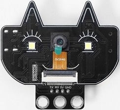

#### 9.1 参数

- 供电范围：5V

- 工作电流：0.21A

- 产品尺寸：55mm × 51mm × 15.5 mm

- 采用低功耗、双核 32 位 CPU，可作为应用处理器。

- 主频高达 240MHz，算力达到 600 DMIPS。

- 内置 520 KB SRAM，外部 8MB PSRAM。

- 兼容 UART 。

- 支持 OV2640 和 OV7670 摄像头，内置闪光灯。

- 支持 TF 卡、多种休眠模式、WIFI 上传和 STA/AP/STA+AP 工作模式。

- 内置 Lwip 和 FreeRTOS。

- 支持 Smart Config/AirKiss 智能配置。


#### 9.2 实验代码

使用USB线将fox:bit摄像头模块的USB口连接到电脑的USB口。

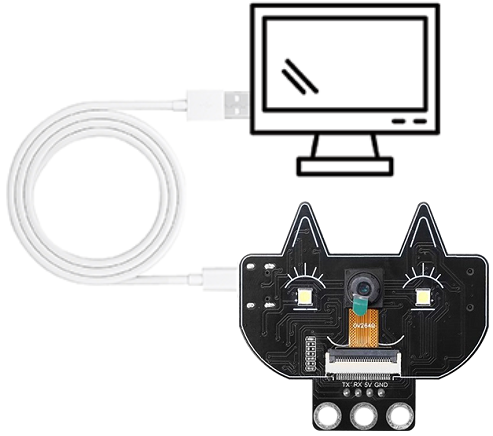

打开Arduino IDE，选择ESP32主控板的板型，点击 **工具**  ->  **开发板**  ->  **ESP32**  ->  **ESP32 Dev Module** 。

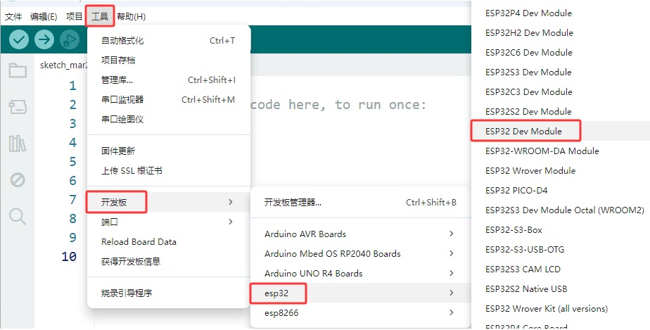

点击 **工具**  ->  **端口**，适当的串口端口（COMxx）

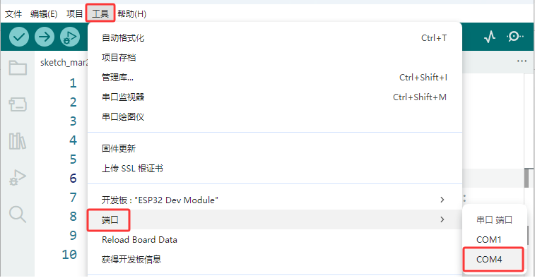

打开示例代码：**文件**  ->  **示例**  ->  **ESP32**  ->  **Camera**  ->  **CameraWebServer**。

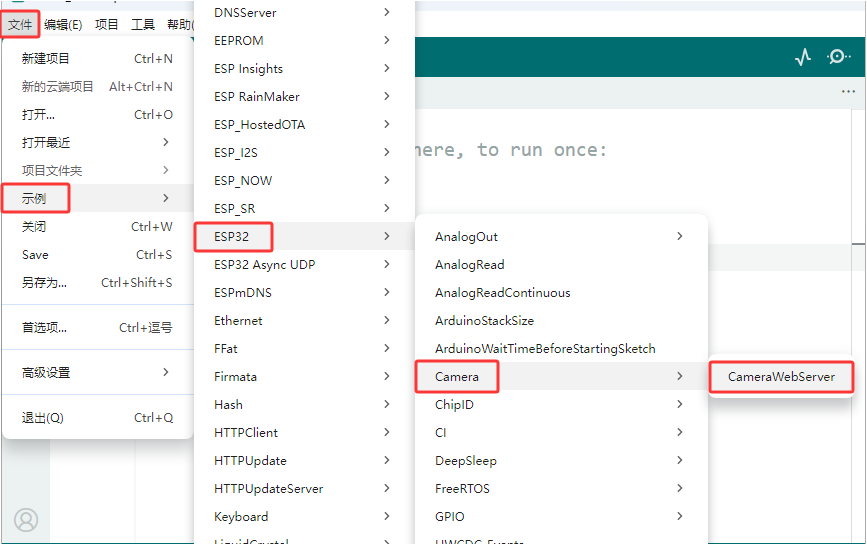

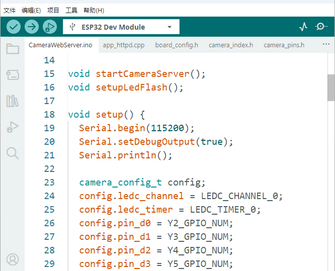

点击 `board_config.h` 文件，修改摄像头类型：注释掉 `#define CAMERA_MODEL_ESP_EYE` ，使用 `#define CAMERA_MODEL_AI_THINKER` 。

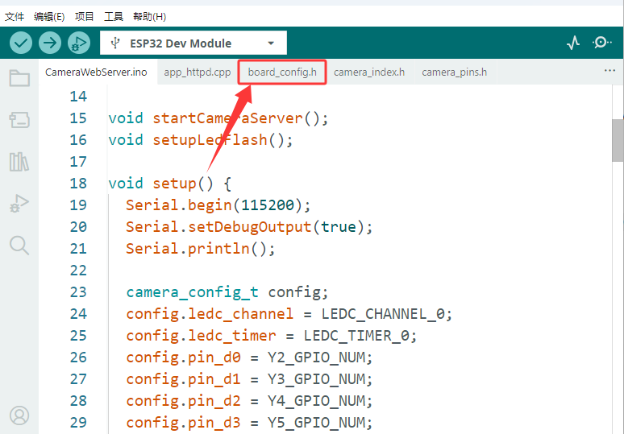

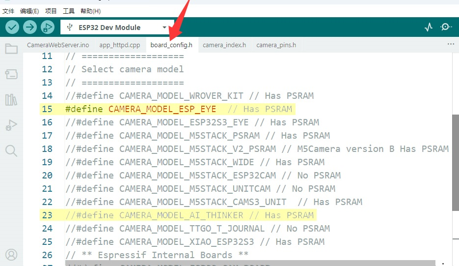

修改成功：

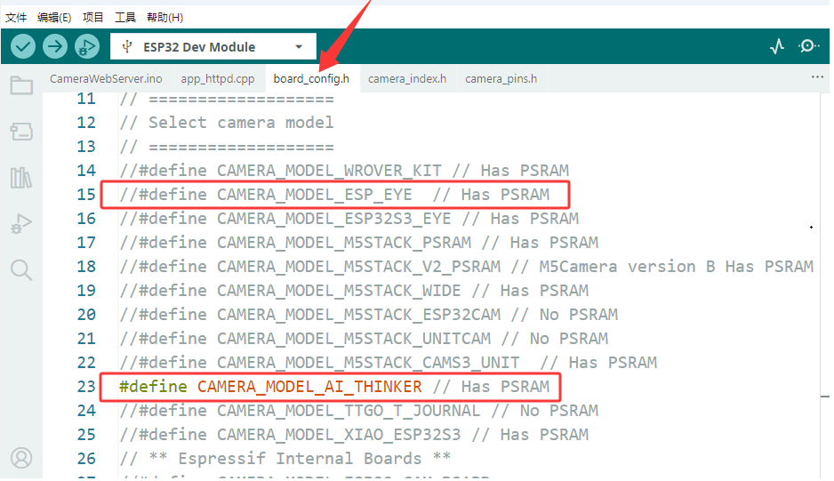

将 `CameraWebServer.ino` 文件(代码)中的WiFi名称和WiFi密码对应的 **星号 (***********)** 替换为你自己的WiFi名称和WiFi密码（ssid 表示WiFi名称，password 表示WiFi密码）。

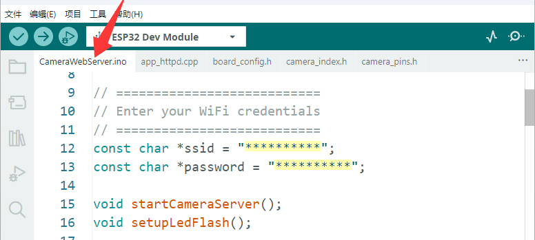

```c++
#include "esp_camera.h"
#include <WiFi.h>

// ===========================
// Select camera model in board_config.h
// ===========================
#include "board_config.h"

// ===========================
// Enter your WiFi credentials
// ===========================
const char *ssid = "***********";
const char *password = "***********";

void startCameraServer();
void setupLedFlash();

void setup() {
  Serial.begin(115200);
  Serial.setDebugOutput(true);
  Serial.println();

  camera_config_t config;
  config.ledc_channel = LEDC_CHANNEL_0;
  config.ledc_timer = LEDC_TIMER_0;
  config.pin_d0 = Y2_GPIO_NUM;
  config.pin_d1 = Y3_GPIO_NUM;
  config.pin_d2 = Y4_GPIO_NUM;
  config.pin_d3 = Y5_GPIO_NUM;
  config.pin_d4 = Y6_GPIO_NUM;
  config.pin_d5 = Y7_GPIO_NUM;
  config.pin_d6 = Y8_GPIO_NUM;
  config.pin_d7 = Y9_GPIO_NUM;
  config.pin_xclk = XCLK_GPIO_NUM;
  config.pin_pclk = PCLK_GPIO_NUM;
  config.pin_vsync = VSYNC_GPIO_NUM;
  config.pin_href = HREF_GPIO_NUM;
  config.pin_sccb_sda = SIOD_GPIO_NUM;
  config.pin_sccb_scl = SIOC_GPIO_NUM;
  config.pin_pwdn = PWDN_GPIO_NUM;
  config.pin_reset = RESET_GPIO_NUM;
  config.xclk_freq_hz = 20000000;
  config.frame_size = FRAMESIZE_UXGA;
  config.pixel_format = PIXFORMAT_JPEG;  // for streaming
  //config.pixel_format = PIXFORMAT_RGB565; // for face detection/recognition
  config.grab_mode = CAMERA_GRAB_WHEN_EMPTY;
  config.fb_location = CAMERA_FB_IN_PSRAM;
  config.jpeg_quality = 12;
  config.fb_count = 1;

  // if PSRAM IC present, init with UXGA resolution and higher JPEG quality
  //                      for larger pre-allocated frame buffer.
  if (config.pixel_format == PIXFORMAT_JPEG) {
    if (psramFound()) {
      config.jpeg_quality = 10;
      config.fb_count = 2;
      config.grab_mode = CAMERA_GRAB_LATEST;
    } else {
      // Limit the frame size when PSRAM is not available
      config.frame_size = FRAMESIZE_SVGA;
      config.fb_location = CAMERA_FB_IN_DRAM;
    }
  } else {
    // Best option for face detection/recognition
    config.frame_size = FRAMESIZE_240X240;
#if CONFIG_IDF_TARGET_ESP32S3
    config.fb_count = 2;
#endif
  }

#if defined(CAMERA_MODEL_ESP_EYE)
  pinMode(13, INPUT_PULLUP);
  pinMode(14, INPUT_PULLUP);
#endif

  // camera init
  esp_err_t err = esp_camera_init(&config);
  if (err != ESP_OK) {
    Serial.printf("Camera init failed with error 0x%x", err);
    return;
  }

  sensor_t *s = esp_camera_sensor_get();
  // initial sensors are flipped vertically and colors are a bit saturated
  if (s->id.PID == OV3660_PID) {
    s->set_vflip(s, 1);        // flip it back
    s->set_brightness(s, 1);   // up the brightness just a bit
    s->set_saturation(s, -2);  // lower the saturation
  }
  // drop down frame size for higher initial frame rate
  if (config.pixel_format == PIXFORMAT_JPEG) {
    s->set_framesize(s, FRAMESIZE_QVGA);
  }

#if defined(CAMERA_MODEL_M5STACK_WIDE) || defined(CAMERA_MODEL_M5STACK_ESP32CAM)
  s->set_vflip(s, 1);
  s->set_hmirror(s, 1);
#endif

#if defined(CAMERA_MODEL_ESP32S3_EYE)
  s->set_vflip(s, 1);
#endif

// Setup LED FLash if LED pin is defined in camera_pins.h
#if defined(LED_GPIO_NUM)
  setupLedFlash();
#endif

  WiFi.begin(ssid, password);
  WiFi.setSleep(false);

  Serial.print("WiFi connecting");
  while (WiFi.status() != WL_CONNECTED) {
    delay(500);
    Serial.print(".");
  }
  Serial.println("");
  Serial.println("WiFi connected");

  startCameraServer();

  Serial.print("Camera Ready! Use 'http://");
  Serial.print(WiFi.localIP());
  Serial.println("' to connect");
}

void loop() {
  // Do nothing. Everything is done in another task by the web server
  delay(10000);
}
```

#### 9.3 代码说明

**1. 硬件配置**

```c++
#define CAMERA_MODEL_AI_THINKER // 使用AI Thinker开发板
#include "camera_pins.h"
```

- 选择了AI Thinker ESP32-CAM模块

- 包含对应的引脚定义文件

**2. 网络配置**

```c++
const char *ssid = "**********";      // 需要填入你自己的WiFi名称
const char *password = "**********";  // 需要填入你自己的WiFi密码
```

- **需要将星号替换为你自己的WiFi名称和WiFi密码**

**3. 摄像头配置**

代码中设置了详细的摄像头参数：

```c++
camera_config_t config;
config.ledc_channel = LEDC_CHANNEL_0;
config.ledc_timer = LEDC_TIMER_0;
config.pin_d0 = Y2_GPIO_NUM;
// ... 其他引脚配置
config.xclk_freq_hz = 20000000;      // 20MHz时钟
config.frame_size = FRAMESIZE_UXGA;  // 最高分辨率
config.pixel_format = PIXFORMAT_JPEG;// JPEG格式，适合流媒体
config.jpeg_quality = 12;            // JPEG质量(0-63，越小质量越好)
config.fb_count = 1;                 // 帧缓冲区数量
```

**4. PSRAM优化配置**

```c++
if (psramFound()) {
  config.jpeg_quality = 10;          // 有PSRAM时提高质量
  config.fb_count = 2;               // 增加帧缓冲区
  config.grab_mode = CAMERA_GRAB_LATEST; // 获取最新帧
}
```

- 自动检测PSRAM并优化配置

- 没有PSRAM时会降低分辨率以保证运行

PSRAM是一种特殊类型的内存，结合了DRAM（动态RAM）和SRAM（静态RAM）的特点。

PSRAM带来的优势：高分辨率支持、图像质量提升、流畅度改善。

**5. WiFi连接过程**

```c++
WiFi.begin(ssid, password);
WiFi.setSleep(false);  // 禁用WiFi睡眠，提高稳定性

Serial.print("WiFi connecting");
while (WiFi.status() != WL_CONNECTED) {
  delay(500);
  Serial.print(".");
}
```

**6. 服务器启动**

```c++
startCameraServer();  // 启动摄像头服务器

Serial.print("Camera Ready! Use 'http://");
Serial.print(WiFi.localIP());  // 显示获取到的IP地址
Serial.println("' to connect");
```


#### 9.4 实验结果

修改好了代码中的WiFi名称和WiFi密码，选择好正确的开发板板型（ESP32 Dev Module）和 适当的串口端口（COMxx），然后单击按钮上传代码。代码上传成功后，单击Arduino IDE右上角的 ，打开串口监视器，设置波特率为 `115200`。串口监视器出现以下内容说明WiFi连接成功：<span style="color: rgb(200, 70, 100);">(注意：确保手机/电脑与fox:bit摄像头连接到同一个 WiFi 。)</span>

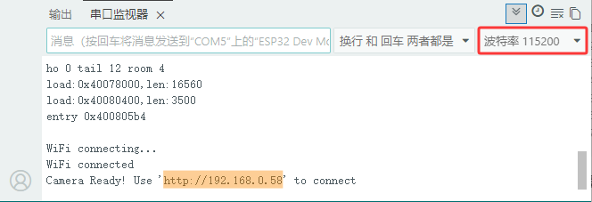

若串口监视器无内容显示，按一下复位键。

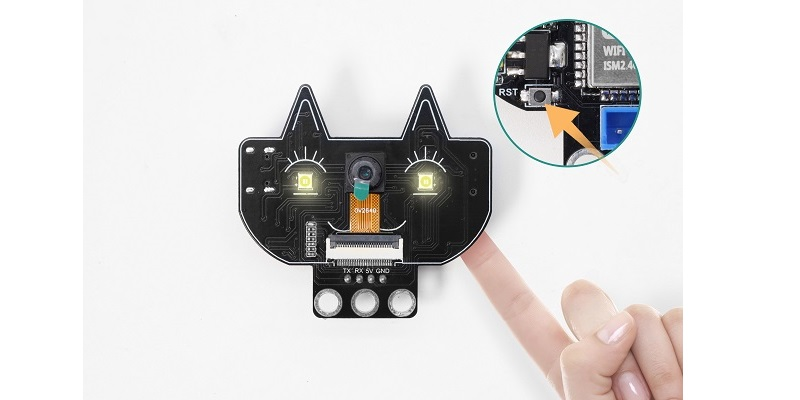

**在电脑上操作：**

先将电脑与fox:bit摄像头连接到相同的WIFI（<span style="color: rgb(200, 70, 100);">与代码中的WiFi名称和WiFi密码保持一致</span>），然后将串口监视器打印IP地址输入到谷歌浏览器或者火狐浏览器的搜索框（用其他浏览器可能导致不兼容），按下回车键跳转到页面。 

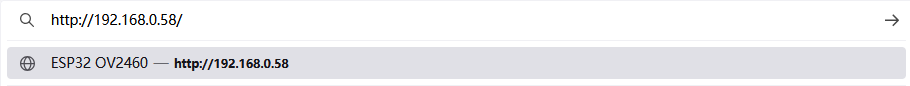

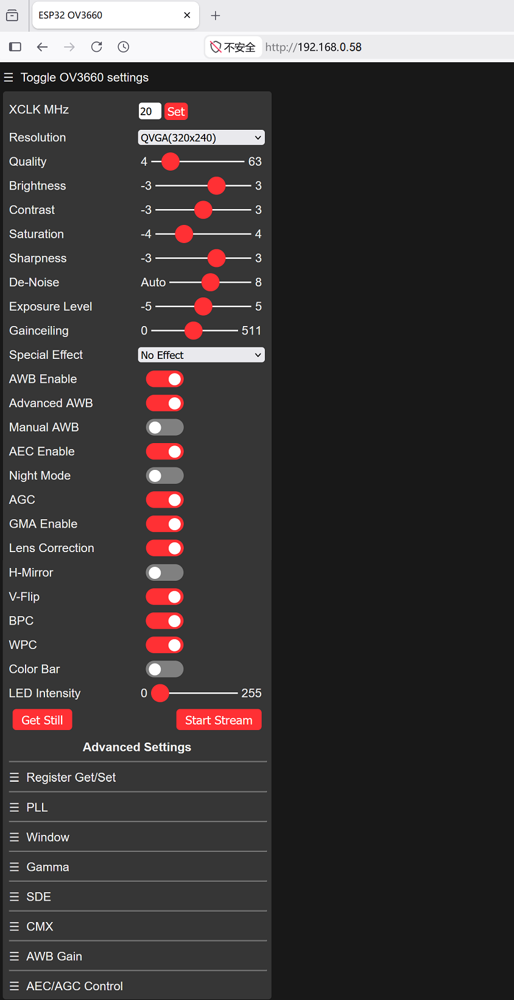

参考下图红框内的参数去设置。

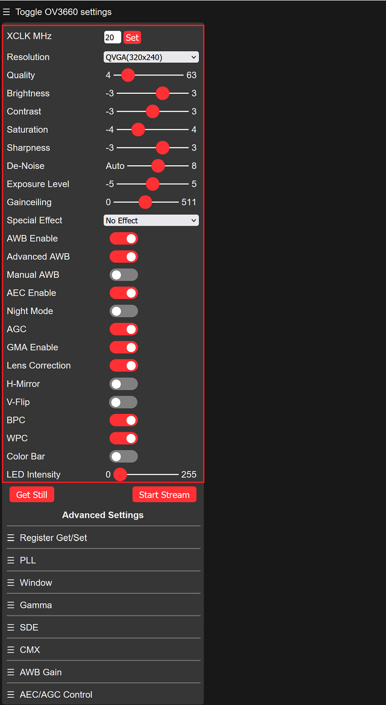

然后点击 **Start Stream** 按钮，摄像头开始工作，画面清晰可见。

此过程中WIFI模块发热，串口会显示大量通信数据是正常工作现象，有条件可以将模块置于通风的位置。

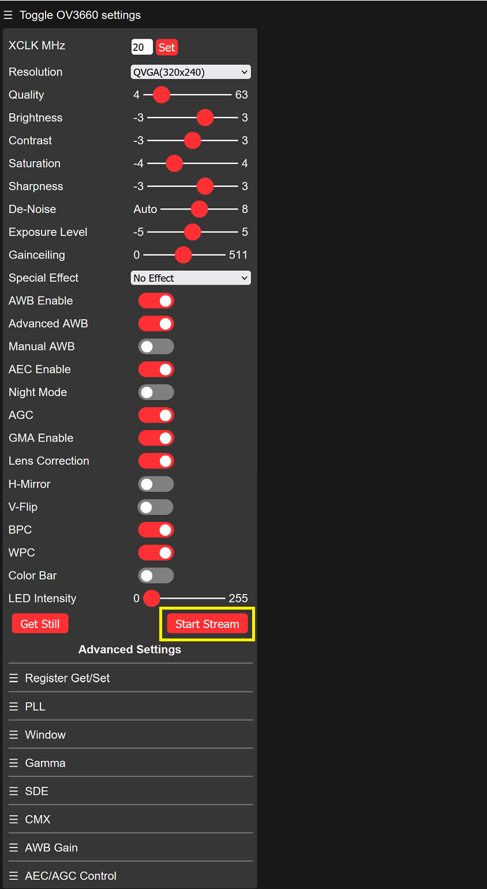

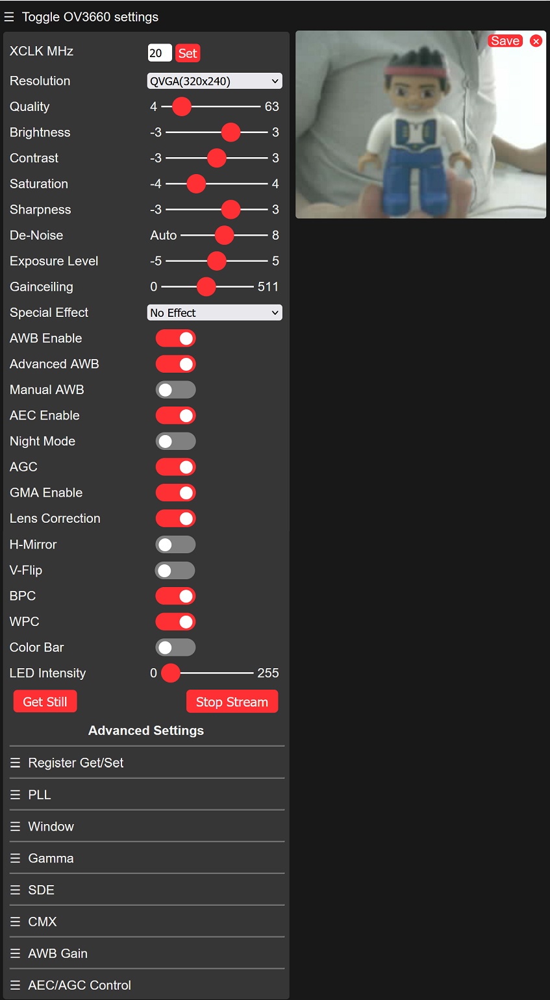


若模块输入电源不足，会导致图片出现水纹，如下所示：

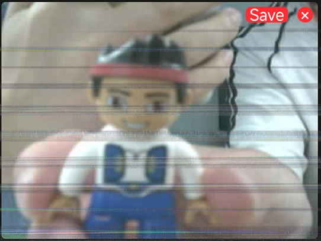

**在智能手机上操作：**

先将手机与fox:bit摄像头连接到相同的WIFI（<span style="color: rgb(200, 70, 100);">与代码中的WiFi名称和WiFi密码保持一致</span>），然后将串口监视器打印IP地址输入到谷歌浏览器或者火狐浏览器的搜索框（用其他浏览器可能导致不兼容），按下回车键跳转到页面。 

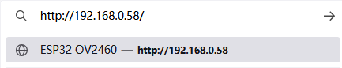

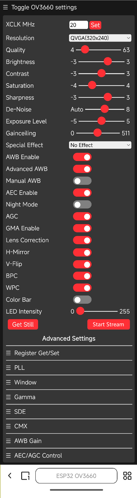

参考下图红框内的参数去设置。

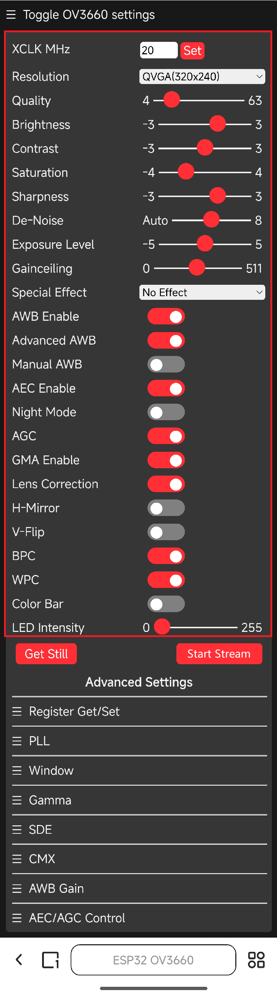

然后点击 **Start Stream** 按钮，摄像头开始工作，画面清晰可见。

此过程中WIFI模块发热，串口会显示大量通信数据是正常工作现象，有条件可以将模块置于通风的位置。

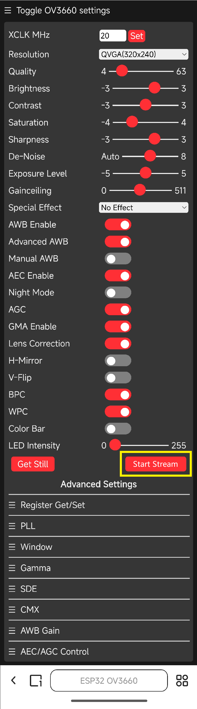

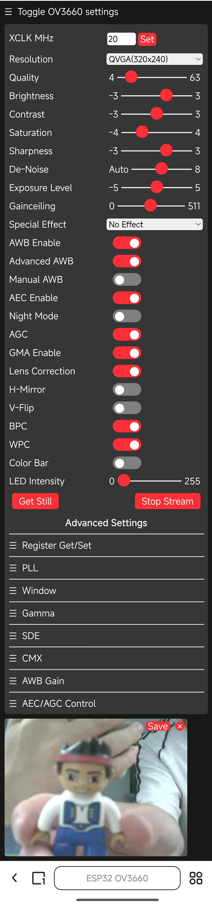

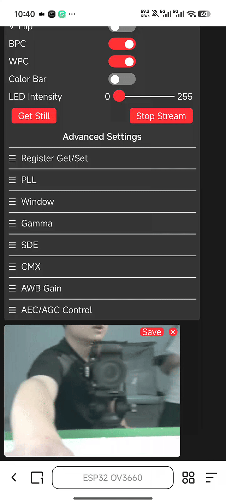

若模块输入电源不足，会导致图片出现水纹，如下所示：


