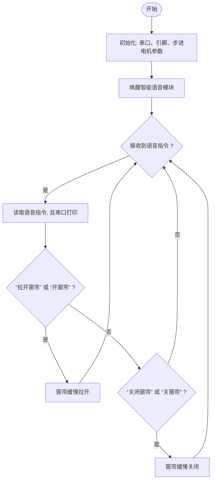

## 第13课 窗帘语音控制

#### 13.1 项目介绍

通过语音指令来控制窗帘的开合、调节光线及隐私保护程度的一种智能学校技术。这种技术结合了语音识别、电机驱动和智能控制系统，使学生和教师无需手动操作，只需简单的语音命令即可实现窗帘的自动化控制。

语音识别技术能够准确识别用户的语音指令，如“拉开窗帘”或“关闭窗帘”等，并将这些指令转化为电信号发送给窗帘的驱动电机。电机则根据接收到的信号，精确控制窗帘的开与合，从而实现智能化控制。

#### 13.2 流程图


#### 13.3 实验代码

```c++
//导入相关库文件
#include <SoftwareSerial.h>
#include <Stepper.h>     // 提供了控制步进电机的基本功能

// 定义引脚常量
const int RX_PIN = 25;  // 引脚 GPIO25 为 RX
const int TX_PIN = 26;  // 引脚 GPIO26 为 TX

// 电机参数（28BYJ-48）
const int STEPS_PER_REV = 2038;  // 实际步数/圈（不同电机可能有差异）
const int MOTOR_PIN1 = 14;       // IN1
const int MOTOR_PIN2 = 27;       // IN2
const int MOTOR_PIN3 = 16;       // IN3
const int MOTOR_PIN4 = 17;       // IN4

// 用户可调参数
int motorSpeed = 10;      // 转速(RPM)，建议5-12，超过15极易堵转
int rotationCount = 2;    // 转动圈数
bool reverseDirection = false; // 反转标志位

// 初始化步进电机（注意引脚顺序IN1-IN3-IN2-IN4）
Stepper myStepper(STEPS_PER_REV, MOTOR_PIN1, MOTOR_PIN3, MOTOR_PIN2, MOTOR_PIN4);

SoftwareSerial mySerial(RX_PIN, TX_PIN); // 定义软件串口引脚（RX, TX）

// 定义变量用于存储从语音模块接收到的控制码
volatile int Voice_Control = 0;  // 初始化为0，确保首次判断时不触发任何指令

void setup(){
  Serial.begin(9600); // 硬件串口（与电脑通信）
  mySerial.begin(9600); // 软件串口（与外设通信）
}

void loop(){
   if (mySerial.available() > 0) {  // 持续检查软串口是否有来自语音模块的数据
     Voice_Control = mySerial.read();  // 读取多个字节的数据
     Serial.println(Voice_Control);   // 将接收到的数据通过硬件串口输出，便于调试和监控
  }
  if (Voice_Control == 63) { // 判断接收到的指令数值63,并执行相应操作
    delay(2000);
    // 反转测试
    rotateMotor(rotationCount, false);
    delay(1000); 
  }
  else if (Voice_Control == 64) { // 判断接收到的指令数值64,并执行相应操作
    delay(2000);
    // 正转测试
    rotateMotor(rotationCount, true);
    delay(1000);  // 停顿1秒  
  }
  // 清除指令，避免重复执行
  Voice_Control = 0;
}

// 电机转动函数
void rotateMotor(int turns, bool reverse) {
  myStepper.setSpeed(motorSpeed);
  int steps = STEPS_PER_REV * turns * (reverse ? -1 : 1);
  myStepper.step(steps);
}
```

#### 13.4 实验结果

外接电源，选择好正确的开发板板型（ESP32 Dev Module）和 适当的串口端口（COMxx），然后单击按钮上传代码。代码上传成功后，通过智能语音模块控制窗帘缓慢拉开与关闭。

对着智能语音模块上的麦克风，使用唤醒词 “你好，小智” 或 “小智小智” 来唤醒智能语音模块，同时喇叭播放回复语 “有什么可以帮到您”；

智能语音模块唤醒后，对着麦克风说：“拉开窗帘” 或 “开窗帘” 等命令词时，喇叭播放对应的回复语 “已为您打开窗帘”，同时窗帘缓慢拉开；

对着麦克风说：“关闭窗帘” 或 “关窗帘” 等命令词时，喇叭播放对应的回复语 “已为您关闭窗帘”，同时窗帘缓慢关闭。

