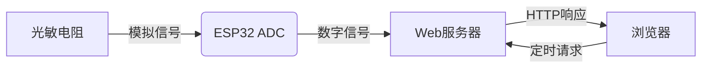
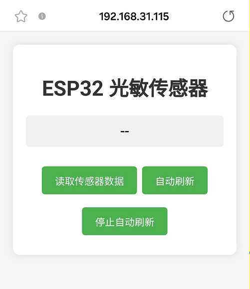
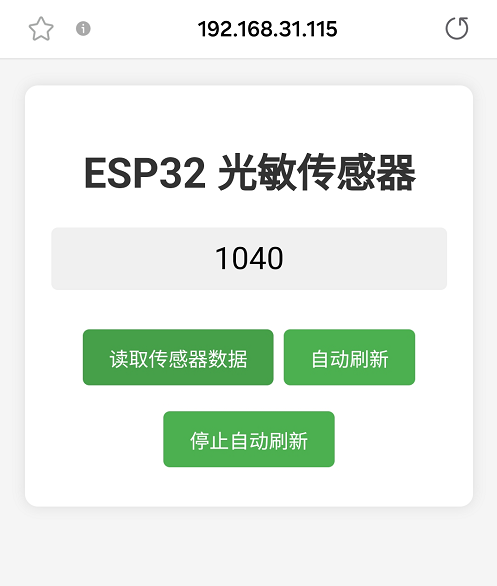

## 20. 网页远程监测光照值

在智慧校园的建设中，环境监测是提升教学环境舒适度、优化能源管理的重要环节。光照强度直接影响学生的学习效率和视觉健康，合理调控教室照明不仅能节能减排，还能创造更适宜的学习环境。

这一课，我们将掌握物联网环境监测的核心技术，实现教室光照强度的实时可视化，为智能照明、节能管理等应用提供基础方案，助力绿色智慧校园建设。


#### 20.1 原理

1. 数据采集

   光敏电阻分压 → ESP32的ADC引脚（模拟转数字）

2. 数据处理

   ESP32 → 路由器 → 手机/电脑

3. 网页交互

   浏览器请求 → 服务器响应 → 返回光照数值并刷新显示


#### 20.2 流程图




#### 20.3 实验代码

⚠️ **<span style="color: rgb(255, 76, 65);">特别提醒： 打开代码文件后，需要分别将代码中的 `YourWiFiSSID` 和 `YourWiFiPassword` 替换为您自己的 Wi-Fi名称和 WiFi密码。</span>**

```c++
const char* ssid = "YourWiFiSSID";         // 修改为你的WiFi名称
const char* password = "YourWiFiPassword"; // 修改为你的WiFi密码
```
⚠️ **<span style="color: rgb(255, 76, 255);">特别提醒：还需要确保手机/电脑与ESP32主控板连接到同一个 WiFi。</span>**

```c++
#include <WiFi.h>
#include <WebServer.h>
#include <Adafruit_GFX.h>
#include <Adafruit_SH110X.h>

// 设置WiFi名称和WiFi密码
const char* ssid = "YourWiFiSSID";         // 修改为你自己的WiFi名称
const char* password = "YourWiFiPassword"; // 修改为你自己的WiFi密码

WebServer server(80);  // 创建Web服务器对象，端口80

// 光敏电阻连接的引脚
const int lightSensorPin = 34;

// 存储传感器值
int sensorValue = 0;

// OLED 配置
#define SCREEN_WIDTH 128
#define SCREEN_HEIGHT 64
#define OLED_RESET -1  // 共享 I2C 重置操作
#define I2C_ADDRESS 0x3C  // 默认0x3C地址

// 创建一个显示对象
Adafruit_SH1106G display(SCREEN_WIDTH, SCREEN_HEIGHT, &Wire, OLED_RESET);

void setup() {
  Serial.begin(9600);
  Wire.begin(); // 初始化I2C总线
  
  // 初始化 OLED
  if(!display.begin(I2C_ADDRESS, true)) {  // 真正的分辨率是 128x64
    Serial.println("SH1106初始化失败");
    while(1);  // 陷入困境且无法继续前进
  }

  // 清空屏幕并设置文本属性
  display.clearDisplay();
  display.setTextSize(1);      // 文本尺寸
  display.setTextColor(SH110X_WHITE);  // 单色显示
  display.setCursor(0, 0);   // 设定起始位置
  
  // 连接WiFi
  WiFi.begin(ssid, password);
  Serial.println("正在连接WiFi...");
  
  while (WiFi.status() != WL_CONNECTED) {
    delay(500);
    Serial.print(".");
  }
  
  Serial.println("");
  Serial.println("WiFi已连接");
  Serial.println("IP: ");
  Serial.println(WiFi.localIP());
  display.print("IP: ");
  display.println(WiFi.localIP());
  display.display();

  // 设置路由器
  server.on("/", handleRoot);  // 返回HTML页面
  server.on("/readLight", handleLightRead); // 返回传感器数据
  
  // 启动服务器
  server.begin();
  Serial.println("HTTP服务器已启动.");
}

void loop() {
  server.handleClient();
}

void handleRoot() {
  String html = R"=====(
<!DOCTYPE html>
<html>
<head>
  <meta charset="UTF-8">
  <meta name="viewport" content="width=device-width, initial-scale=1">
  <title>ESP32 光敏传感器</title>
  <style>
    body {
      font-family: Arial, sans-serif;
      text-align: center;
      margin: 0;
      padding: 20px;
      background-color: #f5f5f5;
    }
    .container {
      max-width: 600px;
      margin: 0 auto;
      background-color: white;
      padding: 20px;
      border-radius: 10px;
      box-shadow: 0 0 10px rgba(0,0,0,0.1);
    }
    h1 {
      color: #333;
    }
    .sensor-value {
      font-size: 24px;
      margin: 20px 0;
      padding: 10px;
      background-color: #f0f0f0;
      border-radius: 5px;
    }
    button {
      background-color: #4CAF50;
      color: white;
      border: none;
      padding: 10px 20px;
      text-align: center;
      text-decoration: none;
      display: inline-block;
      font-size: 16px;
      margin: 10px 2px;
      cursor: pointer;
      border-radius: 5px;
    }
    button:hover {
      background-color: #45a049;
    }
  </style>
</head>
<body>
  <div class="container">
    <h1>ESP32 光敏传感器</h1>
    <div class="sensor-value" id="sensorValue">--</div>
    <button onclick="readSensor()">读取传感器数据</button>
    <button onclick="startAutoRead()">自动刷新</button>
    <button onclick="stopAutoRead()">停止自动刷新</button>
  </div>
  
  <script>
    let autoReadInterval;
    
    function readSensor() {
      fetch('/readLight')
        .then(response => response.text())
        .then(data => {
          document.getElementById('sensorValue').innerText = data;
        });
    }
    
    function startAutoRead() {
      stopAutoRead(); // 先停止任何现有的自动刷新
      readSensor();   // 立即读取一次
      autoReadInterval = setInterval(readSensor, 2000); // 每2秒读取一次
    }
    
    function stopAutoRead() {
      if (autoReadInterval) {
        clearInterval(autoReadInterval);
        autoReadInterval = null;
      }
    }
  </script>
</body>
</html>
)=====";

  server.send(200, "text/html", html);
}

void handleLightRead() {
  sensorValue = analogRead(lightSensorPin);  // 读取光照值
  String valueStr = String(sensorValue);
  server.send(200, "text/plain", valueStr); // 返回纯文本数据
  Serial.println("光照强度: " + valueStr);
}
```


#### 20.4 代码说明

**注意：此课程涉及HTML、CSS、JS等课外知识， 只做简单介绍。**

**1. 初始化阶段**

```c++
#include <WiFi.h>
#include <WebServer.h>
#include <Adafruit_GFX.h>
#include <Adafruit_SH110X.h>

// 设置WiFi名称和WiFi密码
const char* ssid = "YourWiFiSSID";         // 修改为你的WiFi名称
const char* password = "YourWiFiPassword"; // 修改为你的WiFi密码

WebServer server(80);  // 创建Web服务器对象，端口80

// 光敏电阻连接的引脚
const int lightSensorPin = 34;
```

- 引入WiFi、WebServer、Adafruit_GFX和Adafruit_SH110X库，配置网络和硬件引脚。

<br>

**2. 主程序逻辑**

```c++
void setup() {
  // 初始化串口和WiFi连接
  WiFi.begin(ssid, password); 
  
  // 设置路由器
  server.on("/", handleRoot);          // 返回HTML页面
  server.on("/readLight", handleLightRead); // 返回传感器数据
  server.begin();                     // 启动服务器
}

void loop() {
  server.handleClient();  // 持续处理客户端请求
}
```

- 启动服务器后，循环处理网页请求。

<br>

**3. 网页交互**

**HTML页面**

```c++
server.on("/", handleRoot);
```

```c++
void handleRoot() {
  String html = R"=====(
<!DOCTYPE html>
...
</body>
</html>
)=====";
```

- HTML网页的代码，页面包含3个按钮：手动读取、自动刷新（2秒）、停止刷新

**动态更新**

```javascript
fetch('/readLight').then(response => response.text())
```

- 通过JavaScript的`fetch()`请求数据

**数据接口**

```c++
server.on("/readLight", handleLightRead);
```

```c++
void handleLightRead() {
  sensorValue = analogRead(lightSensorPin);  // 读取光照值
  String valueStr = String(sensorValue);
  server.send(200, "text/plain", valueStr); // 返回纯文本数据
  Serial.println("光照强度: " + valueStr);
}
```

- 当网页请求 `/readLight` 路径时，ESP32会读取光敏电阻的模拟值，将该数值以纯文本形式返回给网页，同时在串口监视器中打印出当前的光照传感器数值。


#### 20.5 实验结果

外接电源，选择好正确的开发板板型（ESP32 Dev Module）和 适当的串口端口（COMxx），然后单击按钮上传代码。代码上传成功后，设置波特率为 `9600`，可以看到打印的IP地址 (<span style="color: rgb(255, 76, 65);">如果看不到可以按下复位按键重新连接一次</span>)：

   

   OLED显示屏上同步显示IP地址：

   


在手机/电脑的浏览器中输入IP地址即可访问室内光照值监测页面，页面自动刷新每2秒更新数据。

<span style="color: rgb(200, 70, 100);">注意：确保手机/电脑与ESP32连接到同一个 WiFi 。</span> 
   
   

   

   - 读取传感器数据：点击“读取传感器数据”按钮，页面立即显示光照强度数据。

   - 自动刷新：页面自动刷新，每2秒更新数据。
   
   - 停止自动更新：页面停止刷新数据。
   
   


#### 20.6 常见问题解决

1. 若串口监视器无任何信息打印，请按下ESP32主板的复位键：

   

2. 若ESP32 一直没有获取到 IP 地址，通常是因为 WiFi 连接失败，解决办法：

   - 确保代码里的 WiFi 名称和 WiFi密码已经替换为您自己的 Wi-Fi名称 和 WiFi密码。
   
   - 确保你的 WiFi 网络是 2.4GHz 的，ESP32不支持 5GHz WiFi。

3. 若输入IP地址无页面，解决办法：

   - 确保IP地址输入正确。
   
   - 检查手机/电脑是否与ESP32在同一网络。