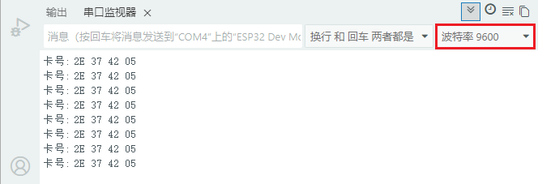
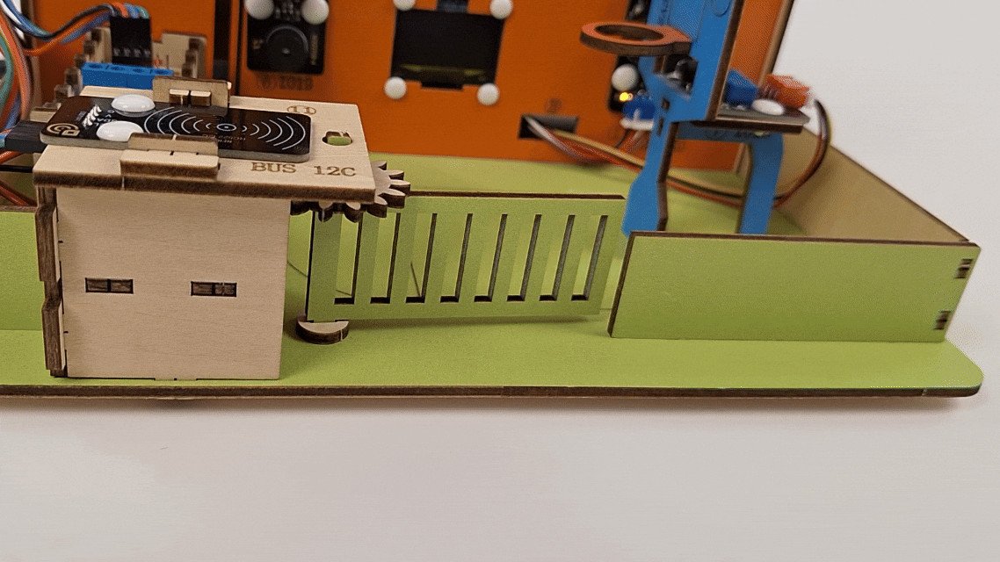
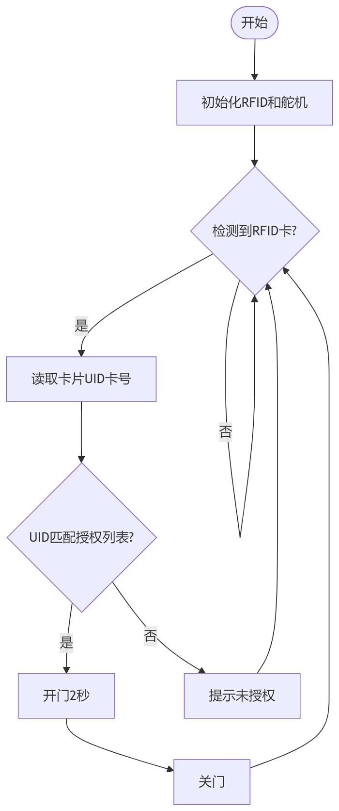
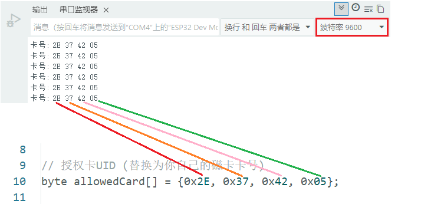

### 第7课 校园智能门禁

让我们用RFID刷卡模块和舵机打造一个校园智能门禁系统，通过刷卡识别身份并自动控制门开与关，体验安全便捷的智慧校园生活！

#### 7.1 RFID刷卡模块

RFID刷卡模块是一种基于无线射频识别技术的非接触式读卡设备，可快速识别IC卡或电子标签中的身份信息，广泛应用于门禁、考勤和支付系统。


##### 7.1.1 参数

- 工作电压：DC 5V 

- 工作电流：13 ~ 100 mA / DC 5V 

- 空闲电流：10 ~ 13 mA / DC 5V

- 休眠电流：< 80 uA

- 峰值电流：< 100 mA

- 工作频率：13.56 MHz

- 最大功率： 0.5 W

- 数据传输速率：最大10Mbit/s

- 工作温度：-10°C ~ +50°C

- 尺寸：48mm x 24mm x 8 mm

- 定位孔大小：直径为 4.8 mm

- 接口：间距2.54 mm，4pin弯针接口


##### 7.1.2 原理

**工作流程**


**（1）能量传输**

- 读卡器天线发射电磁场 → 为无源RFID卡（无电池）提供能量。

**（2）数据交互**

- 卡片进入磁场范围后激活 → 通过负载调制将卡内数据（如：卡号）传回读卡器。

**（3）身份验证**

- 读卡器解码数据 → 与系统数据库比对完成认证。


##### 7.1.3 实验代码

```c++
#include <Wire.h>         // I2C通信库
#include "MFRC522_I2C.h"  // MFRC522的I2C驱动库
MFRC522 mfrc522(0x28);    // 创建MFRC522对象,I2C地址设为0x28

void setup() {
  Serial.begin(9600);   // 初始化串口（调试用）        
  Wire.begin();           // 初始化I2C总线（默认SDA=GPIO21, SCL=GPIO22）
  mfrc522.PCD_Init();     // 初始化MFRC522读卡器
  ShowReaderDetails();    // 显示读卡器版本信息
  Serial.println(F("扫描PICC卡即可查看用户识别码、类型以及数据块信息..."));
}

void loop() {
  // 检测是否有新卡片 && 能否成功读取卡片数据
  if ( ! mfrc522.PICC_IsNewCardPresent() || ! mfrc522.PICC_ReadCardSerial() ) {
    delay(50);  // 降低轮询频率，减少CPU占用
    return;     // 无卡或读卡失败时退出
  }
  
  // 打印RFID卡的卡号（16进制格式）
  Serial.print(F("卡号:"));
  for (byte i = 0; i < mfrc522.uid.size; i++) {
    Serial.print(mfrc522.uid.uidByte[i] < 0x10 ? " 0" : " ");
    Serial.print(mfrc522.uid.uidByte[i], HEX);
  } 
  Serial.println();
}

void ShowReaderDetails() {
  // 获得MFRC522软件
  byte v = mfrc522.PCD_ReadRegister(mfrc522.VersionReg);
  Serial.print(F("MFRC522 Software Version: 0x"));
  Serial.print(v, HEX);

  // 版本判断
  if (v == 0x91)
    Serial.print(F(" = v1.0"));
  else if (v == 0x92)
    Serial.print(F(" = v2.0"));
  else
    Serial.print(F(" (unknown)"));
  Serial.println("");

  // 通信故障检测，返回0x00或0xFF时，可能是通信信号传输失败
  if ((v == 0x00) || (v == 0xFF)) {
    Serial.println(F("警告: 通信失败, MFRC522是否已正确连接?"));
  }
}
```


##### 7.1.4 代码说明

**1. 头文件与对象初始化**

```c++
#include <Wire.h>           // I2C通信库
#include "MFRC522_I2C.h"    // MFRC522的I2C驱动库
MFRC522 mfrc522(0x28);      // 创建MFRC522对象，I2C地址设为0x28
```

- `MFRC522_I2C.h`：MFRC522模块的专用I2C驱动库。

- `MFRC522 mfrc522(0x28)`：初始化MFRC522对象，I2C地址设为`0x28`。

<br>

**2. 初始化设置(setup函数)**

```c++
void setup() {
  Serial.begin(9600);     // 初始化串口（调试用）
  Wire.begin();             // 初始化I2C总线（ESP32默认SDA=GPIO21, SCL=GPIO22）
  mfrc522.PCD_Init();       // 初始化MFRC522读卡器
  ShowReaderDetails();      // 显示读卡器版本信息
  Serial.println(F("扫描PICC卡即可查看用户识别码、类型以及数据块信息..."));
}
```

- `mfrc522.PCD_Init()`：配置读卡器的射频参数和通信协议。

- `ShowReaderDetails()`：验证硬件连接是否正常。

<br>

**3. 主循环(loop函数)**

```c++
void loop() {
  // 检测是否有新卡片 && 能否成功读取卡片数据
  if ( ! mfrc522.PICC_IsNewCardPresent() || ! mfrc522.PICC_ReadCardSerial() ) {
    delay(50);  // 降低轮询频率，减少CPU占用
    return;     // 无卡或读卡失败时退出
  }
  
  // 打印RFID卡的卡号（16进制格式）
  Serial.print(F("卡号:"));
  for (byte i = 0; i < mfrc522.uid.size; i++) {
    Serial.print(mfrc522.uid.uidByte[i] < 0x10 ? " 0" : " ");
    Serial.print(mfrc522.uid.uidByte[i], HEX);
  } 
  Serial.println();
}
```

- `mfrc522.PICC_IsNewCardPresent()`：检测是否有卡进入射频场。

- `mfrc522.PICC_ReadCardSerial()`：激活卡片并读取UID(卡号)。


**4. ShowReaderDetails() 函数**

```c++
void ShowReaderDetails() {
  byte v = mfrc522.PCD_ReadRegister(mfrc522.VersionReg);
  Serial.print(F("MFRC522 Software Version: 0x"));
  Serial.print(v, HEX);
  // 版本判断
  if (v == 0x91) Serial.print(F(" = v1.0"));
  else if (v == 0x92) Serial.print(F(" = v2.0"));
  else Serial.print(F(" (unknown)"));
  
  // 通信故障检测
  if ((v == 0x00) || (v == 0xFF)) {
     Serial.println(F("警告: 通信失败, MFRC522是否已正确连接?"));
  }
}
```

- `mfrc522.PCD_ReadRegister(mfrc522.VersionReg)`：读取MFRC522的版本号。

- 若返回 `0x00` 或 `0xFF`，说明I2C通信失败。

- 地址错误时，`ShowReaderDetails()` 函数会报通信失败。


##### 7.1.5 实验结果

外接电源，选择好正确的开发板板型（ESP32 Dev Module）和 适当的串口端口（COMxx），然后单击按钮上传代码。代码上传成功后，单击Arduino IDE右上角的，打开串口监视器，设置串口波特率为 `9600`。将RFID磁卡放入磁场范围内检测，读卡器将读取到的RFID卡号以16进制的形式打印在串口监视器。




⚠️ <span style="color: rgb(255, 76, 65);">**特别提醒：需要记下RFID刷卡模块读取你自己的RFID磁卡(白色磁卡)的卡号，下面实验代码中需要用到，需要将代码中的卡号换成你自己RFID磁卡(白色磁卡)的卡号。**</span>

##### 7.1.6 常见问题解决

1. **无法读取卡片**
   
   - 检查I2C地址是否正确。
   
   - 检查供电电压（5V）、卡片类型。

2. **版本显示 `0x00` 或 `0xFF`**
   
   - 检查I2C线路（SDA/SCL是否接反）。
   
   - 确保供电电压稳定。

---


#### 7.2 舵机

舵机是一种通过接收控制信号来精确控制旋转角度的电机。


我们用到的这款舵机有三根外接线，棕色线为接地线，红色线为电源正极，橙色线为信号线。


##### 7.2.1 参数

- 工作电压：DC 3.3 ~ 5V 

- 工作温度：-10°C ~ +50°C

- 尺寸：32.25mm x 12.25mm x 30.42 mm

- 接口：间距为2.54 mm 3pin排母接口


##### 7.2.2 原理

**1. 舵机的工作原理**

舵机是一种闭环控制的位置伺服电机，ESP32通过 **PWM（脉冲宽度调制）信号** 控制其角度。核心工作原理：

**PWM信号输入**：

- ESP32生成50Hz（周期20ms）的PWM信号

- **脉冲宽度（高电平时间）决定角度**：

  - **0.5ms（500μs）→ 0°**

  - **1.5ms（1500μs）→ 90°**（中间位置）

  - **2.5ms（2500μs）→ 180°**

    

**引脚限制**：

- 避免使用以下引脚（有特殊功能）：
  
  - GPIO0（下载模式）
  
  - GPIO2（内部上拉）
  
  - GPIO12（启动时电平敏感）


##### 7.2.3 实验代码

⚠️ <span style="color: rgb(200, 70, 100);">请确保组装前舵机已经初始化，否则可能导致舵机堵转损坏。</span>

```c++
#include <ESP32Servo.h> // 添加舵机库

Servo myservo;  // 创建舵机对象
const int servoPin = 32; // 舵机引脚IO32

void setup() {
  myservo.attach(servoPin); // 初始化舵机
}

void loop() {
  myservo.write(90);   // 90°
  delay(1000);
  myservo.write(135);   // 135°
  delay(1000);
  myservo.write(180);    // 180°
  delay(1000);
}
```


##### 7.2.4 代码说明

1. 初始化舵机（GPIO32引脚）

2. 循环执行：
  
   - 转到90° → 暂停1秒
   
   - 转到135° → 暂停1秒
   
   - 转到180° → 暂停1秒
   
   - 重复循环


##### 7.2.5 实验结果

⚠️ <span style="color: rgb(200, 70, 100);">警告：舵机必须正确安装固定后才能通电运行，否则可能因堵转损坏。</span>

⚠️ <span style="color: rgb(200, 70, 100);">详情请查看产品组装教程，舵机必须 **先初始化** 再安装。</span>

外接电源，选择好正确的开发板板型（ESP32 Dev Module）和 适当的串口端口（COMxx），然后单击按钮上传代码。代码上传成功后，舵机会按以下规律循环运动：

1. 立即转到90°位置 → 关门状态，保持1秒

2. 转到135°位置        → 开关门的中间位置，保持1秒

3. 转到180°位置          → 开门状态，保持1秒

4. 重复此循环（90°→135°→180°→90°...）



---


#### 7.3 校园智能门禁

在前面的课程中，我们已经掌握了RFID刷卡模块的身份识别功能和舵机的机械控制原理。现在，让我们将这些技术融合创新，共同打造一个智能化的校园门禁系统！通过这个项目，我们将实现刷卡自动开锁功能，既提升校园安全，又展现科技魅力。

这套系统能够识别授权人员的RFID卡片，通过舵机驱动门锁开关。接下来，我们将从流程图到程序编写，最终实现一个稳定可靠的智能门禁原型。准备好了吗？现在就开始我们的项目开发吧！


##### 7.3.1 流程图




##### 7.3.2 实验代码

⚠️ <span style="color: rgb(200, 70, 100);">请确保组装前舵机已经初始化，否则可能导致舵机堵转损坏。</span>

⚠️ <span style="color: rgb(200, 70, 100);">**上传代码前请将代码块中的RFID卡号替换成RFID刷卡模块读取你自己的白色磁卡所对应的RFID卡号。**</span>



```c++
#include <Wire.h>
#include "MFRC522_I2C.h"
#include <ESP32Servo.h>

MFRC522 rfid(0x28);  // RFID读卡器
Servo doorLock;      // 门锁舵机
const int servoPin = 32;

// 授权卡UID (替换为你自己的磁卡卡号)
byte allowedCard[] = {0x2E, 0x37, 0x42, 0x05};

void setup() {
  Serial.begin(9600);    // 串口通信（调试用）
  Wire.begin();            // 初始化 I2C
  rfid.PCD_Init();         // 初始化 RFID 读卡器
  doorLock.attach(servoPin); // 舵机初始化
}

void loop() {
  if (rfid.PICC_IsNewCardPresent() && rfid.PICC_ReadCardSerial()) { // 检测到新卡？
    if (memcmp(rfid.uid.uidByte, allowedCard, 4) == 0) { // 检查是否授权卡
      doorLock.write(180);  // 开门（180°）
      delay(2000);         // 保持开门 2 秒
      doorLock.write(90); // 关门（90°）
    }
    rfid.PICC_HaltA();     // 停止读卡
  }
  delay(100); 
}
```


##### 7.3.3 代码说明

**1. 授权卡设置**

```c
byte allowedCard[] = {0x2E, 0x37, 0x42, 0x05}; // 替换为你自己的 RFID卡号
```

这里只支持一张授权卡，**RFID卡号 需要替换成你自己的 RFID卡号**。

<br>

**2. 初始化设置(setup函数)**

```c++
void setup() {
  Serial.begin(9600);    // 串口通信（调试用）
  Wire.begin();            // 初始化 I2C
  rfid.PCD_Init();         // 初始化 RFID 读卡器
  doorLock.attach(servoPin); // 舵机初始化
}
```

**3. 主循环 (loop函数)**

```c++
void loop() {
  if (rfid.PICC_IsNewCardPresent() && rfid.PICC_ReadCardSerial()) { // 检测到新卡？
    if (memcmp(rfid.uid.uidByte, allowedCard, 4) == 0) { // 检查是否授权卡
      doorLock.write(180);  // 开门（180°）
      delay(2000);         // 保持开门 2 秒
      doorLock.write(90); // 关门（90°）
    }
    rfid.PICC_HaltA();     // 停止读卡
  }
  delay(100);              // 防抖 & 降低 CPU 占用
}
```

- `PICC_IsNewCardPresent()`：检测是否有新卡靠近。

- `PICC_ReadCardSerial()`：读取卡片的UID(卡号)。

- `memcmp()`：比较读取的 UID 是否匹配 `allowedCard`。
  
  - 匹配 → 开门（`180°`），2 秒后自动关门（`90°`）。
  
  - 不匹配 → 无操作（门保持关闭）。

- `PICC_HaltA()`：停止当前读卡，准备检测下一张卡。


##### 7.3.4 实验结果

⚠️ <span style="color: rgb(200, 70, 100);">警告：舵机必须正确安装固定后才能通电运行，否则可能因堵转损坏。</span>

⚠️ <span style="color: rgb(200, 70, 100);">详情请查看产品组装教程，舵机必须 **先初始化** 再安装。</span>

外接电源，选择好正确的开发板板型（ESP32 Dev Module）和 适当的串口端口（COMxx），然后单击按钮上传代码。代码上传成功后，智能门禁系统循环检测：

- 有卡 → 读RFID卡号 → 匹配成功 → 开门 → 延时2秒 → 关门

- 有卡 → 读RFID卡号 → 匹配失败 → 提示未授权

- 无卡 → 继续检测


##### 7.3.5 常见问题解决

1. 无法检测卡片
   
   - 检查I2C地址是否错误、接线是否松动

2. 舵机不转动
   
   - 检查供电电压，外接电源
   
   - 确保安装前已将舵机初始化

3. 串口输出乱码
   
   - 确保串口监视器设为9600