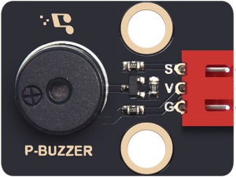
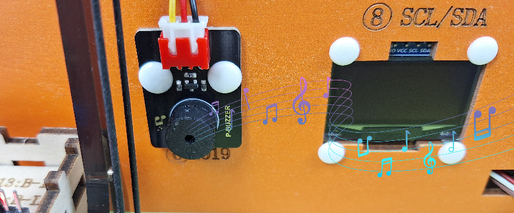
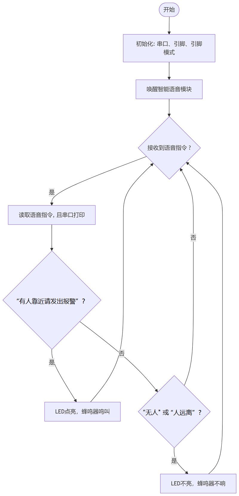

### 第8课 校园入侵警报系统

这节课我们要制作一个校园入侵警报系统，当校外人员偷偷翻墙进校园时，学校保安人员发现他们，立即唤醒智能语音模块，并且对着智能语音模块上的麦克风发出 “有人靠近请发出报警” 等语音命令词，让蜂鸣器发出警报声，路灯点亮，提醒学生、教师和工作人员提高警惕！

#### 8.1 无源蜂鸣器

无源蜂鸣器是一种需要外部PWM信号驱动才能发声的电子元件，其音调由输入方波的频率决定。




##### 8.1.1 参数

- 工作电压：DC 3.3 ~ 5V 

- 工作温度：-10°C ~ +50°C

- 控制信号：数字信号

- 尺寸：32mm x 23mm x 12 mm

- 定位孔大小：直径为 4.8 mm

- 接口：间距为2.54 mm，3pin防反接口


##### 8.1.2 原理

**无源蜂鸣器的工作原理**

1. **核心特性**
   
   - **无内部振荡源**：必须输入特定频率的方波（PWM信号）才能发声，频率决定音调（如2kHz发出高频蜂鸣）。

2. **驱动逻辑**
    
   - 直接接直流电（如5V）只会发出 “咔哒” 声（瞬间通电的机械响应）。
   
   - **持续发声需PWM**：例如，输入1kHz方波，蜂鸣器以1kHz频率振动，产生对应音调。

<br>

**七音符**

音乐，是一种无形的艺术，它以其独特的语言，表达着人们的情感和思想。在音乐中，有一种基本的构成元素，那就是音符。音符是音乐的基础，它们组合在一起，形成了各种各样的旋律和节奏。在所有的音符中，最为基本的就是七个音符：C、D、E、F、G、A、B。

这七个音符就像音乐的字母表，通过它们的组合和变化，可以创造出无数美妙的音乐。


##### 8.1.3 实验代码

```c++
#define BUZZER_PIN 19  // 蜂鸣器连接至IO19（必须是支持PWM的引脚）

void setup() {
  pinMode(BUZZER_PIN, OUTPUT);
}

void loop() {
  // 测试1:发出1kHz蜂鸣声（持续1秒）
  tone(BUZZER_PIN, 1000);  // 频率1000Hz
  delay(1000);
  noTone(BUZZER_PIN);      // 关闭蜂鸣器
  delay(1000);

  // 测试2:发出2kHz蜂鸣声（持续0.5秒）
  tone(BUZZER_PIN, 2000);  // 频率2000Hz
  delay(500);
  noTone(BUZZER_PIN);
  delay(1000);

  // 测试3:播放简单旋律（Do-Re-Mi）
  int melody[] = {262, 294, 330};  // C4, D4, E4 频率
  for (int i = 0; i < 3; i++) {
    tone(BUZZER_PIN, melody[i]);
    delay(300);
    noTone(BUZZER_PIN);
    delay(50);
  }
  delay(2000);  // 等待2秒后循环
}
```


##### 8.1.4 代码说明

1. 引脚定义：蜂鸣器连接至GPIO19（必须支持PWM）。

2. setup()：初始化蜂鸣器引脚为输出模式。

3. loop()（循环执行）：
   
   - 测试1：播放1kHz声音1秒，然后静音1秒。
   
   - 测试2：播放2kHz声音0.5秒，然后静音1秒。
   
   - 测试3：依次播放旋律 "Do(262Hz)-Re(294Hz)-Mi(330Hz)"，每个音持续0.3秒，间隔0.05秒，最后等待2秒。

4. 使用的函数：
   
   - `tone(pin, frequency)`：在指定引脚输出特定频率的PWM信号。
   
   - `noTone(pin)`：停止PWM信号输出。


##### 8.1.5 实验结果

外接电源，选择好正确的开发板板型（ESP32 Dev Module）和 适当的串口端口（COMxx），然后单击按钮上传代码。代码上传成功后，蜂鸣器依次播放：

- 1kHz（1秒） → 2kHz（0.5秒） → Do-Re-Mi 旋律 



---


#### 8.2 校园入侵警报系统

在前面的学习中，我们已经掌握了智能语音模块工作原理和无源蜂鸣器的声音报警功能。在这节课中，我们将这些技术结合起来，动手制作一个真实的安防小系统！校外人员偷偷翻墙进校园时，学校保安人员一旦发现入侵者，立即唤醒智能语音模块，并且对着智能语音模块上的麦克风发出 “有人靠近请发出报警” 等语音命令词，无源蜂鸣器就会立即发出警报声，路灯点亮。既能学习电子知识，又能提高安全意识，快来一起守护校园安全吧！

##### 8.2.1 流程图



##### 8.2.2 实验代码

```c++
// 引入SoftwareSerial库，用于创建软串口
#include <SoftwareSerial.h>

// 创建软串口对象：RX引脚为IO25、TX引脚为IO26, 用于连接语音识别模块
// 定义引脚常量
const int RX_PIN = 25; // 引脚 IO25 为 RX
const int TX_PIN = 26; // 引脚 IO26 为 TX

SoftwareSerial mySerial(RX_PIN, TX_PIN); // 定义软件串口引脚(RX, TX)

// 定义变量用于存储从语音模块接收到的控制码
volatile int Voice_Control = 0;  // 初始化为0, 确保首次判断时不触发任何指令

const int buzzerPin = 19;     // 蜂鸣器模块连接引脚为19
const int ledPin = 12;       // 定义LED的GPIO引脚为12

void setup() {
  // 初始化硬件串口，用于调试输出
  Serial.begin(9600);
  // 初始化软串口，用于连接语音模块
  mySerial.begin(9600);
  //设置引脚的模式
  pinMode(buzzerPin,OUTPUT);
  pinMode(ledPin,OUTPUT);
}

void loop() {
  if (mySerial.available()) {  // 检查软串口是否有来自语音模块的数据可读
    Voice_Control = mySerial.read();  // 从软串口读取多个字节的数据
    Serial.println(Voice_Control);  // 将接收到的数据通过硬件串口输出到串口监视器，便于调试
  } 
  if (Voice_Control == 68){  // 根据接收到的指令值68,执行相应操作
     digitalWrite(ledPin,HIGH);  // LED点亮
     tone(buzzerPin,100);    // 蜂鸣器鸣叫
     delay(100);
  } else if(Voice_Control == 22){  // 根据接收到的指令值22,执行相应操作
     noTone(buzzerPin);  // 蜂鸣器不响
     digitalWrite(ledPin,LOW);  // LED熄灭
  }
  // 清除指令，避免重复执行
  Voice_Control = 0;
}
```


##### 8.3.3 实验结果

外接电源，选择好正确的开发板板型（ESP32 Dev Module）和 适当的串口端口（COMxx），然后单击按钮上传代码。代码上传成功后，通过智能语音模块来控制无源蜂鸣器和路灯。

对着智能语音模块上的麦克风，使用唤醒词 “你好，小智” 或 “小智小智” 来唤醒智能语音模块，同时喇叭播放回复语 “有什么可以帮到您”；

智能语音模块唤醒后，对着麦克风说：“有人靠近请发出警报” 等命令词时，喇叭播放对应的回复语 “已为您发出警报”，同时无源蜂鸣器响起来，路灯会点亮；

对着麦克风说：“无人” 或 “人远离” 等命令词时，喇叭播放对应的回复语 “是，没有人”，同时无源蜂鸣器不响，路灯不亮。

