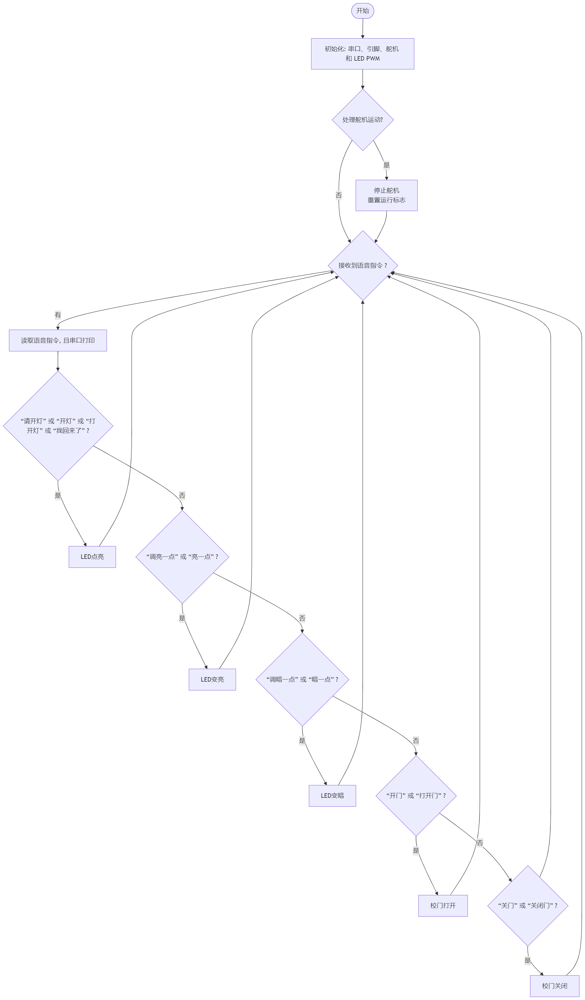

### 第11课 语音控制门灯系统

#### 11.1 项目介绍

语音控制门灯是一种基于智能语音识别技术的现代化家居控制系统，通过语音指令实现对门灯的开启、关闭等操作，为用户提供更便捷、智能的生活体验。

语音控制门灯系统代表了智能家居发展的重要方向，通过将传统的门灯控制与先进的语音识别技术相结合，不仅提升了用户的生活便利性，还为实现真正的智能学校生态奠定了基础。随着人工智能技术的不断进步，语音控制门灯将在安全性、智能化程度和用户体验方面持续优化，成为未来智能建筑的标准配置。

#### 11.2 流程图



#### 11.3 实验代码 


```c++
// 引入SoftwareSerial库，用于创建软串口
#include <SoftwareSerial.h>
#include <ESP32Servo.h>

// 创建软串口对象：RX引脚为IO25，TX引脚为IO26
// 用于连接语音识别模块
// 定义引脚常量
const int RX_PIN = 25; // 引脚 GPIO25 为 RX
const int TX_PIN = 26; // 引脚 GPIO26 为 TX

SoftwareSerial mySerial(RX_PIN, TX_PIN); // 定义软件串口引脚（RX, TX）

const int ledPin = 12; // 定义白色LED连接的引脚号（数字引脚IO12）
const int servoPin = 32; // 定义校门上的舵机引脚 IO32
Servo doorServo;    // 门舵机

// 舵机角度参数
int doorOpenAngle = 180;     // 门打开角度
int doorCloseAngle = 90;   // 门关闭角度
bool doorState = false;     // 门状态：false-关闭, true-打开

// 定义变量用于存储从语音模块接收到的控制码
volatile int Voice_Control = 0;  // 初始化为0，确保首次判断时不触发任何指令

// 非阻塞舵机控制变量
bool doorMoving = false;
unsigned long doorMoveStart = 0;
int targetAngle = 0;

void setup() {
  // 初始化硬件串口，用于调试输出，波特率9600
  Serial.begin(9600);
  // 初始化软串口，用于连接语音模块，波特率9600
  mySerial.begin(9600);
  // 设置LED引脚为输出模式
  pinMode(ledPin, OUTPUT); 
  // 初始化舵机
  doorServo.attach(servoPin);  
  // 初始位置：关闭状态
  doorServo.write(doorCloseAngle);
}

void loop() {
  // 处理舵机运动
  if (doorMoving && (millis() - doorMoveStart >= 1000)) {
    doorMoving = false;
    doorState = (targetAngle == doorOpenAngle);
    Serial.println(doorState ? "门已打开" : "门已关闭");
  }

  if (mySerial.available()) {  // 检查软串口是否有来自语音模块的数据可读
    Voice_Control = mySerial.read();  // 从软串口读取多个字节的数据
    Serial.println(Voice_Control);  // 将接收到的数据通过硬件串口输出到串口监视器，便于调试
  }
  if (Voice_Control == 1) { // 根据接收到的指令值1,执行相应操作
    analogWrite(ledPin, 150); // 当接收到值1时，点亮LED（灯的亮度为150）
  } else if (Voice_Control == 2) {   // 根据接收到的指令值2,执行相应操作
    analogWrite(ledPin, 0);   // 当接收到值2时，熄灭LED（关闭灯）
  } else if (Voice_Control == 3) {  // 根据接收到的指令值3,执行相应操作   
    analogWrite(ledPin, 255);  // 当接收到值3时，熄灭LED（灯的亮度为最亮） 
  } else if (Voice_Control == 4) {   // 根据接收到的指令值4,执行相应操作 
    analogWrite(ledPin, 100); // 当接收到值4时，熄灭LED（灯的亮度为暗）
  } else if (Voice_Control == 59) { // 根据接收到的指令值59,执行相应操作
    openDoor(); // 舵机转动，校门打开
  } else if (Voice_Control == 60) { // 根据接收到的指令值60,执行相应操作
    closeDoor(); // 舵机转动，校门关闭
  }
  // 清除指令，避免重复执行
  Voice_Control = 0;
}

// 打开校门
void openDoor() {
  if (!doorState && !doorMoving) {
    doorServo.write(doorOpenAngle);
    doorState = true;
    doorMoveStart = millis();
    targetAngle = doorOpenAngle;
    Serial.println("门正在打开...");
  } else {
    Serial.println("门已经是打开状态或正在运动");
  }
}

// 关闭校门
void closeDoor() {
  if (doorState && !doorMoving) {
    doorServo.write(doorCloseAngle);
    doorMoving = true;
    doorMoveStart = millis();
    targetAngle = doorCloseAngle;
    Serial.println("门正在关闭...");
  } else {
    Serial.println("门已经是关闭状态或正在运动");
  }
}
```

#### 11.4 实验结果

外接电源，选择好正确的开发板板型（ESP32 Dev Module）和 适当的串口端口（COMxx），然后单击按钮上传代码。代码上传成功后，可以通过智能语音模块来控制校门和路灯。

对着智能语音模块上的麦克风，使用唤醒词 “你好，小智” 或 “小智小智” 来唤醒智能语音模块，同时喇叭播放回复语 “有什么可以帮到您”；

智能语音模块唤醒后，对着麦克风说：“请开灯” 或 “开灯” 或 “打开灯” 或 “我回来了” 等命令词时，喇叭播放对应的回复语 “已为您打开照明”，同时路灯点亮；

对着麦克风说：“调亮一点” 或 “亮一点” 等命令词时，喇叭播放对应的回复语 “灯光已调亮”，同时路灯变亮;

对着麦克风说：“调暗一点” 或 “暗一点” 等命令词时，喇叭播放对应的回复语 “灯光已调暗”，同时路灯变暗;

对着麦克风说：“请关灯” 或 “关灯” 或 “关上灯” 或 “我出去了”等命令词时，喇叭播放对应的回复语 “已为您关闭照明”，同时路灯熄灭。

对着麦克风说：“开门” 或 “打开门”等命令词时，串口打印命令参数 “59”，喇叭播放对应的回复语 “已为您打开门”，同时校门打开；

对着麦克风说：“关门” 或 “关闭门” 等命令词时，串口打印命令参数 “60”，同时喇叭播放对应的回复语 “已为您关闭门”，同时校门关闭。


