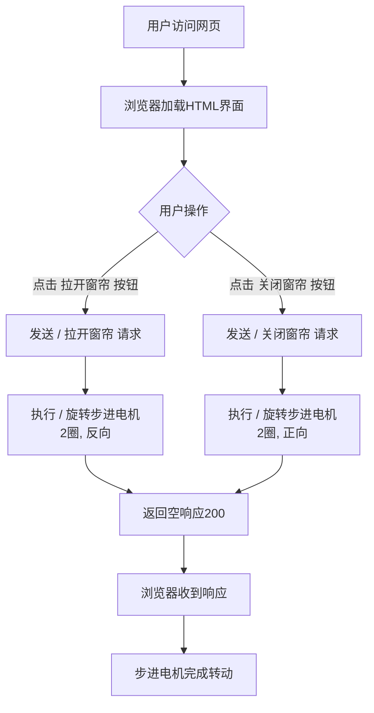
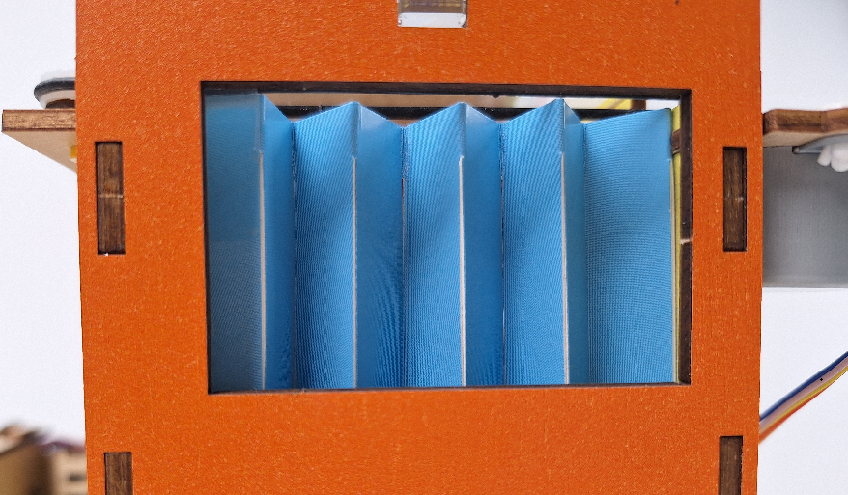
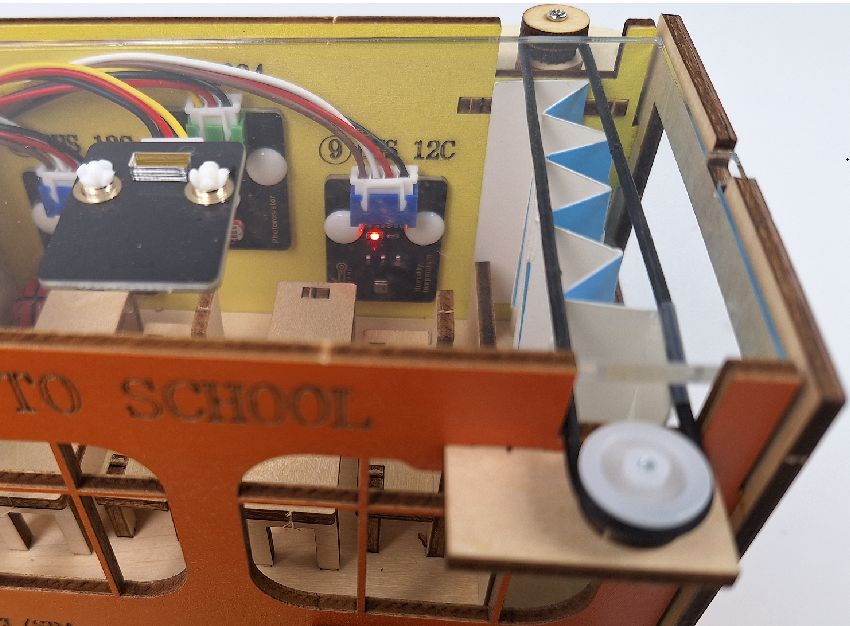
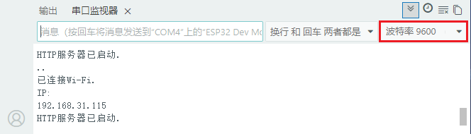

### 第17课 网页远程控制智能窗帘

 在智慧校园的建设中，物联网技术正逐步改变传统的校园管理模式。本课程以“网页远程控制智能窗帘”为实践项目，探索物联网在校园生活中的实际应用。

通过本项目，你不仅能做出一个“会听话”的窗帘，更能掌握物联网系统的核心逻辑——“感知-决策-执行”，为智慧校园的创新打开一扇窗。


#### 17.1 工作原理

**手机浏览器 → WiFi → ESP32 → 控制电机转2圈 → 窗帘开/关**

1. **手机/电脑** 打开网页（输入ESP32的IP地址）

2. **点击按钮**（正转/反转）

3. **ESP32收到指令**（通过WiFi）

4. **电机转动**（转2圈，窗帘移动对应距离）

5. **窗帘移动**（电机通过齿轮带动窗帘）


#### 17.2 流程图




#### 17.3 实验代码

⚠️ **<span style="color: rgb(255, 76, 65);">特别提醒： 打开代码文件后，需要分别将代码中的 `YourWiFiSSID` 和 `YourWiFiPassword` 替换为您自己的 WiFi名称 和 WiFi密码。</span>**

```c++
const char* ssid = "YourWiFiSSID";         // 修改为你的WiFi名称
const char* password = "YourWiFiPassword"; // 修改为你的WiFi密码
```

⚠️ **<span style="color: rgb(255, 76, 255);">特别注意：请确保代码中的WiFi名称和WiFi密码与连接到您的电脑、手机/平板、ESP32开发板和路由器的网络相同，它们必须在同一局域网（WiFi）内。</span>**

⚠️ **<span style="color: rgb(255, 76, 255);">特别注意：WiFi必须是2.4Ghz频率的，否则ESP32无法连接WiFi。</span>**

```c++
#include <Stepper.h>    // 步进电机控制库
#include <WiFi.h>       // ESP32 WiFi功能库
#include <WebServer.h>  // 网页服务器库
#include <Adafruit_GFX.h> // OLED库
#include <Adafruit_SH110X.h>

// 电机参数（28BYJ-48）
const int STEPS_PER_REV = 2038;  // 实际步数/圈
const int MOTOR_PIN1 = 14;       // IN1
const int MOTOR_PIN2 = 27;       // IN2
const int MOTOR_PIN3 = 16;       // IN3
const int MOTOR_PIN4 = 17;       // IN4

// 固定参数
const int motorSpeed = 10;      // 固定转速10rpm
const int rotationCount = 2;    // 固定旋转2圈

// 设置WiFi名称和WIFI密码
const char* ssid = "YourWiFiSSID";         // 修改为你自己的WiFi名称
const char* password = "YourWiFiPassword"; // 修改为你自己的WiFi密码

// 初始化步进电机（请注意引脚顺序：IN1 - IN3 - IN2 - IN4）
Stepper myStepper(STEPS_PER_REV, MOTOR_PIN1, MOTOR_PIN3, MOTOR_PIN2, MOTOR_PIN4);

// OLED 配置
#define SCREEN_WIDTH 128
#define SCREEN_HEIGHT 64
#define OLED_RESET -1  // 共享 I2C 重置操作
#define I2C_ADDRESS 0x3C  // 默认0x3C地址

// 创建一个显示对象
Adafruit_SH1106G display(SCREEN_WIDTH, SCREEN_HEIGHT, &Wire, OLED_RESET);

WebServer server(80);  // 在端口80上创建Web服务器

void setup() {
  Serial.begin(9600);
  
  Wire.begin(); // 初始化I2C总线
  
  // 初始化 OLED
  if(!display.begin(I2C_ADDRESS, true)) {  // 真正的分辨率是 128x64
    Serial.println("SH1106初始化失败");
    while(1);  // 陷入困境且无法继续前进
  }

  // 清空屏幕并设置文本属性
  display.clearDisplay();
  display.setTextSize(1);      // 文本尺寸
  display.setTextColor(SH110X_WHITE);  // 单色显示
  display.setCursor(0, 0);   // 设定起始位置

  // 连接到 WiFi
  WiFi.begin(ssid, password);
  Serial.print("正在连接WiFi...");
  while (WiFi.status() != WL_CONNECTED) {
    delay(500);
    Serial.print(".");
  }
  Serial.println("");
  Serial.println("已连接Wi-Fi.");
  Serial.print("IP: ");
  Serial.println(WiFi.localIP()); // 打印获取到的IP地址
  display.print("IP: ");
  display.println(WiFi.localIP()); // OLED显示获取到的IP地址
  display.display();
  
  // 设置路由器
  server.on("/", handleRoot);
  server.on("/forward", []() {
    rotateMotor(rotationCount, false);
    server.send(200, "text/plain", "");
  });
  server.on("/reverse", []() {
    rotateMotor(rotationCount, true);
    server.send(200, "text/plain", "");
  });
  
  server.begin();
  Serial.println("HTTP服务器已启动.");
}

void loop() {
  server.handleClient();
}

// 电机旋转功能
void rotateMotor(int turns, bool reverse) {
  myStepper.setSpeed(motorSpeed);
  int steps = STEPS_PER_REV * turns * (reverse ? -1 : 1);
  myStepper.step(steps);
}

// 网页界面（中文版）
void handleRoot() {
  String html = R"=====(
<!DOCTYPE html>
<html>
<head>
  <meta charset="UTF-8">
  <meta name="viewport" content="width=device-width, initial-scale=1">
  <title>ESP32 窗帘控制</title>
  <style>
    body { 
      font-family: Arial; 
      text-align: center; 
      margin: 0 auto; 
      padding: 20px; 
      max-width: 400px;
    }
    .control-panel {
      margin: 20px auto;
      padding: 20px;
      background: #f5f5f5;
      border-radius: 10px;
      box-shadow: 0 2px 5px rgba(0,0,0,0.1);
    }
    .btn {
      display: inline-block;
      padding: 12px 24px;
      margin: 10px;
      background: #3498db;
      color: white;
      text-decoration: none;
      border-radius: 5px;
      border: none;
      font-size: 16px;
      cursor: pointer;
      transition: background 0.3s;
    }
    .btn:hover {
      background: #2980b9;
    }
    .btn-reverse {
      background: #e74c3c;
    }
    .btn-reverse:hover {
      background: #c0392b;
    }
  </style>
</head>
<body>
  <div class="control-panel">
    <h2>ESP32 窗帘控制</h2>
    <p>固定设置：转速 10 转/分钟，每次 2 圈</p>
    <button class="btn" onclick="controlMotor('forward')">拉开窗帘</button>
    <button class="btn btn-reverse" onclick="controlMotor('reverse')">关闭窗帘</button>
  </div>

  <script>
    function controlMotor(direction) {
      fetch('/' + direction)
        .catch(err => console.log('请求失败', err));
    }
  </script>
</body>
</html>
)=====";
  
  server.send(200, "text/html", html);
}
```


#### 17.4 代码说明

**注意：此课程涉及HTML、CSS、JS等课外知识， 只做简单介绍。**

**1. 基础设置**

```c++
#include <Stepper.h>    // 步进电机控制库
#include <WiFi.h>       // ESP32 WiFi功能库
#include <WebServer.h>  // 网页服务器库
#include <Adafruit_GFX.h> // OLED库
#include <Adafruit_SH110X.h>

// 电机参数（28BYJ-48）
const int STEPS_PER_REV = 2038;  // 实际步数/圈
const int MOTOR_PIN1 = 14;       // IN1
const int MOTOR_PIN2 = 27;       // IN2
const int MOTOR_PIN3 = 16;       // IN3
const int MOTOR_PIN4 = 17;       // IN4

// 固定参数
const int motorSpeed = 10;      // 固定转速10rpm
const int rotationCount = 2;    // 固定旋转2圈

// 设置WiFi名称和WIFI密码
const char* ssid = "YourWiFiSSID";         // 修改为你的WiFi名称
const char* password = "YourWiFiPassword"; // 修改为你的WiFi密码

// 初始化步进电机（请注意引脚顺序：IN1 - IN3 - IN2 - IN4）
Stepper myStepper(STEPS_PER_REV, MOTOR_PIN1, MOTOR_PIN3, MOTOR_PIN2, MOTOR_PIN4);

// OLED 配置
#define SCREEN_WIDTH 128
#define SCREEN_HEIGHT 64
#define OLED_RESET -1  // 共享 I2C 重置操作
#define I2C_ADDRESS 0x3C  // 默认0x3C地址

// 创建一个显示对象
Adafruit_SH1106G display(SCREEN_WIDTH, SCREEN_HEIGHT, &Wire, OLED_RESET);

WebServer server(80);  // 在端口80上创建Web服务器
```

- 引入必要的库，设置WiFi账号名称与密码，定义步进电机引脚，OLED配置，初始化Web服务器。

<br>

**2. 初始化设置(setup函数)**

**连接WiFi网络，等待连接成功将IP地址打印在OLED屏和串口监视器。**

```c++
WiFi.begin(ssid, password);
Serial.print("正在连接WiFi...");
while (WiFi.status() != WL_CONNECTED) {
  delay(500);
  Serial.print(".");
}
Serial.println("");
Serial.println("已连接Wi-Fi.");
Serial.print("IP: ");
Serial.println(WiFi.localIP()); // 打印获取到的IP地址
display.print("IP: ");
display.println(WiFi.localIP()); // OLED显示获取到的IP地址
display.display(); 
```

**启动Web服务器**

```c++
server.begin(); // 启动Web服务器
Serial.println("HTTP server started");
```

<br>

**3. 主循环(loop函数)**

```c++
void loop() {
  server.handleClient(); // 处理客户端请求
}
```

- 持续监听来自浏览器的HTTP请求，并调用对应的处理函数（如`handleRoot`、`handleControl`等）。

<br>

**4. HTML网页内容**

```c++
  String html = R"=====(
...
)=====";
  
  server.send(200, "text/html", html);  // 发送完整HTML页面
```

- HTML网页的代码，页面包含正反转控制按钮和参数信息，并通过JavaScript与ESP32后端交互。


#### 17.5 实验结果

⚠️ <span style="color: rgb(200, 70, 100);">上传代码前请先将窗帘调整至下图所示位置：</span>





1. 外接电源，选择好正确的开发板板型（ESP32 Dev Module）和 适当的串口端口（COMxx），然后单击按钮上传代码。代码上传成功后，设置波特率为 `9600`，可以看到打印的IP地址 (<span style="color: rgb(255, 76, 65);">如果看不到，可以按下复位按键重新连接一次</span>)：

   

   OLED显示屏上同步显示IP地址：

   

2. 将IP地址输入到手机/电脑浏览器并打开，你将看到一个简单的控制页面。

   ⚠️ <span style="color: rgb(200, 70, 100);">注意：确保手机/电脑与ESP32连接到同一个 WiFi 。</span>

   

   

3. 点击 "拉开窗帘" 或 "关闭窗帘" 按钮来控制窗帘的打开或关闭。


#### 17.6 常见问题解决

1. 若串口监视器无任何信息打印，请按下ESP32主板的复位键：

   

2. 若ESP32 一直没有获取到 IP 地址，通常是因为 WiFi 连接失败，解决办法：

   - 确保代码里的 WiFi 名称和 WiFi密码已经替换为您自己的 Wi-Fi名称 和 WiFi密码。
   
   - 确保你的 WiFi 网络是 2.4GHz 的，ESP32不支持 5GHz WiFi。

3. 若输入IP地址无页面，解决办法：

   - 确保IP地址输入正确。
   
   - 检查手机/电脑是否与ESP32在同一网络。