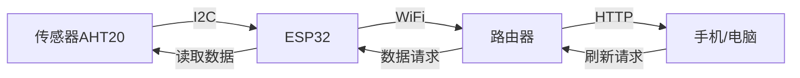
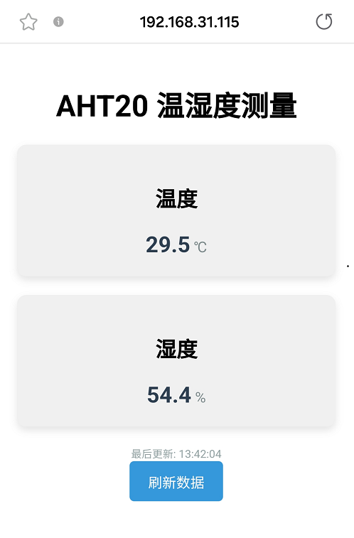

### 第18课 网页远程监测温湿度

在智慧校园建设中，环境感知是打造绿色、舒适、智能化教学空间的重要基础。本课程将带领你开发一套轻量级环境监测系统，通过ESP32微控制器和AHT20传感器，实现教室环境质量远程监管。

现在开始，用技术让校园环境管理更智能！


#### 18.1 工作原理

1. 数据采集：
   AHT20传感器 → ESP32（通过I2C）
2. 数据传输：
   ESP32 → 路由器 → 手机/电脑
3. 数据显示：
   浏览器请求 → 服务器响应 → 更新网页


#### 18.2 流程图




#### 18.3 实验代码

⚠️ **<span style="color: rgb(255, 76, 65);">特别提醒： 打开代码文件后，需要分别将代码中的 `YourWiFiSSID` 和 `YourWiFiPassword` 替换为您自己的 WiFi名称 和 WiFi密码。</span>**

```c++
const char* ssid = "YourWiFiSSID";         // 修改为你的WiFi名称
const char* password = "YourWiFiPassword"; // 修改为你的WiFi密码
```
⚠️ **<span style="color: rgb(255, 76, 255);">特别注意：请确保代码中的WiFi名称和WiFi密码与连接到您的电脑、手机/平板、ESP32开发板和路由器的网络相同，它们必须在同一局域网（WiFi）内。</span>**

⚠️ **<span style="color: rgb(255, 76, 255);">特别注意：WiFi必须是2.4Ghz频率的，否则ESP32无法连接WiFi。</span>**

```c++
#include <WiFi.h>
#include <WebServer.h>
#include <Adafruit_GFX.h>
#include <Adafruit_SH110X.h>
#include <Wire.h>
#include <AHT20.h>

// 设置WiFi名称和WiFi密码
const char* ssid = "YourWiFiSSID";         // 修改为你自己的WiFi名称
const char* password = "YourWiFiPassword"; // 修改为你自己的WiFi密码

WebServer server(80);  // 创建Web服务器对象，端口80
AHT20 aht20;           // 创建AHT20传感器对象

// OLED 配置
#define SCREEN_WIDTH 128
#define SCREEN_HEIGHT 64
#define OLED_RESET -1  // 共享 I2C 重置操作
#define I2C_ADDRESS 0x3C  // 默认0x3C地址

// 创建一个显示对象
Adafruit_SH1106G display(SCREEN_WIDTH, SCREEN_HEIGHT, &Wire, OLED_RESET);

void setup() {
  Serial.begin(9600);

  // 初始化 OLED
  if(!display.begin(I2C_ADDRESS, true)) {  // 真正的分辨率是 128x64
    Serial.println("SH1106初始化失败");
    while(1);  // 陷入困境且无法继续前进
  }

  // 清空屏幕并设置文本属性
  display.clearDisplay();
  display.setTextSize(1);      // 文本尺寸
  display.setTextColor(SH110X_WHITE);  // 单色显示
  display.setCursor(0, 0);   // 设定起始位置
  
  Wire.begin(); // 初始化I2C总线

  // 检查AHT20是否连接正常
  if (aht20.begin() == false) {
    Serial.println("AHT20未检测到,请检查接线.");
    while (1);
  }
  Serial.println("AHT20已确认");

  // 连接WiFi
  WiFi.begin(ssid, password);
  Serial.print("正在连接WiFi...");
  while (WiFi.status() != WL_CONNECTED) {
    delay(500);
    Serial.print(".");
  }
  Serial.println("");
  Serial.println("已连接Wi-Fi.");
  Serial.print("IP: ");
  Serial.println(WiFi.localIP());
  display.print("IP: ");
  display.println(WiFi.localIP());
  display.display();

  // 设置服务器
  server.on("/", handleRoot);       // 根路径
  server.on("/data", handleData);   // 数据API路径

  // 启动服务器
  server.begin();
  Serial.println("HTTP服务器已启动.");
}

void loop() {
  server.handleClient();  // 处理客户端请求
}

// 处理根路径请求（中文界面）
void handleRoot() {
  String html = R"=====(
<!DOCTYPE html>
<html>
<head>
  <meta charset="UTF-8">
  <meta name="viewport" content="width=device-width, initial-scale=1">
  <title>AHT20 温湿度测量</title>
  <style>
    body { font-family: Arial, sans-serif; text-align: center; margin: 0; padding: 20px; }
    .container { max-width: 600px; margin: 0 auto; }
    .data-box { 
      background-color: #f0f0f0; 
      border-radius: 10px; 
      padding: 20px; 
      margin: 20px 0; 
      box-shadow: 0 4px 8px rgba(0,0,0,0.1);
    }
    .value { font-size: 24px; font-weight: bold; color: #2c3e50; }
    .unit { font-size: 16px; color: #7f8c8d; }
    .updated { font-size: 12px; color: #95a5a6; margin-top: 10px; }
    button { 
      background-color: #3498db; 
      color: white; 
      border: none; 
      padding: 10px 20px; 
      border-radius: 5px; 
      cursor: pointer; 
      font-size: 16px;
    }
    button:hover { background-color: #2980b9; }
  </style>
</head>
<body>
  <div class="container">
    <h1>AHT20 温湿度测量</h1>
    
    <div class="data-box">
      <h2>温度</h2>
      <div><span id="temp-value" class="value">--</span> <span class="unit">℃</span></div>
    </div>
    
    <div class="data-box">
      <h2>湿度</h2>
      <div><span id="humi-value" class="value">--</span> <span class="unit">%</span></div>
    </div>
    
    <div class="updated" id="last-updated">最后更新: --</div>
    
    <button onclick="refreshData()">刷新数据</button>
  </div>

  <script>
    function refreshData() {
      fetch('/data')
        .then(response => response.json())
        .then(data => {
          document.getElementById('temp-value').textContent = data.temperature.toFixed(1);
          document.getElementById('humi-value').textContent = data.humidity.toFixed(1);
          const now = new Date();
          document.getElementById('last-updated').textContent = `最后更新: ${now.toLocaleTimeString()}`;
        })
        .catch(error => console.error('获取数据失败:', error));
    }
    
    // 页面加载时获取数据
    window.onload = refreshData;
    
    // 每5秒自动刷新数据
    setInterval(refreshData, 5000);
  </script>
</body>
</html>
)=====";

  server.send(200, "text/html", html);
}

// 处理数据API请求（保持JSON格式不变）
void handleData() {
  // 获取温湿度数据
  float temperature = aht20.getTemperature();
  float humidity = aht20.getHumidity();
  
  // 创建JSON响应
  String json = "{";
  json += "\"temperature\":" + String(temperature) + ",";
  json += "\"humidity\":" + String(humidity);
  json += "}";
  
  server.send(200, "application/json", json);
}
```


#### 18.4 代码说明

**注意：此课程涉及HTML、CSS、JS等课外知识， 只做简单介绍。**

**1. 硬件初始化**

```c++
  Wire.begin(); // 初始化I2C总线

  // 检查AHT20是否连接正常
  if (aht20.begin() == false) {
    Serial.println("AHT20未检测到,请检查接线.");
    while (1);
  }
  Serial.println("AHT20已确认");
```

- 通过I2C协议与传感器通信。若传感器未连接，程序会卡死在检测循环中。

<br>

**2. 网络服务部分**

**WiFi连接**

```c++
WiFi.begin(ssid, password);
Serial.print("正在连接WiFi...");
while (WiFi.status() != WL_CONNECTED) {
   delay(500);
   Serial.print(".");
}
Serial.println("");
Serial.println("已连接Wi-Fi.");
Serial.print("IP: ");
Serial.println(WiFi.localIP());
display.print("IP: ");
display.println(WiFi.localIP());
display.display();
```

- 连接成功后串口会打印ESP32的局域网IP地址，OLED显示ESP32的局域网IP地址。

**服务器初始化**

```c++
WebServer server(80);  // 创建端口80的HTTP服务器

// 设置服务器
server.on("/", handleRoot);       // 根路径
server.on("/data", handleData);   // 数据API路径

// 启动服务器
server.begin();
Serial.println("HTTP服务器已启动.");
```

- `/` ：返回可视化网页HTML

- `/data` ：返回JSON格式的传感器数据

<br>

**3. 数据处理**

```c++
float temperature = aht20.getTemperature();
float humidity = aht20.getHumidity();
String json = "{\"temperature\":" + String(temperature) + "...";
```

- 从传感器直接获取浮点型数据

- 手动拼接JSON字符串


**4. 动态更新**

```javascript
function refreshData() {
  fetch('/data')
    .then(response => response.json())
    .then(data => {
       document.getElementById('temp-value').textContent = data.temperature.toFixed(1);
       document.getElementById('humi-value').textContent = data.humidity.toFixed(1);
       const now = new Date();
       document.getElementById('last-updated').textContent = `最后更新: ${now.toLocaleTimeString()}`;
      })
       .catch(error => console.error('获取数据失败:', error));
}
    
// 页面加载时获取数据
window.onload = refreshData;
    
// 每5秒自动刷新数据
setInterval(refreshData, 5000);
```

- 通过 JavaScript 的 Fetch API 实现无刷新数据更新

- toFixed(1)保留1位小数

- 自动更新时间


#### 18.5 实验结果

1. 外接电源，选择好正确的开发板板型（ESP32 Dev Module）和 适当的串口端口（COMxx），然后单击按钮上传代码。代码上传成功后，设置波特率为 `9600`，可以看到打印的IPIP地址 (<span style="color: rgb(255, 76, 65);">如果看不到，可以按下复位按键重新连接一次</span>)：

   

   OLED显示屏上同步打印IP地址：
 
   

2. 在手机/电脑的浏览器中输入IP地址即可访问温湿度监测页面。

   ⚠️ <span style="color: rgb(200, 70, 100);">注意：确保手机/电脑与ESP32连接到同一个 WiFi 。</span>
   
    

   - 自动更新：页面打开时立即获取数据，页面自动刷新每5秒更新数据。
   
   - 手动更新：点击刷新按钮立即更新，操作后立即显示新数据。
   
   


#### 18.6 常见问题解决

1. 若串口监视器无任何信息打印，请按下ESP32主板的复位键：

   

2. 若ESP32 一直没有获取到 IP 地址，通常是因为 WiFi 连接失败，解决办法：

   - 确保代码里的 WiFi 名称和 WiFi密码已经替换为您自己的 Wi-Fi名称 和 WiFi密码。
   
   - 确保你的 WiFi 网络是 2.4GHz 的，ESP32不支持 5GHz WiFi。

3. 若输入IP地址无页面，解决办法：

   - 确保IP地址输入正确。
   
   - 检查手机/电脑是否与ESP32在同一网络。
