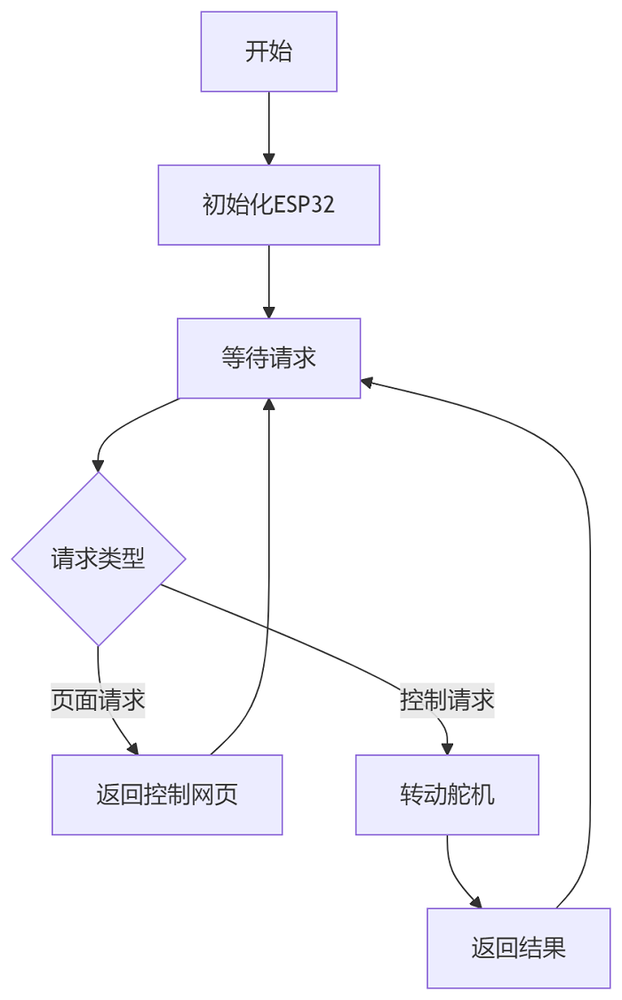
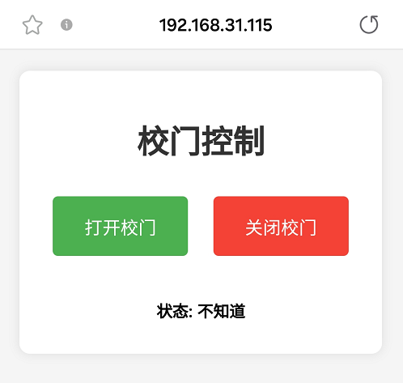
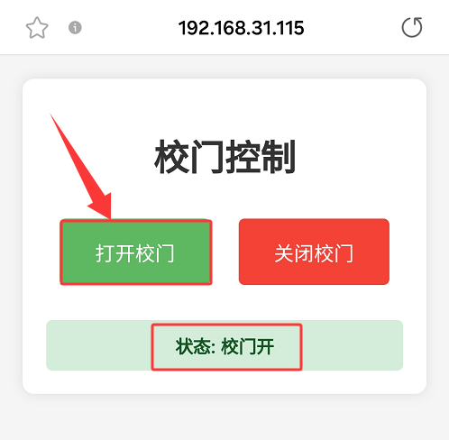
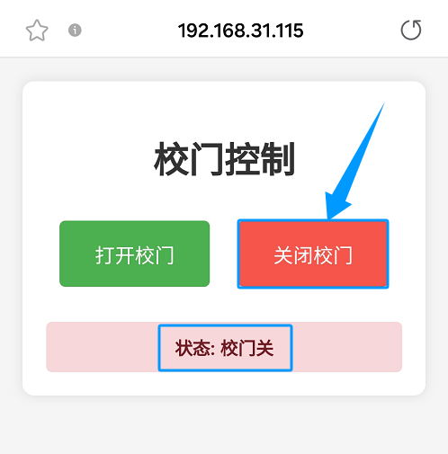
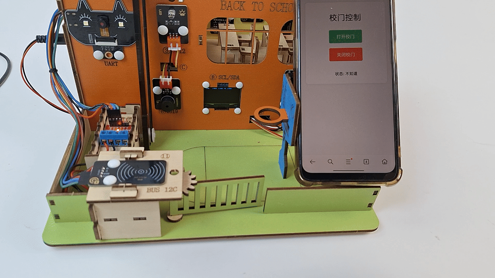

### 第19课 网页远程控制校门

在智慧校园的建设浪潮中，智能管控与远程互联正成为校园现代化的重要标志。本项目以"网页远程控制校门开关"为主题，带领您深入探索物联网技术在校园安全管理中的创新应用。

现在开始，用技术守护校园安全，用创新构建智慧管理环境，共同探索物联网技术在教育领域的无限可能！


#### 19.1 工作原理

**手机浏览器 → WiFi → ESP32 → 控制舵机转动 → 校门开/关**

1. **手机/电脑** 打开网页（输入ESP32的IP地址）

2. **点击按钮**（开门/关门）

3. **ESP32收到指令**（通过WiFi）

4. **舵机转动**（180°或90°，对应校门开和关）


#### 19.2 流程图




#### 19.3 实验代码

⚠️ **<span style="color: rgb(255, 76, 65);">特别提醒： 打开代码文件后，需要分别将代码中的 `YourWiFiSSID` 和 `YourWiFiPassword` 替换为您自己的 WiFi名称 和 WiFi密码。</span>**

```c++
const char* ssid = "YourWiFiSSID";         // 修改为你的WiFi名称
const char* password = "YourWiFiPassword"; // 修改为你的WiFi密码
```

⚠️ **<span style="color: rgb(255, 76, 255);">特别注意：请确保代码中的WiFi名称和WiFi密码与连接到您的电脑、手机/平板、ESP32开发板和路由器的网络相同，它们必须在同一局域网（WiFi）内。</span>**

⚠️ **<span style="color: rgb(255, 76, 255);">特别注意：WiFi必须是2.4Ghz频率的，否则ESP32无法连接WiFi。</span>**

```c++
#include <WiFi.h>        // 提供ESP32的WiFi连接功能
#include <WebServer.h>   // 提供ESP32的Web服务器功能
#include <ESP32Servo.h>  // 专门用于ESP32的舵机控制库
#include <Adafruit_GFX.h> // 专门用于OLED控制库
#include <Adafruit_SH110X.h> // 专门用于OLED控制库

// 设置WiFi名称和WiFi密码
const char* ssid = "YourWiFiSSID";         // 修改为你自己的WiFi名称
const char* password = "YourWiFiPassword"; // 修改为你自己的WiFi密码

WebServer server(80);
Servo myServo;

// 舵机控制引脚
const int servoPin = 32;

// OLED 配置
#define SCREEN_WIDTH 128
#define SCREEN_HEIGHT 64
#define OLED_RESET -1  // 共享 I2C 重置操作
#define I2C_ADDRESS 0x3C  // 默认0x3C地址

// 创建一个显示对象
Adafruit_SH1106G display(SCREEN_WIDTH, SCREEN_HEIGHT, &Wire, OLED_RESET);

void handleRoot() {
  // 发送 HTML 页面
  String html = R"rawliteral(
<!DOCTYPE html>
<html lang="zh-CN">
<head>
    <meta charset="UTF-8">
    <meta name="viewport" content="width=device-width, initial-scale=1.0">
    <title>ESP32 Servo Control</title>
    <style>
        body {
            font-family: Arial, sans-serif;
            text-align: center;
            margin: 0;
            padding: 20px;
            background-color: #f5f5f5;
        }
        .container {
            max-width: 400px;
            margin: 0 auto;
            background: white;
            padding: 20px;
            border-radius: 10px;
            box-shadow: 0 0 10px rgba(0,0,0,0.1);
        }
        h1 {
            color: #333;
        }
        .btn {
            display: inline-block;
            padding: 15px 30px;
            margin: 10px;
            font-size: 18px;
            border: none;
            border-radius: 5px;
            cursor: pointer;
            transition: background-color 0.3s;
        }
        .open-btn {
            background-color: #4CAF50;
            color: white;
        }
        .close-btn {
            background-color: #f44336;
            color: white;
        }
        .btn:hover {
            opacity: 0.9;
        }
        .status {
            margin-top: 20px;
            padding: 10px;
            border-radius: 5px;
            font-weight: bold;
        }
        .open {
            background-color: #d4edda;
            color: #155724;
        }
        .closed {
            background-color: #f8d7da;
            color: #721c24;
        }
    </style>
</head>
<body>
    <div class="container">
        <h1>校门控制</h1>
        <button class="btn open-btn" onclick="controlServo(180)">打开校门</button>
        <button class="btn close-btn" onclick="controlServo(90)">关闭校门</button>
        <div id="status" class="status">状态: 不知道</div>
    </div>

    <script>
        function controlServo(angle) {
            // Update status display
            const statusElem = document.getElementById('status');
            statusElem.textContent = angle === 180 ? '状态: 校门开...' : '状态: 校门关...';
            statusElem.className = 'status';
            
            // Send a request to ESP32
            fetch(`/control?angle=${angle}`)
                .then(response => response.text())
                .then(data => {
                    statusElem.textContent = `状态: ${angle === 180 ? '校门开' : '校门关'}`;
                    statusElem.className = `status ${angle === 180 ? 'open' : 'closed'}`;
                })
                .catch(error => {
                    console.error('Error:', error);
                    statusElem.textContent = 'Operation failed. Please try again';
                    statusElem.className = 'status';
                });
        }
    </script>
</body>
</html>
)rawliteral";
  
  server.send(200, "text/html", html);
}

void handleControl() {
  if (server.hasArg("angle")) {
    int angle = server.arg("angle").toInt();
    
    // 控制舵机使其旋转至指定角度
    myServo.write(angle);
    
    // 接收回复
    String message = angle == 180 ? "Door opened" : "Door closed"; // 原始字符串字面量
    server.send(200, "text/plain", message); // 发送HTML响应
    
    Serial.print("Servo rotates to: ");
    Serial.print(angle);
    Serial.println("°");
  } else {
    server.send(400, "text/plain", "参数错误");
  }
}

void setup() {
  Serial.begin(9600);
  Wire.begin(); // 初始化I2C总线
  
  // 初始化 OLED
  if(!display.begin(I2C_ADDRESS, true)) {  // 真正的分辨率是 128x64
    Serial.println("SH1106初始化失败");
    while(1);  // 陷入困境且无法继续前进
  }

  // 清空屏幕并设置文本属性
  display.clearDisplay();
  display.setTextSize(1);      // 文本尺寸
  display.setTextColor(SH110X_WHITE);  // 单色显示
  display.setCursor(0, 0);   // 设定起始位置

  // 允许 ESP32 使用舵机
  ESP32PWM::allocateTimer(0);
  ESP32PWM::allocateTimer(1);
  ESP32PWM::allocateTimer(2);
  ESP32PWM::allocateTimer(3);
  
  // 连接WiFi
  WiFi.begin(ssid, password);
  Serial.print("正在连接WiFi...");
  while (WiFi.status() != WL_CONNECTED) {
    delay(500);
    Serial.print(".");
  }
  Serial.println("");
  Serial.println("已连接Wi-Fi.");
  Serial.print("IP: ");
  Serial.println(WiFi.localIP());
  display.print("IP: ");
  display.println(WiFi.localIP());
  display.display();
  
  // 设置舵机
  myServo.setPeriodHertz(50);    // 标准 50 赫兹舵机系统
  myServo.attach(servoPin, 500, 2400); // 连接到舵机引脚，并设置最小和最大脉冲宽度
  
  // 将舵机的位置初始化至校门关闭状态(90°)
  myServo.write(90);
  
  // 设置路由器
  server.on("/", handleRoot);
  server.on("/control", handleControl);
  
  // 启动服务器
  server.begin();
  Serial.println("HTTP服务器已启动");
}

void loop() {
  server.handleClient();
}
```


#### 19.4 代码说明

**注意：此课程涉及HTML、CSS、JS等课外知识， 只做简单介绍。**

**1. 库引入详解**

```c++
#include <WiFi.h>        // 提供ESP32的WiFi连接功能
#include <WebServer.h>   // 提供ESP32的Web服务器功能
#include <ESP32Servo.h>  // 专门用于ESP32的舵机控制库
```

- **WiFi.h**：使ESP32能够连接无线网络，作为Web服务器

- **WebServer.h**：让ESP32能够处理HTTP请求和响应

- **ESP32Servo.h**：简化舵机控制，提供高级API控制舵机角度

<br>

**2. 常量和全局变量定义**

```c++
// 网络凭证 - 需要用户修改的部分
const char* ssid = "YourWiFiSSID";      // WiFi名称
const char* password = "YourWiFiPassword"; // WiFi密码

WebServer server(80);  // 创建Web服务器实例，监听80端口(HTTP默认端口)
Servo myServo;         // 创建舵机对象实例

const int servoPin = 32; // 舵机信号线连接的GPIO引脚
```

<br>

**3. 网页请求处理函数**

**handleRoot()函数**

此函数处理对根路径("/")的请求，返回完整的HTML页面：

```c++
void handleRoot() {
  String message = angle == 180 ? "Door opened" : "Door closed"; // 原始字符串字面量
  server.send(200, "text/plain", message); // 发送HTML响应
}
```

**页面结构**:

- 包含标题 "校门控制"

- 两个控制按钮(开门和关门)

- 状态显示区域

<br>

**handleControl()函数**

处理控制请求("/control"):

```c++
void handleControl() {
  if (server.hasArg("angle")) {
    int angle = server.arg("angle").toInt();
    
    // 控制舵机使其旋转至指定角度
    myServo.write(angle);
    
    // 接收回复
    String message = angle == 180 ? "Door opened" : "Door closed"; // 原始字符串字面量
    server.send(200, "text/plain", message); // 发送HTML响应
    
    Serial.print("Servo rotates to: ");
    Serial.print(angle);
    Serial.println("°");
  } else {
    server.send(400, "text/plain", "参数错误");
  }
}
```

<br>

**4. setup()函数详解**

```c++
void setup() {
  Serial.begin(9600);
  Wire.begin(); // 初始化I2C总线
  
  // 初始化 OLED
  if(!display.begin(I2C_ADDRESS, true)) {  // 真正的分辨率是 128x64
    Serial.println("SH1106初始化失败");
    while(1);  // 陷入困境且无法继续前进
  }

  // 清空屏幕并设置文本属性
  display.clearDisplay();
  display.setTextSize(1);      // 文本尺寸
  display.setTextColor(SH110X_WHITE);  // 单色显示
  display.setCursor(0, 0);   // 设定起始位置

  // 允许 ESP32 使用舵机
  ESP32PWM::allocateTimer(0);
  ESP32PWM::allocateTimer(1);
  ESP32PWM::allocateTimer(2);
  ESP32PWM::allocateTimer(3);
  
  // 连接WiFi
  WiFi.begin(ssid, password);
  Serial.print("正在连接WiFi...");
  while (WiFi.status() != WL_CONNECTED) {
    delay(500);
    Serial.print(".");
  }
  Serial.println("");
  Serial.println("已连接Wi-Fi.");
  Serial.print("IP: ");
  Serial.println(WiFi.localIP());
  display.print("IP: ");
  display.println(WiFi.localIP());
  display.display();
  
  // 设置舵机
  myServo.setPeriodHertz(50);    // 标准 50 赫兹舵机系统
  myServo.attach(servoPin, 500, 2400); // 连接到舵机引脚，并设置最小和最大脉冲宽度
  
  // 将舵机的位置初始化至校门关闭状态(90°)
  myServo.write(90);
  
  // 设置路由器
  server.on("/", handleRoot);
  server.on("/control", handleControl);
  
  // 启动服务器
  server.begin();
  Serial.println("HTTP服务器已启动");
}
```

<br>

**5. loop()函数**

```c++
void loop() {
  server.handleClient(); // 处理客户端请求
}
```

此函数不断检查并处理来自客户端的HTTP请求，保持Web服务器运行。


#### 19.5 实验结果

1. 外接电源，选择好正确的开发板板型（ESP32 Dev Module）和 适当的串口端口（COMxx），然后单击按钮上传代码。代码上传成功后，设置波特率为 `9600`，可以看到打印的IP地址 (<span style="color: rgb(255, 76, 65);">如果看不到，可以按下复位按键重新连接一次</span>)：

   

   OLED显示屏上同步显示IP地址：

   

2. 在手机/电脑的浏览器中输入IP地址即可访问校门控制页面。

   ⚠️ <span style="color: rgb(200, 70, 100);">注意：确保手机/电脑与ESP32连接到同一个 WiFi 。</span> 
   
   
   
   

   - 打开校门：开门按钮
   
   

   - 关闭校门：关门按钮
   
   

   - 状态：显示当前校门的开关状态
   


#### 19.6 常见问题解决

1. 若串口监视器无任何信息打印，请按下ESP32主板的复位键：

   

2. 若ESP32 一直没有获取到 IP 地址，通常是因为 WiFi 连接失败，解决办法：

   - 确保代码里的 WiFi 名称和 WiFi密码已经替换为您自己的 Wi-Fi名称 和 WiFi密码。
   
   - 确保你的 WiFi 网络是 2.4GHz 的，ESP32不支持 5GHz WiFi。

3. 若输入IP地址无页面，解决办法：

   - 确保IP地址输入正确。
   
   - 检查手机/电脑是否与ESP32在同一网络。