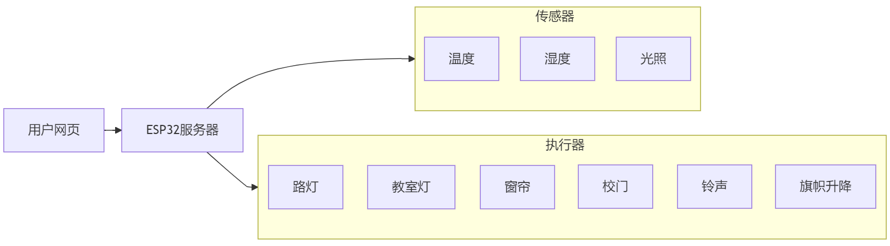
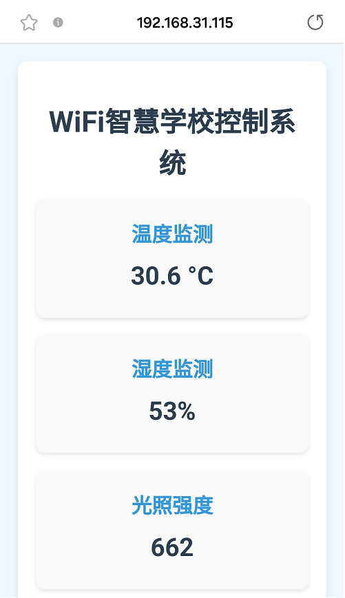
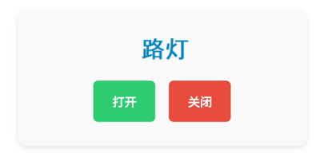
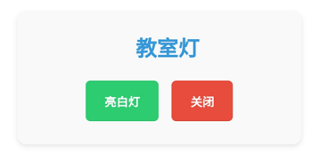
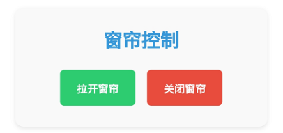
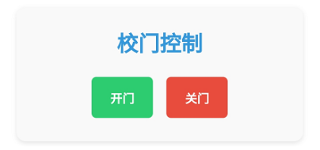
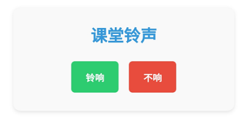
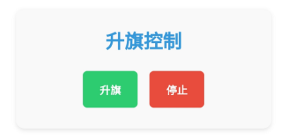

### 第21课 WiFi智慧校园

本WIFI智慧校园课程将指导您开发一个集环境监测与设备控制于一体的物联网应用系统。通过网页端实时监控教室内的温湿度、光照强度等环境数据，并支持远程控制窗帘开关、旗帜升降、教室灯、铃声与操场灯的明灭以及校门启闭状态。一起来助力绿色智慧校园建设吧！


#### 21.1 流程图





#### 21.2 实验代码

⚠️ **<span style="color: rgb(255, 76, 65);">特别提醒： 打开代码文件后，需要分别将代码中的 `YourWiFiSSID` 和 `YourWiFiPassword` 替换为您自己的 WiFi名称 和 WiFi密码。</span>**

```c++
const char* ssid = "YourWiFiSSID";         // 修改为你的WiFi名称
const char* password = "YourWiFiPassword"; // 修改为你的WiFi密码
```
⚠️ **<span style="color: rgb(255, 76, 255);">特别注意：请确保代码中的WiFi名称和WiFi密码与连接到您的电脑、手机/平板、ESP32开发板和路由器的网络相同，它们必须在同一局域网（WiFi）内。</span>**

⚠️ **<span style="color: rgb(255, 76, 255);">特别注意：WiFi必须是2.4Ghz频率的，否则ESP32无法连接WiFi。</span>**

```c++
#include <WiFi.h>
#include <WebServer.h>
#include <Wire.h>
#include <AHT20.h>
#include <Stepper.h>
#include <ESP32Servo.h>
#include <Adafruit_GFX.h>
#include <Adafruit_SH110X.h>
#include <Adafruit_NeoPixel.h>


// 设置WiFi名称和WiFi密码
const char* ssid = "YourWiFiSSID";         // 修改为你自己的WiFi名称
const char* password = "YourWiFiPassword"; // 修改为你自己的WiFi密码

// OLED 配置
#define SCREEN_WIDTH 128
#define SCREEN_HEIGHT 64
#define OLED_RESET -1  // 共享 I2C 重置操作
#define I2C_ADDRESS 0x3C  // 默认0x3C地址

// 定义引脚
#define LIGHT_SENSOR_PIN 34
#define LED_PIN 12
#define RGB_LED_PIN 4
#define SERVO_PIN 32

// 配置 RGB
#define RGB_LED_COUNT 4
Adafruit_NeoPixel rgbLeds(RGB_LED_COUNT, RGB_LED_PIN, NEO_GRB + NEO_KHZ800);

// 创建一个显示对象
Adafruit_SH1106G display(SCREEN_WIDTH, SCREEN_HEIGHT, &Wire, OLED_RESET);

// 设置步进电机
const int STEPS_PER_REV = 2038;  // 每回合的实际步数
const int MOTOR_PIN1 = 14;       // IN1
const int MOTOR_PIN2 = 27;       // IN2  
const int MOTOR_PIN3 = 16;       // IN3
const int MOTOR_PIN4 = 17;       // IN4

// 设置蜂鸣器连接至GPIO19（必须是支持PWM的引脚）
const int BUZZER_PIN = 19; 

// 设置电机驱动板的引脚
const int MOTOR_IB = 13;  // B-IB
const int MOTOR_IA = 5;   // B-IA

// 初始化步进电机（请注意引脚顺序：IN1 - IN3 - IN2 - IN4）
Stepper myStepper(STEPS_PER_REV, MOTOR_PIN1, MOTOR_PIN3, MOTOR_PIN2, MOTOR_PIN4);

// 舵机
Servo myservo;
int servoAngle = 90;

// 传感器实例
AHT20 aht20;

// 网络服务器实例
WebServer server(80);

// 设置 RGB亮白灯
void setRGBWhite() {
  for (int i = 0; i < RGB_LED_COUNT; i++) {
    rgbLeds.setPixelColor(i, rgbLeds.Color(255, 255, 255));
  }
  rgbLeds.show();
}

// 关闭RGB
void setRGBOff() {
  for (int i = 0; i < RGB_LED_COUNT; i++) {
    rgbLeds.setPixelColor(i, rgbLeds.Color(0, 0, 0));
  }
  rgbLeds.show();
}

void setup() {
  Serial.begin(9600);

  // 初始化LED引脚
  pinMode(LED_PIN, OUTPUT);
  digitalWrite(LED_PIN, LOW);
  
  // 初始化 SK6812 RGB 灯带
  rgbLeds.begin();
  rgbLeds.setBrightness(100);
  setRGBOff(); // SK6812 RGB初始状态是关闭的。
  
  // 初始化步进电机的速度
  myStepper.setSpeed(10);
  
  // 初始化电机驱动板
  pinMode(MOTOR_IA, OUTPUT);
  pinMode(MOTOR_IB, OUTPUT);
  digitalWrite(MOTOR_IA, LOW); // 不转
  digitalWrite(MOTOR_IB, LOW);
  
  // 初始化无源蜂鸣器
  pinMode(BUZZER_PIN, OUTPUT);
  
  // 初始化舵机
  myservo.attach(SERVO_PIN);
  myservo.write(servoAngle);

  Wire.begin(); // 初始化I2C总线
  
  // 检查 AHT20 是否连接正确
  if (aht20.begin() == false) {
    Serial.println("AHT20 not detected. Please check wiring.");
    while (1);
  }
  Serial.println("AHT20 acknowledged");

  // 初始化 OLED
  if(!display.begin(I2C_ADDRESS, true)) {  // 真正的分辨率是 128x64
    Serial.println("SH1106初始化失败");
    while(1);  // 陷入困境且无法继续前进
  }

  // 清空屏幕并设置文本属性
  display.clearDisplay();
  display.setTextSize(1);      // 文本尺寸
  display.setTextColor(SH110X_WHITE);  // 单色显示
  display.setCursor(0, 0);   // 设定起始位置（中心位置）

  // 连接 Wi-Fi
  WiFi.begin(ssid, password);
  Serial.print("正在连接WiFi...");
  while (WiFi.status() != WL_CONNECTED) {
    delay(500);
    Serial.print(".");
  }
  Serial.println("");
  Serial.println("已连接Wi-Fi.");
  Serial.print("IP: ");
  Serial.println(WiFi.localIP());
  display.print("IP: ");
  display.println(WiFi.localIP());
  display.display();

  // 设置服务路由器
  server.on("/", handleRoot);       // 根路径
  server.on("/data", handleData);   // 数据 API 路径
  server.on("/control", handleControl); // 控制路径

  // 启动服务器
  server.begin();
  Serial.println("HTTP服务器已启动.");
}

void loop() {
  server.handleClient();  // 处理客户请求
}

// 处理根路径请求
void handleRoot() {
  String html = R"=====(
<!DOCTYPE html>
<html>
<head>
  <meta charset="UTF-8">
  <meta name="viewport" content="width=device-width, initial-scale=1">
  <title>WIFI智慧学校控制系统</title>
  <style>
    body { 
      font-family: Arial, sans-serif; 
      text-align: center; 
      margin: 0; 
      padding: 20px; 
      background: #f0f8ff;
    }
    .container { 
      max-width: 1000px; 
      margin: 0 auto; 
      background: white; 
      padding: 20px; 
      border-radius: 10px; 
      box-shadow: 0 4px 8px rgba(0,0,0,0.1);
    }
    h1 { 
      color: #2c3e50; 
      margin-bottom: 20px;
    }
    .dashboard {
      display: grid;
      grid-template-columns: repeat(auto-fit, minmax(300px, 1fr));
      gap: 20px;
      margin: 20px 0;
    }
    .card {
      background: #f9f9f9;
      padding: 20px;
      border-radius: 10px;
      box-shadow: 0 2px 5px rgba(0,0,0,0.1);
    }
    .card h2 {
      color: #3498db;
      margin-top: 0;
      margin-bottom: 15px;
    }
    .value {
      font-size: 28px;
      font-weight: bold;
      color: #2c3e50;
      margin: 10px 0;
    }
    .btn {
      padding: 12px 20px;
      margin: 5px;
      border: none;
      border-radius: 5px;
      cursor: pointer;
      font-weight: bold;
    }
    .btn-on {
      background: #2ecc71;
      color: white;
    }
    .btn-off {
      background: #e74c3c;
      color: white;
    }
    .update-time {
      color: #95a5a6;
      margin-top: 20px;
      font-size: 14px;
    }
  </style>
</head>
<body>
  <div class="container">
    <h1>WiFi智慧学校控制系统</h1>
    
    <div class="dashboard">
      <div class="card">
        <h2>温度监测</h2>
        <div class="value" id="temperature">--</div>
      </div>
      
      <div class="card">
        <h2>湿度监测</h2>
        <div class="value" id="humidity">--</div>
      </div>
      
      <div class="card">
        <h2>光照强度</h2>
        <div class="value" id="light-value">--</div>
      </div>
      
      <div class="card">
        <h2>路灯</h2>
        <div>
          <button class="btn btn-on" onclick="controlDevice('led', 'on')">打开</button>
          <button class="btn btn-off" onclick="controlDevice('led', 'off')">关闭</button>
        </div>
      </div>
      
      <div class="card">
        <h2>教室灯</h2>
        <div>
          <button class="btn btn-on" onclick="controlDevice('rgb', 'on')">亮白灯</button>
          <button class="btn btn-off" onclick="controlDevice('rgb', 'off')">关闭</button>
        </div>
      </div>
      
      <div class="card">
        <h2>窗帘控制</h2>
        <div>
          <button class="btn btn-on" onclick="controlDevice('stepper', 'forward')">拉开窗帘</button>
          <button class="btn btn-off" onclick="controlDevice('stepper', 'reverse')">关闭窗帘</button>
        </div>
      </div>
      
      <div class="card">
        <h2>校门控制</h2>
        <div>
          <button class="btn btn-on" onclick="controlDevice('servo', '180')">开门</button>
          <button class="btn btn-off" onclick="controlDevice('servo', '90')">关门</button>
        </div>
      </div>

      <div class="card">
        <h2>课堂铃声</h2>
        <div>
          <button class="btn btn-on" onclick="controlDevice('buzzer', 'on')">铃响</button>
          <button class="btn btn-off" onclick="controlDevice('buzzer', 'off')">不响</button>
        </div>
      </div>
      
      <div class="card">
        <h2>降旗控制</h2>
        <div>
          <button class="btn btn-on" onclick="controlDevice('motor1', 'on')">降旗</button>
          <button class="btn btn-off" onclick="controlDevice('motor1', 'off')">停止</button>
        </div>
      </div>
     
      <div class="card">
        <h2>升旗控制</h2>
        <div>
          <button class="btn btn-on" onclick="controlDevice('motor2', 'on')">升旗</button>
          <button class="btn btn-off" onclick="controlDevice('motor2', 'off')">停止</button>
        </div>
      </div>
    </div>
          
    <p class="update-time">最新更新:  <span id="update-time">--</span></p>
  </div>

  <script>
    function controlDevice(device, state) {
      fetch('/control?device=' + device + '&state=' + state)
        .then(response => response.text())
        .then(data => console.log(data))
        .catch(error => console.error('Control error:', error));
    }

    function refreshData() {
      fetch('/data')
        .then(response => response.json())
        .then(data => {
          document.getElementById('temperature').innerHTML = data.temperature.toFixed(1) + ' &deg;C';
          document.getElementById('humidity').textContent = data.humidity.toFixed(0) + '%';
          document.getElementById('light-value').textContent = data.light;
          
          const now = new Date();
          document.getElementById('update-time').textContent = now.toLocaleTimeString();
        })
        .catch(error => console.error('Obtain dara failed:', error));
    }
    
    // Obtain data when the page is loading
    window.onload = refreshData;
    
    // Refresh the data every 2 seconds
    setInterval(refreshData, 2000);
  </script>
</body>
</html>
)=====";

  server.send(200, "text/html", html);
}

// 处理数据 API 请求
void handleData() {
  // 获取传感器数据
  float temperature = 0;
  float humidity = 0;
  int lightValue = 0;
  
  // 直接从 AHT20 传感器读取数据
  temperature = aht20.getTemperature();
  humidity = aht20.getHumidity();
  
  lightValue = analogRead(LIGHT_SENSOR_PIN);

  // 创建一个 JSON 响应
  String json = "{";
  json += "\"temperature\":" + String(temperature) + ",";
  json += "\"humidity\":" + String(humidity) + ",";
  json += "\"light\":" + String(lightValue);
  json += "}";
  
  server.send(200, "application/json", json);
}

// 处理控制请求
void handleControl() {
  if (server.hasArg("device") && server.hasArg("state")) {
    String device = server.arg("device");
    String state = server.arg("state");
    
    if (device == "led") {
      if (state == "on") {
        digitalWrite(LED_PIN, HIGH);
        server.send(200, "text/plain", "OK");
      } else if (state == "off") {
        digitalWrite(LED_PIN, LOW);
        server.send(200, "text/plain", "OK");
      }
    }
    else if (device == "rgb") {
      if (state == "on") {
        setRGBWhite();
        server.send(200, "text/plain", "OK");
      } else if (state == "off") {
        setRGBOff();
        server.send(200, "text/plain", "OK");
      }
    }
    else if (device == "stepper") {
      if (state == "forward") {
        // 正向旋转 2 圈
        myStepper.step(STEPS_PER_REV * 2);
        server.send(200, "text/plain", "OK");
      } else if (state == "reverse") {
        // 反向旋转 2 圈
        myStepper.step(STEPS_PER_REV * -2);
        server.send(200, "text/plain", "OK");
      }
    }
    else if (device == "servo") {
      servoAngle = state.toInt();
      myservo.write(servoAngle);
      delay(100);
      server.send(200, "text/plain", "OK");
    }
    else if (device == "buzzer") {
      if (state == "on") {
        tone(BUZZER_PIN, 1000);  // 频率1000Hz
        delay(100);  
        server.send(200, "text/plain", "OK");
      } else if (state == "off") {
        noTone(BUZZER_PIN);
        server.send(200, "text/plain", "OK");
      }
    }
    else if (device == "motor1") {
      if (state == "on") {
        analogWrite(MOTOR_IA, 0); // 反转
        analogWrite(MOTOR_IB, 150);
        delay(800);
        analogWrite(MOTOR_IA, 0); // 不转
        analogWrite(MOTOR_IB, 0);
        server.send(200, "text/plain", "OK");
      } else if (state == "off") {
        analogWrite(MOTOR_IA, 0); // 不转
        analogWrite(MOTOR_IB, 0);
        server.send(200, "text/plain", "OK");
      }
    }
    else if (device == "motor2") {
      if (state == "on") {
        analogWrite(MOTOR_IA, 150); // 正转
        analogWrite(MOTOR_IB, 0);
        delay(800);
        analogWrite(MOTOR_IA, 0); // 不转
        analogWrite(MOTOR_IB, 0);
        server.send(200, "text/plain", "OK");
      } else if (state == "off") {
        analogWrite(MOTOR_IA, 0); // 不转
        analogWrite(MOTOR_IB, 0);
        server.send(200, "text/plain", "OK");
      }
    }
  }
}
```


#### 21.3 代码说明

**注意：此课程涉及HTML、CSS、JS等课外知识， 且代码都有详细的注释，这里只做简单介绍。**

**网络功能**

- WiFi连接

- Web服务器 (端口80)

**传感器数据监测**

- 温度监测：AHT20传感器实时监测环境温度

- 湿度监测：AHT20传感器实时监测环境湿度

- 光照监测：光敏电阻检测环境光照强度

**设备控制功能**

- 路灯控制：通过GPIO 12控制LED的开与关

- 教室灯控制：通过RGB LED灯带实现白光的开与关

- 窗帘控制：步进电机正反转控制窗帘拉开与关闭

- 校门控制：舵机控制校门的开关角度(180°开门, 90°关门)

- 课堂铃声：通过蜂鸣器鸣叫发声，提示上下课

- 降旗控制：通过电机驱动板控制电机来实现旗帜的下降与停止

- 升旗控制：通过电机驱动板控制电机来实现旗帜的上升与停止

**用户界面**

- 网页界面：响应式设计，支持电脑和手机访问

- OLED显示：本地显示IP地址


#### 21.4 实验结果

外接电源，选择好正确的开发板板型（ESP32 Dev Module）和 适当的串口端口（COMxx），然后单击按钮上传代码。代码上传成功后，设置波特率为 `9600`，可以看到打印的IP地址 (<span style="color: rgb(255, 76, 65);">如果看不到，可以按下复位按键重新连接一次</span>)：


OLED显示屏上显示打印IP地址：


将**你的IP地址**输入到手机/电脑浏览器并打开，即可访问智慧校园页面。

⚠️ <span style="color: rgb(200, 70, 100);">注意：确保手机/电脑与ESP32连接到同一个 WiFi 。</span>



可以看到实时显示温度值、湿度值和室内光照值，方便我们监测教室内的情况。



- 按下 **打开** 按钮，打开校园路灯；按下 **关闭** 按钮，关闭校园路灯。



- 按下 **亮白灯**按钮 ，打开教室灯；按下 **关闭** 按钮，关闭教室灯。



- 按下 **拉开窗帘** 按钮，拉开窗帘；按下 **关闭窗帘** 按钮，关闭窗帘。



- 按下 **开门**按钮 ，打开校园大门；按下 **关门** 按钮，关闭校园大门。



- 按下 **铃响** 按钮，课堂铃声鸣叫；按下 **不响** 按钮，关闭课堂铃声。


- 按下 **降旗** 按钮，旗帜下降；按下 **停止** 按钮，旗帜停下来。



- 按下 **升旗** 按钮 ，旗帜上升；按下 **停止** 按钮，旗帜停下来。


#### 21.5 常见问题解决

1. 若代码上传不成功，确保库文件都已成功添加。


2. 若串口监视器无任何信息打印，请按下ESP32主板的复位键：

   

3. 若ESP32 一直没有获取到 IP 地址，通常是因为 WiFi 连接失败，解决办法：

   - 确保代码里的 WiFi 名称和 WiFi密码已经替换为您自己的 Wi-Fi名称 和 WiFi密码。
  
   - 确保你的 WiFi 网络是 2.4GHz 的，ESP32不支持 5GHz WiFi。

4. 若输入IP地址无页面，解决办法：

   - 确保IP地址输入正确。
   
   - 检查手机/电脑是否与ESP32在同一网络。
