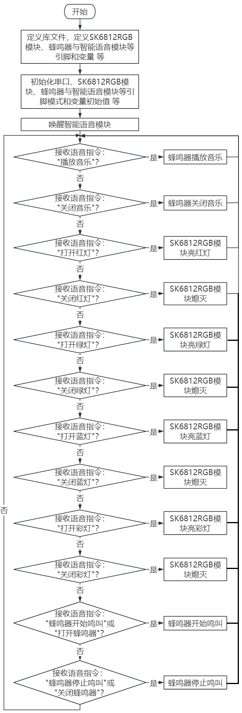
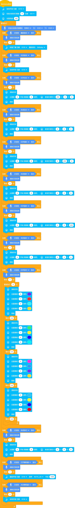

## 第11课 语音动感世界

#### 11.1 项目介绍

在前面的教程中，已经了解过SK6812 RGB灯模块、智能语音模块和无源蜂鸣器的工作原理和应用。

在本项目中，使用智能语音模块来控制SK6812 RGB灯模块和无源蜂鸣器，实现自动化语音控制多彩灯光及蜂鸣器发出鸣叫声与播放美妙音乐。

#### 11.2 流程图

#### 11.3 实验代码

#### 11.4 实验结果

外接电源，选择好正确的开发板板型（ESP32 Dev Module）和 适当的串口端口（COMxx），然后单击按钮上传代码。上传代码成功后，通过智能语音模块来控制无源蜂鸣器和SK6812 RGB灯。

对着智能语音模块上的麦克风，使用唤醒词 “你好，小智” 或 “小智小智” 来唤醒智能语音模块，同时喇叭播放回复语 “有什么可以帮到您”；

智能语音模块唤醒后，对着麦克风说：“播放音乐” 等命令词时，喇叭播放对应的回复语 “已为您播放音乐”，同时蜂鸣器播放音乐；

对着麦克风说：“关闭音乐” 等命令词时，喇叭播放对应的回复语 “已为您停止音乐”，同时蜂鸣器停止播放音乐；

对着麦克风说：“打开红灯” 等命令词时，喇叭播放对应的回复语 “已为您打开红灯”，同时SK6812 RGB灯亮红色灯；

对着麦克风说：“关闭红灯” 等命令词时，喇叭播放对应的回复语 “已为您关闭红灯”，同时SK6812 RGB灯熄灭；

对着麦克风说：“打开绿灯” 等命令词时，喇叭播放对应的回复语 “已为您打开绿灯”，同时SK6812 RGB灯亮绿色灯；

对着麦克风说：“关闭绿灯” 等命令词时，喇叭播放对应的回复语 “已为您关闭绿灯”，同时SK6812 RGB灯熄灭；

对着麦克风说：“打开蓝灯” 等命令词时，喇叭播放对应的回复语 “已为您打开蓝灯”，同时SK6812 RGB灯亮蓝色灯；

对着麦克风说：“关闭蓝灯” 等命令词时，喇叭播放对应的回复语 “已为您关闭蓝灯”，同时SK6812 RGB灯熄灭；

对着麦克风说：“打开彩灯” 等命令词时，喇叭播放对应的回复语 “已为您打开彩灯”，同时SK6812 RGB灯亮彩色灯；

对着麦克风说：“关闭彩灯” 等命令词时，喇叭播放对应的回复语 “已为您关闭彩灯”，同时SK6812 RGB灯熄灭；

对着麦克风说：“打开蜂鸣器” 或 “蜂鸣器开始鸣叫”等命令词时，喇叭播放对应的回复语 “已打开蜂鸣器”，同时蜂鸣器开始鸣叫；

对着麦克风说：“关闭蜂鸣器” 或 “蜂鸣器停止鸣叫” 等命令词时，喇叭播放对应的回复语 “已关闭蜂鸣器”，同时蜂鸣器停止鸣叫。

