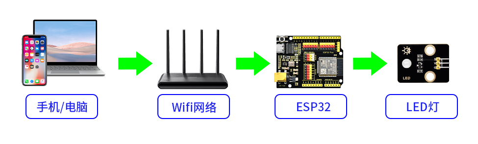
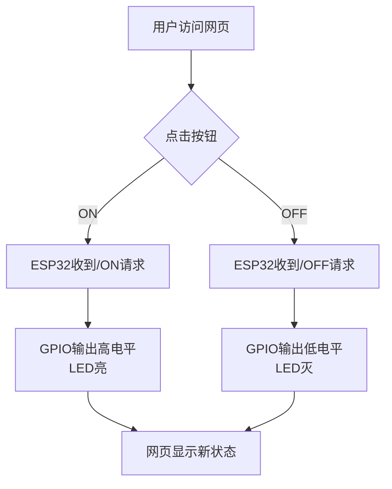
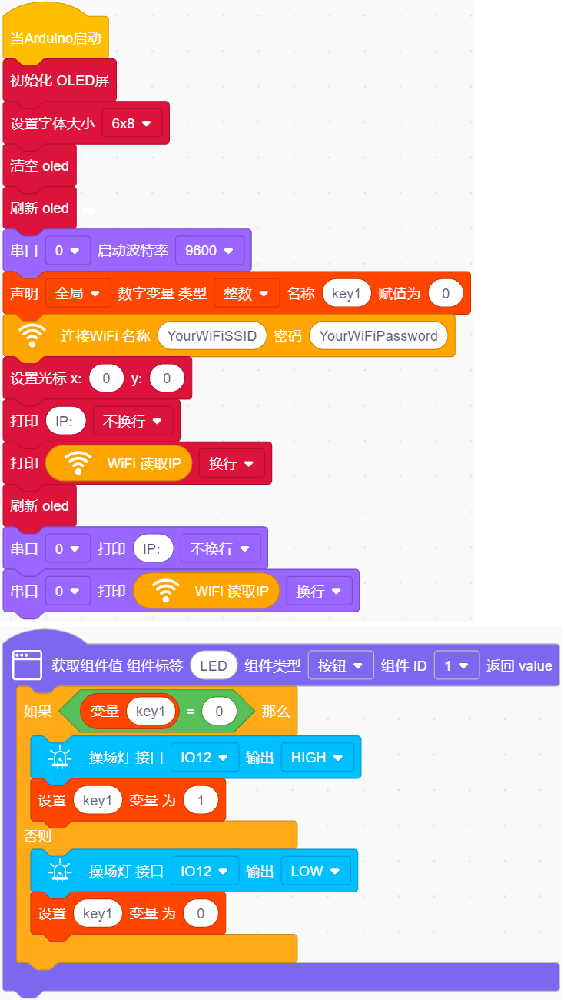
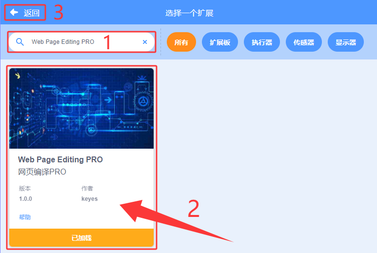
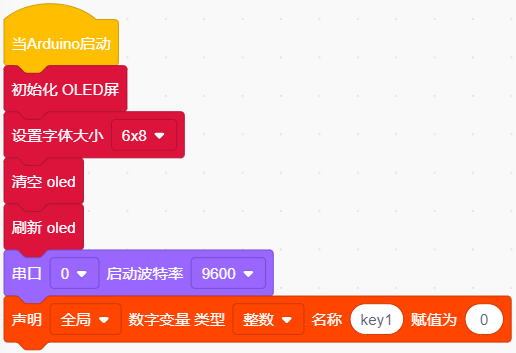
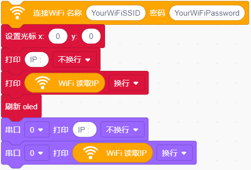
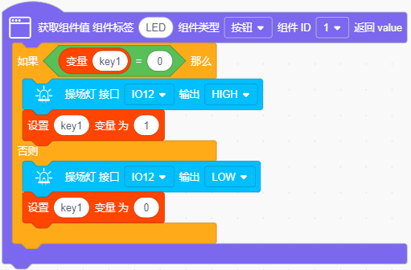
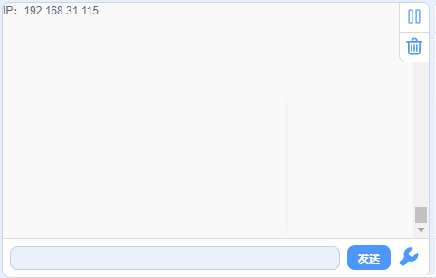
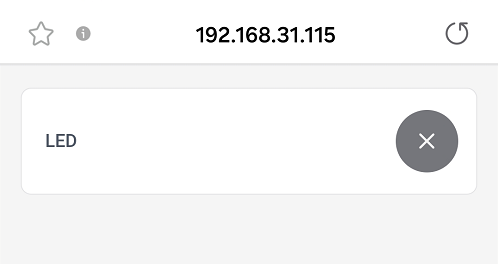
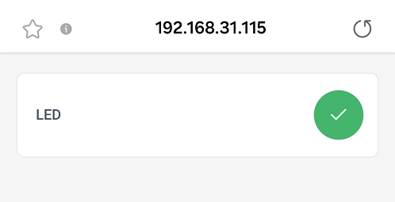

## 15. 网页远程控制LED

网页远程控制LED实验是智慧校园物联网应用的微型实践，通过ESP32搭建Web服务器，实现浏览器对LED的远程操控，直接映射校园中智能照明、设备管理等真实场景。

本课将带领你探索物联网的奇妙世界！通过ESP32开发板，编写代码，就能用手机网页远程控制LED灯的开关。一起来完成你的第一个"智慧校园"物联网项目吧！

#### 15.1 原理

**注意：此课程涉及HTML、CSS、JS等课外知识， 只做简单介绍。**

**关键步骤：**

**（1）ESP32 变身微型服务器**

- ESP32 连接 WiFi 后，会变成一个 **微型Web服务器**（就像一台超迷你的电脑）。

- 它会有一个局域网 IP 地址（比如：`172.23.131.16`），其他连接 **同一WiFi** 的设备都能访问它。

**（2）网页交互设计**

- ESP32 托管一个简单的网页，网页上有两个按钮：
   
   - "开灯" 按钮   → 点击后发送 `/ON` 请求
   
   - "关灯" 按钮 → 点击后发送 `/OFF` 请求

**（3）请求处理流程**

1. 点击网页按钮 → 浏览器向 ESP32 发送请求

2. ESP32 接收请求

3. ESP32 收到请求后，通过 GPIO 引脚控制 LED：
   
   - 开灯：引脚输出高电平 → LED 通电发光
   
   - 关灯：引脚输出低电平 → LED 断电熄灭

**（4）实时反馈**

网页通过 JavaScript 动态更新状态，无需刷新页面（类似你刷手机时的即时响应）。

 

**技术三要素**

| 要素             | 作用                          | 类比                     |
| ---------------- | ----------------------------- | ------------------------ |
| **WiFi通信**     | 让浏览器和ESP32能对话         | 像两个人用对讲机通话     |
| **Web服务器**    | 托管网页并处理按钮点击请求    | 像餐厅服务员接收你的点单 |
| **GPIO数字输出** | 把网页指令变成实际电流控制LED | 像你用手按下物理开关     |

#### 15.2 流程图

#### 15.3 实验代码

⚠️ **特别提醒： 打开代码文件后，需要分别将代码中的 `YourWiFiSSID` 和 `YourWiFiPassword` 替换为您自己的 Wi-Fi名称和 WiFi密码。**

⚠️ **特别提醒：还需要确保手机/电脑与ESP32主控板连接到同一个 WiFi。**

#### 15.4 代码说明

**注意：此课程涉及HTML、CSS、JS等课外知识， 只做简单介绍。**

需要添加 Web 库才能使用。

单击页面左下角的

在搜索框输入 `Web Page Editing PRO`，单击添加，单击 `返回` 返回编程页面。

- OLED屏、串口初始化

- 设置WiFi账号密码，连接WiFi，等待连接成功将IP地址打印在OLED屏和串口监视器。

  注意：请将代码里的 WiFi 名称和密码替换为你的。

- 页面有一个按钮组件：**LED**

- 点击按钮，可以控制LED亮灭。

#### 15.5 实验结果

1\. 外接电源，选择好正确的开发板板型（ESP32 Dev Module）和 适当的串口端口（COMxx），上传代码前单击KidsBlock IDE右下角的，设置串口波特率为`9600`。

   

2\. 然后单击按钮上传代码。上传代码成功后，可以看到打印的IP地址：

   

   OLED屏上同步打印IP地址：

   

3\. 将IP地址输入到手机/电脑浏览器并打开，你将看到一个简单的控制页面。

   注意：确保手机/电脑与ESP32主板连接到同一个 WiFi 。

   

   

4\. 点击按钮，点亮LED灯。

   

#### 15.6 常见问题解决

1\. 若串口监视器无任何信息打印，请按下ESP32主板的复位键：

   

2\. 若ESP32 一直没有获取到 IP 地址，通常是因为 WiFi 连接失败，解决办法：
   
   - 确保代码里的 WiFi 名称和密码已经替换为你的。
  
   - 确保你的 WiFi 网络是 2.4GHz 的，ESP32不支持 5GHz WiFi。

3\. 若输入IP地址无页面，解决办法：
   
   - 确保IP地址输入正确。
  
   - 检查手机/电脑是否与ESP32在同一网络。

