### 第5课 语音控制旗帜升降台

让我们用直流减速电机和智能语音控制模块打造一个语音旗帜升降台，通过智能语音控制实现旗帜的自动升降，体验科技与工程的完美结合！

#### 5.1 直流减速电机

直流双轴减速马达是一种常见的电机类型，由直流电机和减速箱组合而成，具有两个输出轴。

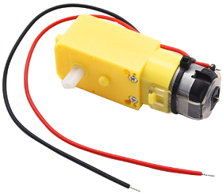

##### 5.1.1 参数

- 工作电压：DC 3.3 ~ 5V 

- 空载转速：10-500 RPM

- 负载转速：5-300 RPM

- 输出扭矩：0.1-50 kg·cm

- 工作温度：-10°C ~ +50°C

- 尺寸：70mm x 22.3mm x 19mm 

##### 5.1.2 原理

直流电机通过电刷和换向器将电能转换为机械能，直接输出时为高转速（通常几千至上万RPM）、低扭矩特性；其后连接的减速齿轮箱通过3-6级齿轮组逐级减速（减速比1:10 ~ 1:1000），在降低转速的同时按比例放大扭矩，最终通过同步传动的双输出轴输出低速高扭矩动力，两轴转速和扭矩保持高度同步（误差小于5%），从而满足设备对精准低速和大扭矩驱动的需求。

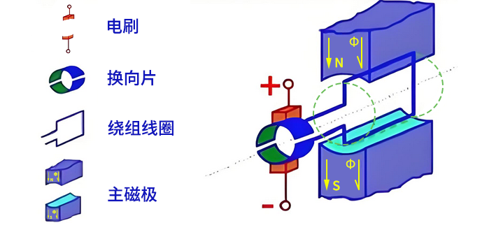

##### 5.1.3 9110S 电机驱动板

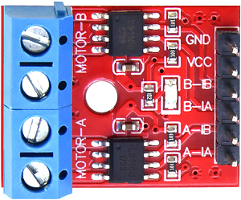

1. 直流减速电机需要外部驱动模块，是因为：

- 需要大电流驱动（远超单片机IO能力）

- 会产生反电动势（可能损坏控制电路）

- 需H桥实现正反转控制

2. 我们选择了 9110S 驱动板，能完美解决这些问题：

- 提供1.8A驱动电流

- 集成H桥和保护电路

- 支持PWM调速

- 只需简单数字信号控制

**参数**

- 工作电压：DC 5V 

- 安装孔直径：3mm

- 尺寸：25mm x 19mm x 13mm 

**基本控制逻辑**

9110S 通过两个逻辑输入引脚 ( INA 和 INB )控制电机状态，其真值表如下：

| INA  | INB  | 电机状态 | 输出模式       |
| ---- | ---- | -------- | -------------- |
| L    | L    | 停止     | Hi-Z(高阻态)   |
| H    | L    | 正转     | OUTA=H, OUTB=L |
| L    | H    | 反转     | OUTA=L, OUTB=H |
| H    | H    | 刹车     | OUTA=L, OUTB=L |

**PWM调速控制**

9110S 支持PWM调速控制，有两种衰减模式：

- 快衰减模式：如同自行车突然放开踏板，靠惯性滑行停止（自由滑行停止）
  
  - 一个PWM输入，另一个输入保持低电平

- 慢衰减模式：如同自行车轻捏刹车闸缓慢减速（受控减速）
  
  - 一个PWM输入，另一个输入保持高电平

| 控制方式      | INA  | INB  | 适用场景           |
| ------------- | ---- | ---- | ------------------ |
| 正转PWM快衰减 | PWM  | 0    | 快速减速，响应灵敏 |
| 正转PWM慢衰减 | PWM  | 1    | 平滑调速，减少震动 |
| 反转PWM快衰减 | 0    | PWM  | 快速反向制动       |
| 反转PWM慢衰减 | 1    | PWM  | 平稳反向运行       |

##### 5.1.4 实验代码

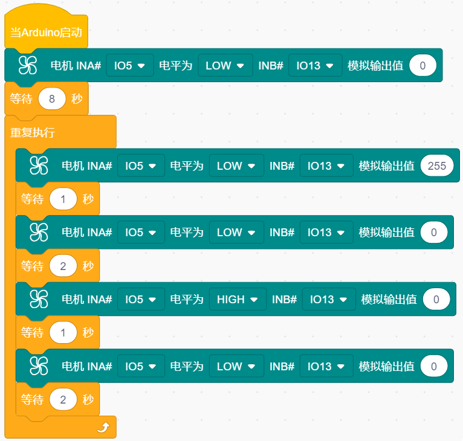

##### 5.1.5 代码说明

- 初始化，等待8秒，用于调整旗帜，若时间不够可以延长。

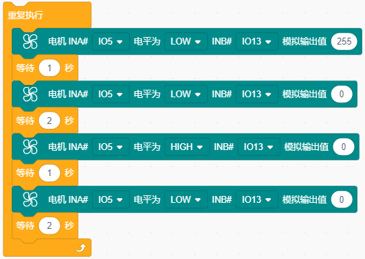

- 循环执行：**反转0.7秒→停止2秒→正转0.7秒→停止2秒** 的动作序列。
  
  - **正转/反转**：通过 INA / INB 高低电平组合控制方向（HIGH/LOW）
  
  - **停止**：双低电平切断动力，电机自由停止

- 电机状态控制

  - 正转：`INA=HIGH`, `INB=PWM(0%)` → 相当于`INB=LOW`

  - 反转：`INA=LOW`, `INB=PWM(100%)` → 相当于`INB=HIGH`

  - 停止：`INA=LOW`, `INB=PWM(0%)` → 相当于`INB=LOW`

  

##### 5.1.6 实验结果

外接电源，选择好正确的开发板板型（ESP32 Dev Module）和 适当的串口端口（COMxx），然后单击按钮上传代码。上传代码成功后，等待8秒，用于调整旗帜至下图所示位置：

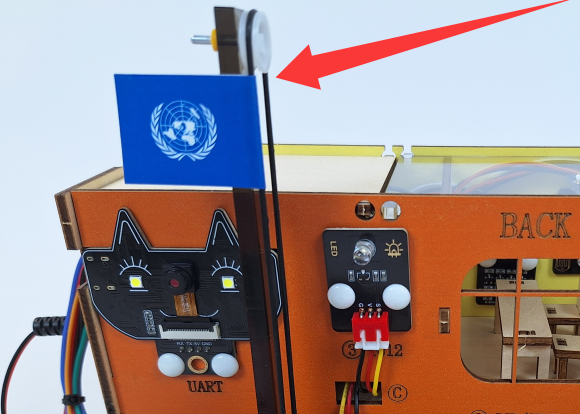

随后电机循环执行：

反转(旗帜下降)0.7秒 → 停止2秒 → 正转(旗帜上升)0.7秒 → 停止2秒

可以看到每2秒旗帜下降或升起。

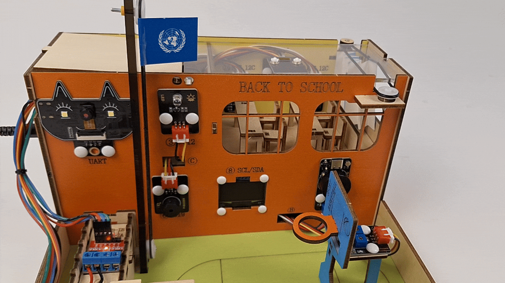

⚠️ 注意：由于固定转轴的橡胶圈摩擦力会随着使用逐渐减弱，长期运行后会出现轻微打滑。这会导致每次升旗到顶端时，旗帜的位置都会比上一次偏移一点，就像自行车链条打滑时踏板会空转一样。

---

#### 5.2 智能语音模块

智能语音模块为用户提供便捷便宜的串口离线语音识别方案，可广泛且快速应用于智能家居，各类智能小家电，86盒，玩具，灯具等需要语音操控的产品。教程内容包括智能语音模块的工作原理、引脚功能、电路连接方法以及如何通过微控制器（如ESP32）来控制。您将学习如何编写代码通过串口打印智能语音模块的命令。无论您是电子初学者还是有经验的开发者，本教程都将帮助您掌握智能语音模块的应用，为您的项目增添清晰、生动的视觉显示功能。

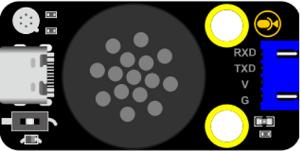

##### 5.2.1 参数

- 工作电压：3.3V ~ 5.5V

- 负载：LDO输出3.3V，外部负载不能超过150MA

- 供电及待机：500MA/60MA

- 硬件: 10个IO口 / 1路uart(串口) / 5个ADC / 2个PWM / 1路I2S / 1路SPI / 1路I2C

- 音频输出：1路MONO功放输出接口

- 语音指令：70条（最大支持150条）

- FLASH: 2M

- 喇叭功率：8欧1W

- 支持语言：默认固件支持中文（也可自行生成英文）

- 工作温度：0 ~ 80℃

-  尺寸：47.73mm × 23.93mm × 9mm

- 重量：8.96g

##### 5.2.2 元件知识

**智能语音模块：** 语音识别采用了离线语音识别芯片MUS516P6，该芯片采用 32bit RSIC 架构内核，并加入了专门针对信号处理和语音识别所需要的 DSP指令集，支持浮点运算的 FPU 运算单元，以及 FFT 加速器。智能语音模块通过串口通信的方式实现与主机的交互，最多支持150条语音指令，可在用户平台上自主定制语音指令和固件，命令词可任意修改，开发简单，不需要写代码。自带固件下载芯片，只需数据线即可完成固件下载。支持语音调节音量、学习唤醒词，识别灵敏且准确率高。

##### 5.2.3 语音固件命令

**语音识别指令：**

命令码：收到命令词后语音模块通过串口输出的命令字符，通过这个命令字符就能判断需要执行什么功能。

命令词：人对着智能语音模块说话的词语，如：“开灯” 就是在告诉智能语音模块我需要开灯，它就会发送指定的命令码到ESP32开发板中，ESP32开发板通过对指令码进行判断从而实现控制LED灯点亮。

命令回复：告诉你，你的命令已经执行完毕。

| 命令码 | 命令词 | 命令回复语 |
| :--: | :--: | :--: |
| 1  | "打开台灯" 或 "请开灯" 或 "开灯" 或 "打开灯" 或 "我回来了" |已为您打开照明|
| 2  |"关闭台灯" 或 "请关灯" 或 "关灯" 或 "睡觉了" 或 "关上灯" 或 "我出去了"|已为您关闭照明|
| 3  |"调亮一点" 或 "亮一点"|灯光已调亮|
| 4  |"调暗一点" 或 "暗一点"|灯光已调暗|
| 5  |"打开风扇" 或 "请开风扇" 或 "开风扇"|已为您打开风扇|
| 6  |"关闭风扇" 或 "请关风扇" 或 "关风扇" 或 "关上风扇"|已为您关闭风扇|
| 7  |"风大一点" 或 "大一点"|风速已增加|
| 8  |"风小一点" 或 "小一点"|风速已减弱|
| 9  |"浇水" 或 "请浇水"|已开始浇水|
| 10 |"停止浇水" 或 "请停止浇水"|已停止浇水|
| 11 |播放音乐|已为您播放音乐|
| 12 |关闭音乐|已为您停止音乐|
| 13 |打开红灯|已为您打开红灯|
| 14 |关闭红灯|已为您关闭红灯|
| 15 |打开绿灯|已为您打开绿灯|
| 16 |关闭绿灯|已为您关闭绿灯|
| 17 |打开蓝灯|已为您打开蓝灯|
| 18 |关闭蓝灯|已为您关闭蓝灯|
| 19 |打开点阵|已为您打开点阵|
| 20 |关闭点阵|已为您关闭点阵|
| 21 |"有人" 或 "有人靠近" 或 "有人过来"|是,有人正过来|
| 22 |"无人" 或 "人远离"|是,没有人|
| 23 |下雨|正在下雨|
| 24 |"停雨" 或 "雨停了"|雨停了|
| 25 |前进|正在前进|
| 26 |后退|正在后退|
| 27 |左转|正在左转|
| 28 |右转|正在右转|
| 29 |循迹|循迹模式开启|
| 30 |跟随|跟随模式开启|
| 31 |避障|避障模式开启|
| 32 |寻光|寻光模式开启|
| 33 |停止|已停止|
| 34 |开始喂食 或 喂食|已开始喂食|
| 35 |停止喂食|已停止喂食|
| 36 |打开彩灯|已为您打开彩灯|
| 37 |关闭彩灯|已为您关闭彩灯|
| 38 |"打开蜂鸣器" 或 "蜂鸣器开始鸣叫"|已打开蜂鸣器|
| 39 |"关闭蜂鸣器" 或 "蜂鸣器停止鸣叫"|已关闭蜂鸣器|
| 40 |增大音量|已增大音量|
| 41 |减小音量|已减小音量|
| 42 |最大音量|已调到最大音量|
| 43 |中等音量|已调到中等音量|
| 44 |最小音量|已调到最小音量|
| 45 |舵机角度增大|舵机角度已增大|
| 46 |舵机角度减少|舵机角度已减少|
| 47 |"当前温度是多少" 或 "当前温度多少"|正在为您读取温度|
| 48 |"当前湿度是多少" 或 "当前湿度多少"|正在为您读取湿度|
| 49 |"当前雨水量是多少" 或 "当前雨量多少"|正在为您读取当前雨水量|
| 50 |"当前光照强度是多少" 或 "光照强度多少" |正在为您读取光照强度|
| 51 |"当前土壤湿度是多少" 或 "土壤湿度多少"|正在为您读取土壤湿度|
| 52 |"当前水位是多少" 或 "水位多少"|正在为您读入水位|
| 53 |"几点了" 或 "现在几点了"|正在为您读取时间|
| 54 |现在距离是多少|正在为您读取距离|
| 55 |开机|已开机 |
| 56 |关机|已关机 |
| 57 |"开窗" 或 "打开窗户"|已为您打开窗户|
| 58 |"关窗" 或 "关闭窗户" |已为您关闭窗户|
| 59 |"开门" 或 "打开门"|已为您打开门|
| 60 |"关门" 或 "关闭门"|已为您关闭门|
| 61 |"升旗" 或 "旗子上升"|已为您升旗|
| 62 |"降旗" 或 "降旗"|已为您降旗|
| 63 |"开窗帘" 或 "打开窗帘" |已为您打开窗帘|
| 64 |"关窗帘" 或 "关闭窗帘" |已为您关闭窗帘|
| 65 |"当前总挥发性有机物浓度是多少" |正在为您读取总挥发性有机物浓度|
| 66 |"当前二氧化碳浓度是多少" |正在为您读取二氧化碳浓度|
| 67 |"当前空气质量指数是多少" |正在为您读取空气质量指数|

**语音播报指令：**

消息号：消息号是ESP32通过串口发送给智能语音模块的指令，智能语音模块接收到消息号后就会播报对应的语音。

语音播报：收到消息号后播报的语音，双引号 “xxxx” 中的是数据的名称，如：当前雨水量为百分之“二十”，当前温度是“二十六”度。

⚠️ 注意：如果是超过4095的数值将需要将数值转换成百分比后再发送给智能语音模块，因为智能语音模块最大能播报的数值是4095 ！！！

| 消息号 | 播报指令 |
| :--: | :--: |
| 1  |当前温度为|
| 2  |度|
| 3  |当前雨水量为百分之|
| 4  |当前湿度为百分之|
| 5  |当前光照强度为|
| 6  |当前土壤湿度为百分之|
| 7  |当前水位为|
| 8  |现在是北京时间|
| 9  |当前距离为|
| 10 |点|
| 11 |分|
| 12 |秒|
| 13 |点整|
| 14 |毫升|
| 15 |毫米|
| 16 |厘米|
| 17 |米|
| 18 |千米|
| 19 |当前总挥发性有机物浓度为十亿分之|
| 20 |当前二氧化碳浓度为百万分之|
| 21 |当前空气质量指数为|

##### 5.2.4 实验代码

##### 5.2.5 代码说明

- 初始化语音模块软串口/硬串口、引脚，并且还可以接收语音指令、读取语音指令且串口打印语音指令参数 等。

- 重复接收语音指令、读取语音指令且串口打印语音指令。

##### 5.2.6 实验结果

外接电源，选择好正确的开发板板型（ESP32 Dev Module）和 适当的串口端口（COMxx），然后单击按钮上传代码。上传代码成功后，单击KidsBlock IDE右下角的，设置串口波特率为`9600`。

对着智能语音模块上的麦克风，使用唤醒词 “你好，小智” 或 “小智小智” 来唤醒智能语音模块，同时喇叭播放回复语 “有什么可以帮到您”；接下来即可通过串口打印窗口查看小智语音模块接收到语音命令词所对应的命令码 等。

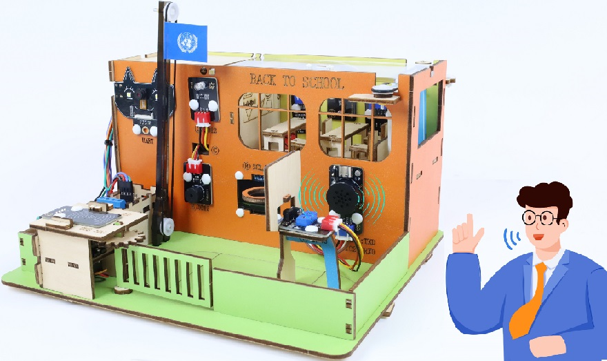

智能语音模块唤醒后，对着麦克风说：“打开台灯” 或 “请开灯” 或 “开灯” 或 “打开灯” 或 “我回来了”等命令词时，串口打印命令参数 “1”，同时喇叭播放对应的回复语 “已为您打开照明”。

对着麦克风说：“关闭台灯” 或 “请关灯” 或 “关灯” 或 “睡觉了” 或 “关上灯” 或 “我出去了”等命令词时，串口打印命令参数 “2”，同时喇叭播放对应的回复语 “已为您关闭照明”。

对着麦克风说：“调亮一点” 或 “亮一点”等命令词时，串口打印命令参数 “3”，同时喇叭播放对应的回复语 “灯光已调亮”。

对着麦克风说 “调暗一点” 或 “暗一点”等命令词时，串口打印命令参数 “4”，同时喇叭播放对应的回复语 “灯光已调暗”。

其他的这里就不一一分别陈述，请查看上面所列的语音识别指令和语音播报指令，所对应的命令码和信息号。

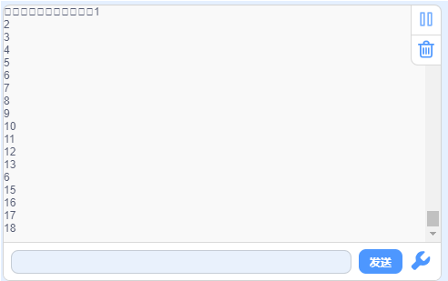

##### 5.2.7 自定义语音固件教程

如果你想更深入的了解智能语音模块，你可以访问这个智能语音模块的单独教程，里面有智能语音模块更详细的介绍以及如何自定义智能语音模块固件。

[智能语音模块 — keyestudio WiKi 文档](https://www.keyesrobot.cn/projects/KE4084/zh-cn/latest/)

#### 5.3 智能旗帜升降台

在前面两小节课程中，我们已经学习了直流减速电机和智能语音模块的基本原理与使用方法。现在，让我们将这些知识结合起来，动手制作一个语音旗帜升降台！通过这个项目，我们将实现一个能够通过语音控制旗帜自动升降的智能系统，既便捷高效，又充满科技感。

接下来，我们将一步步完成硬件连接、代码编写和功能调试，最终打造出一个实用的语音旗帜升降台。让我们一起开启这段充满创意与挑战的旅程吧！

##### 5.3.1 流程图

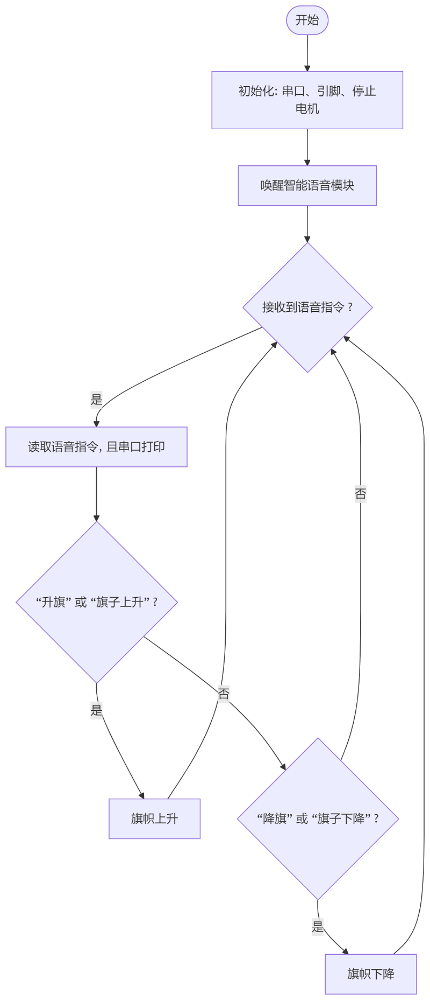

##### 5.3.2 实验代码

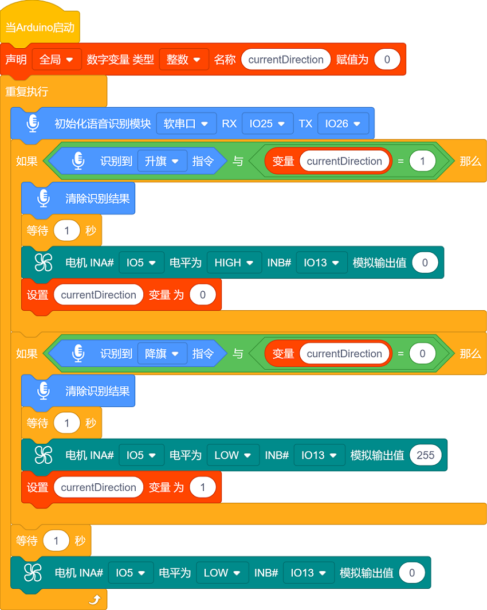

##### 5.3.3 代码说明

- 定义变量 `currentDirection` 用来判断当前方向

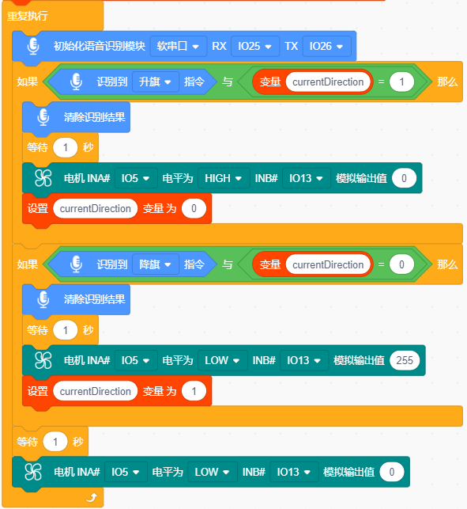

这段代码实现 **语音交替控制电机方向** 的功能：

语音“降旗” → 电机反转、旗帜下降 → 停止 → 语音“升旗” → 电机正转、旗帜上升 → 停止 → 循环...

每次电机完成转动后，程序会自动切换方向标志（`currentDirection`），这样下次语音时，电机就会朝相反方向转动。

`currentDirection`：

- `0` → 反转 → 降旗

- `1` → 正转 → 升旗

##### 5.3.4 实验结果

外接电源，选择好正确的开发板板型（ESP32 Dev Module）和 适当的串口端口（COMxx），然后单击按钮上传代码。上传代码成功后，通过智能语音模块来控制旗帜升降。

首先，调整旗帜至下图所示位置：

然后，对着智能语音模块上的麦克风，使用唤醒词 “你好，小智” 或 “小智小智” 来唤醒智能语音模块，同时喇叭播放回复语 “有什么可以帮到您”；

智能语音模块唤醒后，对着麦克风说：“降旗” 或 “旗子下降” 等命令词时，喇叭播放对应的回复语 “已为您降旗”，旗帜下降。

对着麦克风说：“升旗” 或 “旗子上升” 等命令词时，喇叭播放对应的回复语 “已为您升旗”，同时旗帜上升。

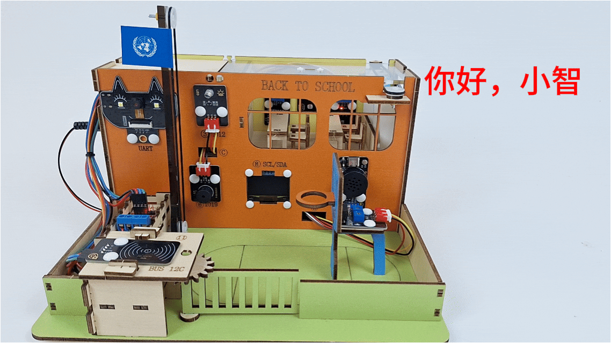