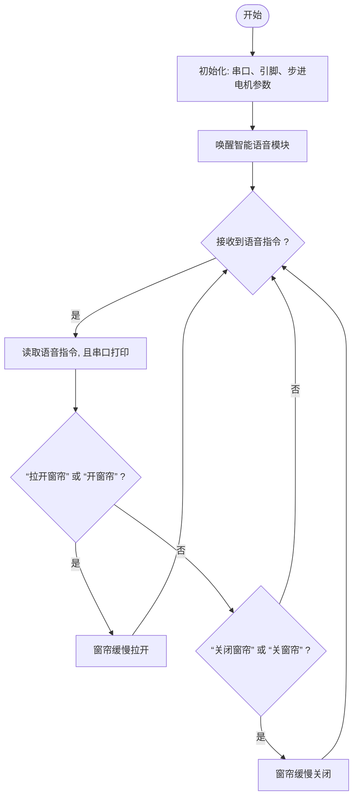
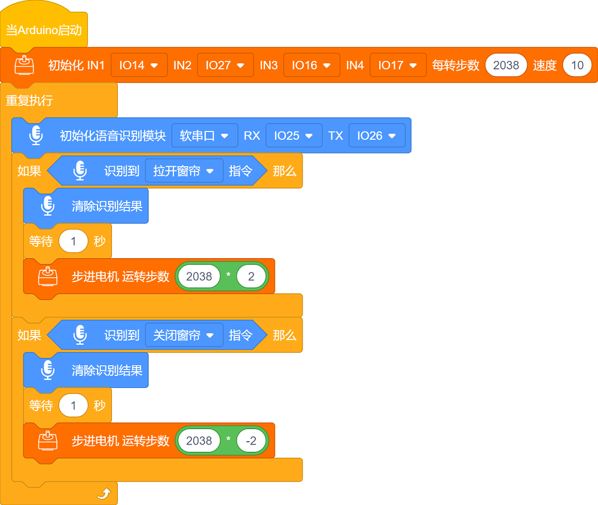

### 第12课 窗帘语音控制

#### 12.1 项目介绍

通过语音指令来控制窗帘的开合、调节光线及隐私保护程度的一种智能学校技术。这种技术结合了语音识别、电机驱动和智能控制系统，使学生和教师无需手动操作，只需简单的语音命令即可实现窗帘的自动化控制。

语音识别技术能够准确识别用户的语音指令，如“拉开窗帘”或“关闭窗帘”等，并将这些指令转化为电信号发送给窗帘的驱动电机。电机则根据接收到的信号，精确控制窗帘的开与合，从而实现智能化控制。

#### 12.2 流程图

#### 12.3 实验代码

#### 12.4 实验结果

外接电源，选择好正确的开发板板型（ESP32 Dev Module）和 适当的串口端口（COMxx），然后单击按钮上传代码。上传代码成功后，通过智能语音模块控制窗帘缓慢拉开与关闭。

对着智能语音模块上的麦克风，使用唤醒词 “你好，小智” 或 “小智小智” 来唤醒智能语音模块，同时喇叭播放回复语 “有什么可以帮到您”；

智能语音模块唤醒后，对着麦克风说：“拉开窗帘” 或 “开窗帘” 等命令词时，喇叭播放对应的回复语 “已为您打开窗帘”，同时窗帘缓慢拉开；

对着麦克风说：“关闭窗帘” 或 “关窗帘” 等命令词时，喇叭播放对应的回复语 “已为您关闭窗帘”，同时窗帘缓慢关闭。

