## 7. 校园智能门禁

让我们用RFID刷卡模块和舵机打造一个校园智能门禁系统，通过刷卡识别身份并自动控制门锁开关，体验安全便捷的智慧校园生活！

### 7.1 RFID刷卡模块

RFID刷卡模块是一种基于无线射频识别技术的非接触式读卡设备，可快速识别IC卡或电子标签中的身份信息，广泛应用于门禁、考勤和支付系统。

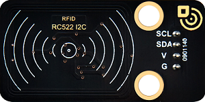

#### 7.1.1 参数

- 工作电压：DC 5V 

- 工作电流：13 ~ 100 mA / DC 5V 

- 空闲电流：10 ~ 13 mA / DC 5V

- 休眠电流：< 80 uA

- 峰值电流：< 100 mA

- 工作频率：13.56 MHz

- 最大功率： 0.5 W

- 数据传输速率：最大10Mbit/s

- 工作温度：-10°C ~ +50°C

- 尺寸：48mm x 24mm x 8 mm

- 定位孔大小：直径为 4.8 mm

- 接口：间距2.54 mm，4pin弯针接口

#### 7.1.2 原理

**工作流程**

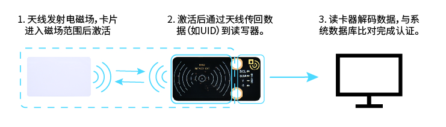

**（1）能量传输**

- 读卡器天线发射电磁场 → 为无源RFID卡（无电池）提供能量。

**（2）数据交互**

- 卡片进入磁场范围后激活 → 通过负载调制将卡内数据（如：卡号）传回读卡器。

**（3）身份验证**

- 读卡器解码数据 → 与系统数据库比对完成认证。

#### 7.1.3 实验代码

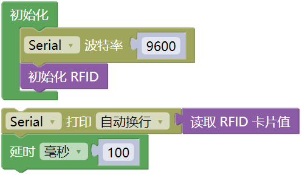

#### 7.1.4 代码说明

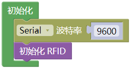

- 初始化 RFID

- 串口初始化

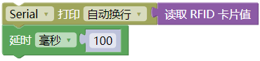

- 检测是否有卡进入射频场，激活卡片读取UID并打印在串口

- 每0.1秒刷新一次

#### 7.1.5 实验结果

外接电源，选择好正确的开发板板型（ESP32 Dev Module）和 适当的串口端口（COMxx），然后单击按钮上传代码。上传代码成功后，单击Mixly IDE左上角的，出现串口监视器窗口，设置串口波特率为 `9600`。

将RFID磁卡放入磁场范围内检测，读卡器将读取到的RFID卡号以16进制的形式打印在串口监视器。

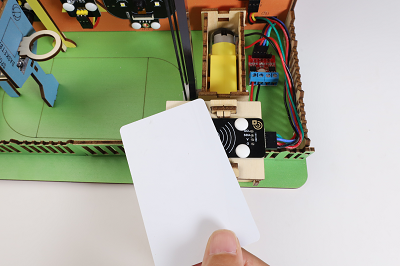

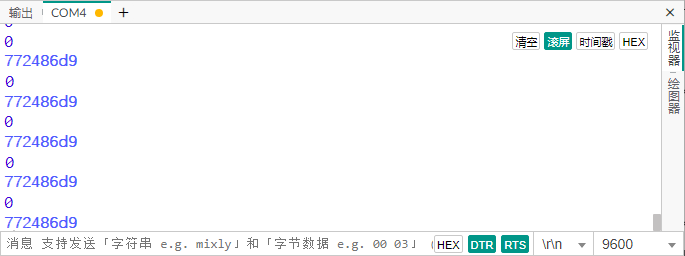

#### 7.1.6 常见问题解决

1\. **无法读取卡片**
   
   - 检查I2C地址是否正确。
   
   - 检查供电电压（5V）、卡片类型。

2\. **版本显示 `0x00` 或 `0xFF`**
   
   - 检查I2C线路（SDA/SCL是否接反）。
   
   - 确保供电电压稳定。

---

### 7.2 舵机

舵机是一种通过接收控制信号来精确控制旋转角度的电机。

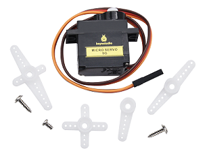

我们用到的这款舵机有三根外接线，棕色线为接地线，红色线为电源正极，橙色线为信号线。

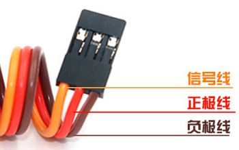

#### 7.2.1 参数

- 工作电压: DC 3.3 ~ 5V 

- 工作温度：-10°C ~ +50°C

- 尺寸：32.25mm x 12.25mm x 30.42 mm

- 接口：间距为2.54 mm 3pin排母接口

#### 7.2.2 原理

**1. 舵机的工作原理**

舵机是一种闭环控制的位置伺服电机，ESP32通过 **PWM（脉冲宽度调制）信号** 控制其角度。核心工作原理：

**PWM信号输入**：

- ESP32生成50Hz（周期20ms）的PWM信号

- **脉冲宽度（高电平时间）决定角度**：

  - **0.5ms（500μs）→ 0°**

  - **1.5ms（1500μs）→ 90°**（中间位置）

  - **2.5ms（2500μs）→ 180°**

    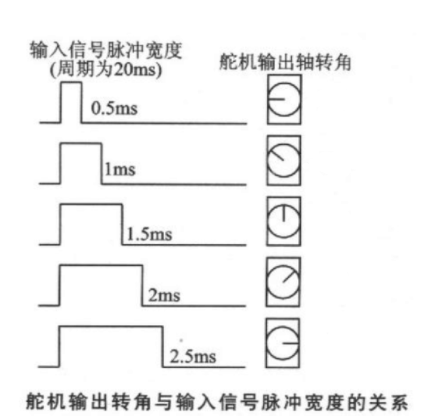

**引脚限制**：

- 避免使用以下引脚（有特殊功能）：
  
  - GPIO0（下载模式）
  
  - GPIO2（内部上拉）
  
  - GPIO12（启动时电平敏感）

#### 7.2.3 实验代码

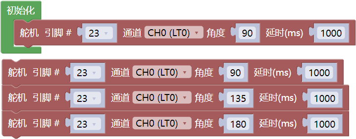

#### 7.2.4 代码说明

1\. 初始化舵机（GPIO23引脚）

2\. 循环执行：
  
   - 转到90° → 暂停1秒
   
   - 转到135° → 暂停1秒
   
   - 转到180° → 暂停1秒
   
   - 重复循环

#### 7.2.5 实验结果

警告：舵机必须正确安装固定后才能通电运行，否则可能因堵转损坏。

详情请查看产品组装教程，舵机必须 **先初始化** 再安装。

外接电源，选择好正确的开发板板型（ESP32 Dev Module）和 适当的串口端口（COMxx），然后单击按钮上传代码。上传代码成功后，舵机会按以下规律循环运动：

1\. 立即转到90°位置 → 关门状态，保持1秒

2\. 转到135°位置        → 开关门的中间位置，保持1秒

3\. 转到180°位置          → 开门状态，保持1秒

4\. 重复此循环（90°→135°→180°→90°...）

---

### 7.3 校园智能门禁

在前面的课程中，我们已经掌握了RFID刷卡模块的身份识别功能和舵机的机械控制原理。现在，让我们将这些技术融合创新，共同打造一个智能化的校园门禁系统！通过这个项目，我们将实现刷卡自动开锁功能，既提升校园安全，又展现科技魅力。

这套系统能够识别授权人员的RFID卡片，通过舵机驱动门锁开关。接下来，我们将从流程图到程序编写，最终实现一个稳定可靠的智能门禁原型。准备好了吗？现在就开始我们的项目开发吧！

#### 7.3.1 流程图

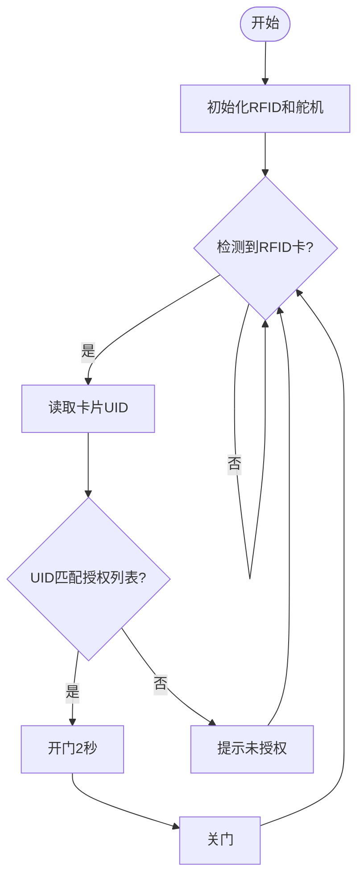

#### 7.3.2 实验代码

请确保组装前舵机已经初始化，否则可能导致舵机堵转损坏。

**上传代码前请将代码块中的RFID卡号替换成你自己的RFID卡号。**

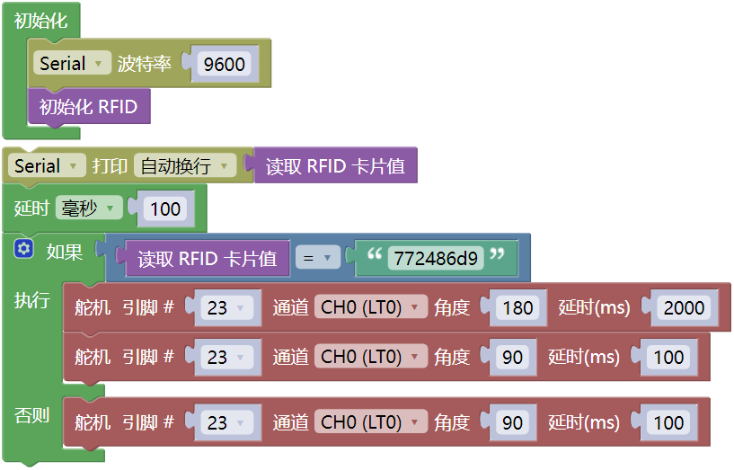

#### 7.3.3 代码说明

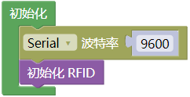

- 初始化RFID和串口波特率

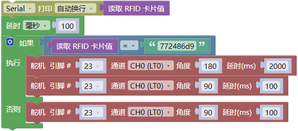

- 检测是否有新卡靠近，读取 RFID卡号，并且串口打印RFID卡号，比较读取的 RFID卡号 是否与你设置的 RFID卡号 匹配。
  
  - 匹配 → 开门（`180°`），2 秒后自动关门（`90°`）。
  
  - 不匹配 → 无操作（门保持关闭）。

#### 7.3.4 实验结果

请确保组装前舵机已经初始化，再上传代码。

外接电源，选择好正确的开发板板型（ESP32 Dev Module）和 适当的串口端口（COMxx），然后单击按钮上传代码。上传代码成功后，智能门禁系统循环检测：

- 有卡 → 读RFID卡号 → 匹配成功 → 开门→延时2秒→关门

- 有卡 → 读RFID卡号 → 匹配失败 → 提示未授权

- 无卡 → 继续检测

#### 7.3.5 常见问题解决

1\. 无法检测卡片
   
   - 检查I2C地址是否错误、接线是否松动

2\. 舵机不转动
   
   - 检查供电电压，外接电源
   
   - 确保安装前已将舵机初始化

3\. 串口输出乱码
   
   - 确保串口监视器设为115200