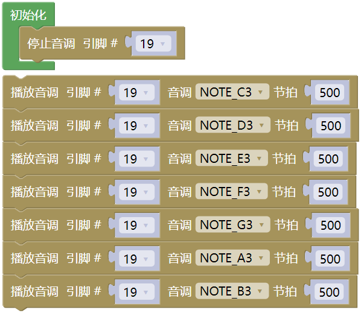
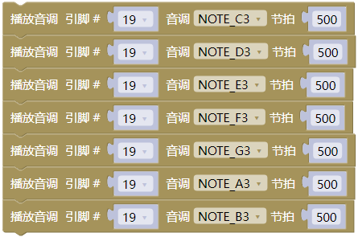
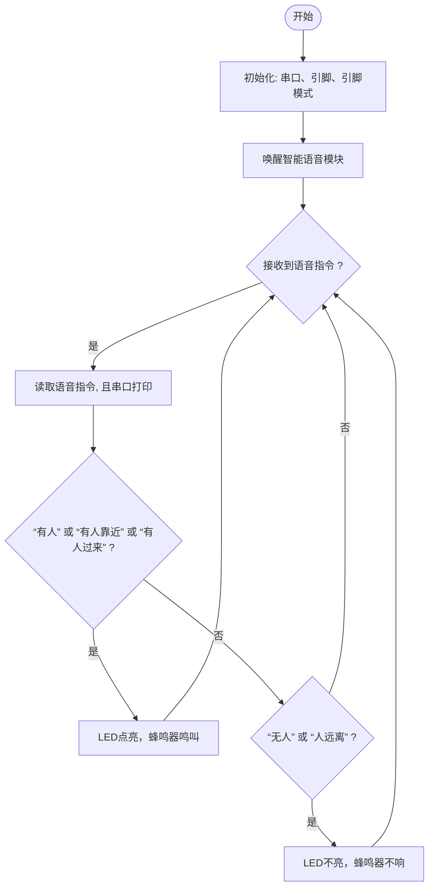
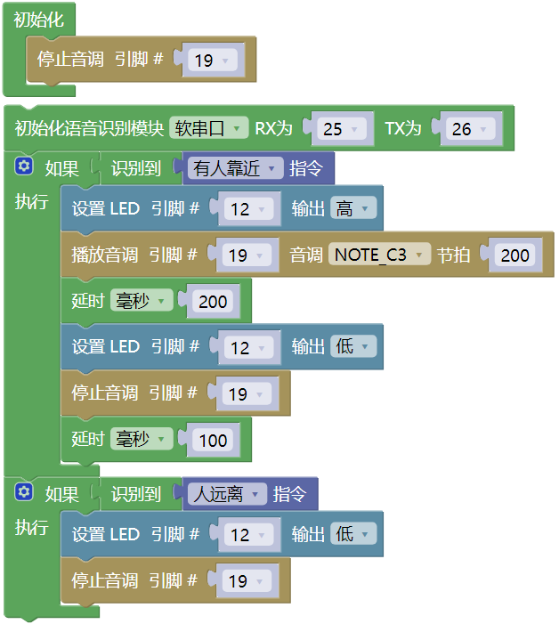

## 8. 校园入侵警报系统

这节课我们要制作一个校园入侵警报系统，当校外人员偷偷翻墙进校园时，学校保安人员发现他们，立即唤醒小智语音模块，并且对着小智语音模块上的麦克风发出“有人”或“有人靠近”或“有人过来”等语音命令词，让蜂鸣器发出警报声，提醒学生、教师和工作人员提高警惕！

### 8.1 无源蜂鸣器

无源蜂鸣器是一种需要外部PWM信号驱动才能发声的电子元件，其音调由输入方波的频率决定。

#### 8.1.1 参数

- 工作电压：DC 3.3 ~ 5V 

- 工作温度：-10°C ~ +50°C

- 控制信号：数字信号

- 尺寸：32mm x 23mm x 12 mm（不带壳）

- 定位孔大小：直径为 4.8 mm

- 接口：间距为2.54 mm，3pin防反接口

#### 8.1.2 原理

**无源蜂鸣器的工作原理**

1\. **核心特性**
   
   - **无内部振荡源**：必须输入特定频率的方波（PWM信号）才能发声，频率决定音调（如2kHz发出高频蜂鸣）。

2\. **驱动逻辑**
    
   - 直接接直流电（如5V）只会发出 “咔哒” 声（瞬间通电的机械响应）。
   
   - **持续发声需PWM**：例如，输入1kHz方波，蜂鸣器以1kHz频率振动，产生对应音调。

 

**七音符**

音乐，是一种无形的艺术，它以其独特的语言，表达着人们的情感和思想。在音乐中，有一种基本的构成元素，那就是音符。音符是音乐的基础，它们组合在一起，形成了各种各样的旋律和节奏。在所有的音符中，最为基本的就是七个音符：C、D、E、F、G、A、B。

这七个音符就像音乐的字母表，通过它们的组合和变化，可以创造出无数美妙的音乐。

#### 8.1.3 实验代码

播放简单旋律（Do-Re-Mi-Fa-Sol-La-Si）

#### 8.1.4 代码说明

- 蜂鸣器连接至GPIO19（必须支持PWM）。

- 循环执行：依次播放旋律"Do-Re-Mi-Fa-Sol-La-Si"，每个音持续0.5秒

#### 8.1.5 实验结果

外接电源，选择好正确的开发板板型（ESP32 Dev Module）和 适当的串口端口（COMxx），然后单击按钮上传代码。上传代码成功后，蜂鸣器依次播放：Do-Re-Mi-Fa-Sol-La-Si

---

### 8.2 校园入侵警报系统

在前面的学习中，我们已经掌握了智能语音模块工作原理和无源蜂鸣器的声音报警功能。在这节课中，我们将这些技术结合起来，动手制作一个真实的安防小系统！校外人员偷偷翻墙进校园时，学校保安人员一旦发现入侵者，立即唤醒智能语音模块，并且对着智能语音模块上的麦克风发出“有人”或“有人靠近”或“有人过来”等语音命令词，无源蜂鸣器就会立即发出警报声。既能学习电子知识，又能提高安全意识，快来一起守护校园安全吧！

#### 8.2.1 流程图

#### 8.2.2 实验代码

#### 8.3.3 实验结果

外接电源，选择好正确的开发板板型（ESP32 Dev Module）和 适当的串口端口（COMxx），然后单击按钮上传代码。上传代码成功后，通过智能语音模块来控制无源蜂鸣器和路灯。

对着智能语音模块上的麦克风，使用唤醒词 “你好，小智” 或 “小智小智” 来唤醒智能语音模块，同时喇叭播放回复语 “有什么可以帮到您”；

智能语音模块唤醒后，对着麦克风说：“有人” 或 “有人靠近” 或 “有人过来” 等命令词时，喇叭播放对应的回复语 “是，有人正过来”，同时无源蜂鸣器响起来，路灯也会闪烁；

对着麦克风说：“无人” 或 “人远离” 等命令词时，喇叭播放对应的回复语 “是，没有人”，同时无源蜂鸣器不响，路灯不亮。