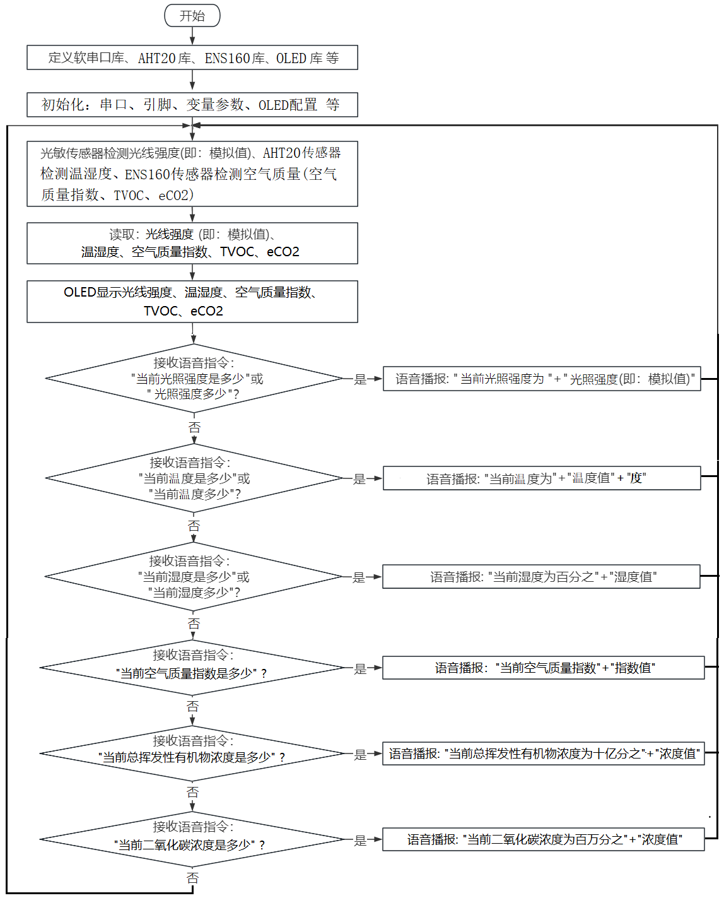
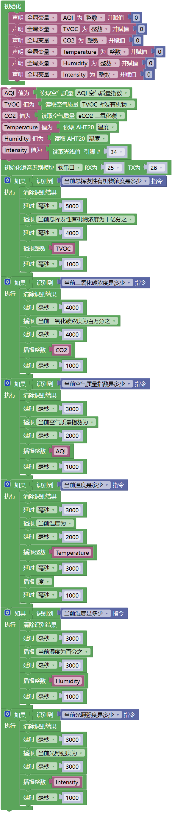

### 第13课 语音环境监测系统

#### 13.1 项目介绍

本教程介绍如何使用AHT20温湿度传感器、ENS160传感器模块、光敏电阻传感器、智能语音模块和OLED模块，构建一个智能语音环境监测系统。

该系统的AHT20温湿度传感器能够测量教室温度和湿度，ENS160传感器模块可以检测教室内空气质量，光敏电阻传感器检测太阳光照射到教室内的光照强度。OLED模块实时显示教室内的温度、湿度、空气质量和光照强度，同时智能语音模块实时播报。

#### 13.2 流程图

#### 13.3 实验代码 

#### 13.4 实验结果 

外接电源，选择好正确的开发板板型（ESP32 Dev Module）和 适当的串口端口（COMxx），然后单击按钮上传代码。上传代码成功后，OLED显示屏实时显示AHT20温湿度传感器检测到环境中的湿度值和温度值；ENS160传感器模块检测到环境中的当前总挥发性有机物浓度、当前二氧化碳浓度和当前空气质量指数；光敏电阻传感器检测到的光照强度。

⚠️ 特别提醒：如果OLED模块上显示屏显示的空气质量指数(AQI)、总挥发性有机物浓度(TVOC)和二氧化碳浓度(eCO2)的数据都是0，请按一下ESP32主控板上的复位键，等待几秒钟。

对着智能语音模块上的麦克风，使用唤醒词 “你好，小智” 或 “小智小智” 来唤醒智能语音模块，同时喇叭播放回复语 “有什么可以帮到您”；

智能语音模块唤醒后，对着麦克风说：“当前温度是多少” 或 “当前温度多少” 等命令词时，接着语音播报 “正在为您读取温度” + “当前温度为” + “AHT20温湿度传感器检测到的温度值” + “度”；

对着麦克风说：“当前湿度是多少” 或 “当前湿度多少” 等命令词时，接着语音播报 “正在为您读取湿度” + “当前湿度为百分之” + “AHT20温湿度传感器检测到的湿度值”；

对着麦克风说：“当前总挥发性有机物浓度是多少” 等命令词时，接着语音播报 “正在为您读取总挥发性有机物浓度” + “当前总挥发性有机物浓度为十亿分之” + “ENS160传感器模块检测到环境中的当前总挥发性有机物浓度值”；

对着麦克风说：“当前二氧化碳浓度是多少” 等命令词时，接着语音播报 “正在为您读取二氧化碳浓度” + “当前二氧化碳浓度为百万分之” + “ENS160传感器模块检测到环境中的当前二氧化碳浓度值”

对着麦克风说：“当前空气质量指数是多少” 等命令词时，接着语音播报 “正在为您读取空气质量指数” + “ENS160传感器模块检测到环境中的当前空气质量指数”；

对着麦克风说：“当前光照强度是多少” 或 “光照强度多少” 等命令词句时，接着语音播报 “正在为您读取光照强度” + “当前光照强度为” + “光敏传感器检测到的光照强度模拟值”。

