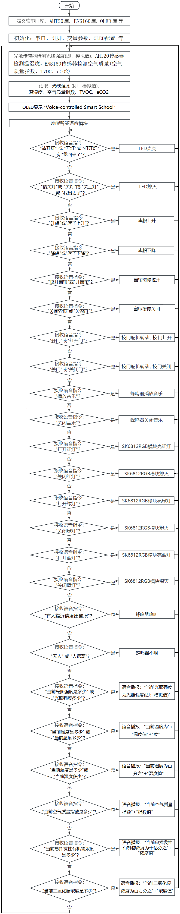
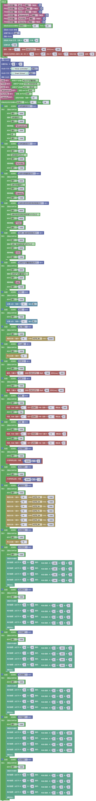
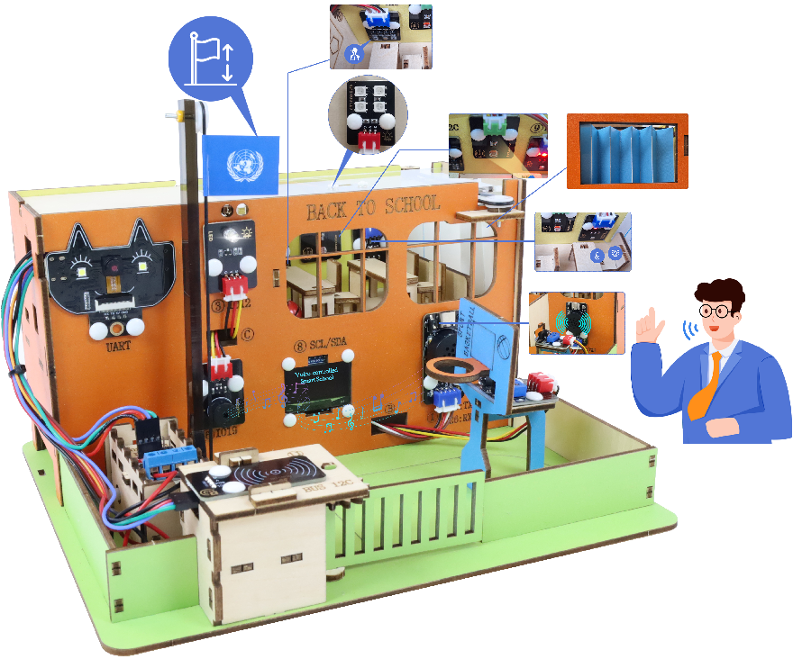

## 第14课 语音控制智慧校园

#### 14.1 项目介绍

经过前面一系列的语音控制项目的学习，我们是不是可以通过智能语音模块控制智慧校园更多传感器模块呢？当然是可以的。在本项目实验中，通过ESP32主控板控制更多传感器模块，然后通过智能语音模块进行实时语音播报智慧校园教室内的温度、湿度、空气质量和光照强度等。同时，它还能控制路灯进行照明、教室内的SK6812 RGB灯亮不同颜色灯，校门开与关、窗帘拉开与关闭、校园入侵警报、旗帜升降和音乐播放等。

#### 14.2 流程图

#### 14.3 实验代码

#### 14.4 实验结果

外接电源，选择好正确的开发板板型（ESP32 Dev Module）和 适当的串口端口（COMxx），然后单击按钮上传代码。上传代码成功后，OLED模块显示屏显示“Voice-controlled Smart School”。

首先，调整旗帜至下图所示位置：

然后，对着智能语音模块上的麦克风，使用唤醒词 “你好，小智” 或 “小智小智” 来唤醒智能语音模块，同时喇叭播放回复语 “有什么可以帮到您”；

对着麦克风说：“当前光照强度是多少” 或 “光照强度多少” 等命令词句时，接着语音播报 “正在为您读取光照强度” + “当前光照强度为” + “光敏传感器检测到的光照强度模拟值”；

智能语音模块唤醒后，对着麦克风说：“当前温度是多少” 或 “当前温度多少” 等命令词时，接着语音播报 “正在为您读取温度” + “当前温度为” + “AHT20温湿度传感器检测到的温度值” + “度”；

对着麦克风说：“当前湿度是多少” 或 “当前湿度多少” 等命令词时，接着语音播报 “正在为您读取湿度” + “当前湿度为百分之” + “AHT20温湿度传感器检测到的湿度值”；

对着麦克风说：“当前空气质量指数是多少” 等命令词时，接着语音播报 “正在为您读取空气质量指数” + “ENS160传感器模块检测到环境中的当前空气质量指数”；

对着麦克风说：“当前总挥发性有机物浓度是多少” 等命令词时，接着语音播报 “正在为您读取总挥发性有机物浓度” + “当前总挥发性有机物浓度为十亿分之” + “ENS160传感器模块检测到环境中的当前总挥发性有机物浓度值”；

对着麦克风说：“当前二氧化碳浓度是多少” 等命令词时，接着语音播报 “正在为您读取二氧化碳浓度” + “当前二氧化碳浓度为百万分之” + “ENS160传感器模块检测到环境中的当前总挥发性有机物浓度值”;

特别提醒：如果智能语音模块播报的空气质量指数(AQI)、总挥发性有机物浓度(TVOC)和二氧化碳浓度(eCO2)的数据都是0，请按一下ESP32主控板上的复位键，等待几秒钟。

对着麦克风说：“请开灯” 或 “开灯” 或 “打开灯” 或 “我回来了” 等命令词时，喇叭播放对应的回复语 “已为您打开照明”，同时路灯点亮；

对着麦克风说：“请关灯” 或 “关灯” 或 “关上灯” 或 “我出去了” 等命令词时，喇叭播放对应的回复语 “已为您关闭照明”，同时路灯熄灭；

对着麦克风说：“有人” 或 “有人靠近” 或 “有人过来” 等命令词时，喇叭播放对应的回复语 “是，有人正过来”，同时无源蜂鸣器响起来；

对着麦克风说：“无人” 或 “人远离” 等命令词时，喇叭播放对应的回复语 “是，没有人”，同时无源蜂鸣器不响；

对着麦克风说：“开门” 或 “打开门”等命令词时，喇叭播放对应的回复语 “已为您打开门”，同时校门打开；

对着麦克风说：“关门” 或 “关闭门” 等命令词时，喇叭播放对应的回复语 “已为您关闭门”，同时校门关闭；

对着麦克风说：“降旗” 或 “旗子下降” 等命令词时，喇叭播放对应的回复语 “已为您降旗”，旗帜下降；

对着麦克风说：“升旗” 或 “旗子上升” 等命令词时，喇叭播放对应的回复语 “已为您升旗”，同时旗帜上升。

对着麦克风说：“拉开窗帘” 或 “开窗帘” 等命令词时，喇叭播放对应的回复语 “已为您打开窗帘”，同时窗帘缓慢拉开；

对着麦克风说：“关闭窗帘” 或 “关窗帘” 等命令词时，喇叭播放对应的回复语 “已为您关闭窗帘”，同时窗帘缓慢关闭；

对着麦克风说 “播放音乐” 等命令词时，喇叭播放对应的回复语 “已为您播放音乐”，同时蜂鸣器播放音乐；

对着麦克风说：“关闭音乐” 等命令词时，喇叭播放对应的回复语 “已为您关闭音乐”，同时蜂鸣器不响；

对着麦克风说：“打开红灯” 等命令词时，喇叭播放对应的回复语 “已为您打开红灯”，同时SK6812 RGB灯亮红色灯；

对着麦克风说：“关闭红灯” 等命令词时，喇叭播放对应的回复语 “已为您关闭红灯”，同时SK6812 RGB灯熄灭；

对着麦克风说：“打开绿灯” 等命令词时，喇叭播放对应的回复语 “已为您打开绿灯”，同时SK6812 RGB灯亮绿色灯；

对着麦克风说：“关闭绿灯” 等命令词时，喇叭播放对应的回复语 “已为您关闭绿灯”，同时SK6812 RGB灯熄灭；

对着麦克风说：“打开蓝灯” 等命令词时，喇叭播放对应的回复语 “已为您打开蓝灯”，同时SK6812 RGB灯亮蓝色灯；

对着麦克风说：“关闭蓝灯” 等命令词时，喇叭播放对应的回复语 “已为您关闭蓝灯”，同时SK6812 RGB灯熄灭。
