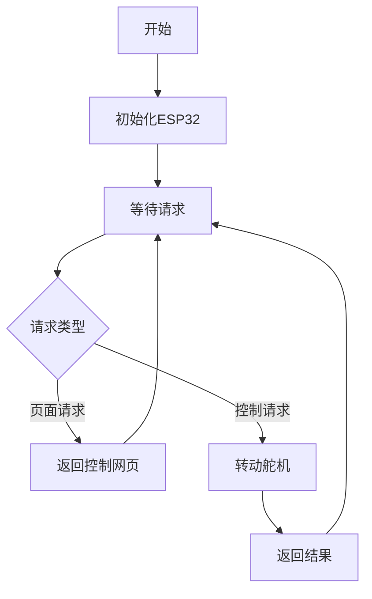
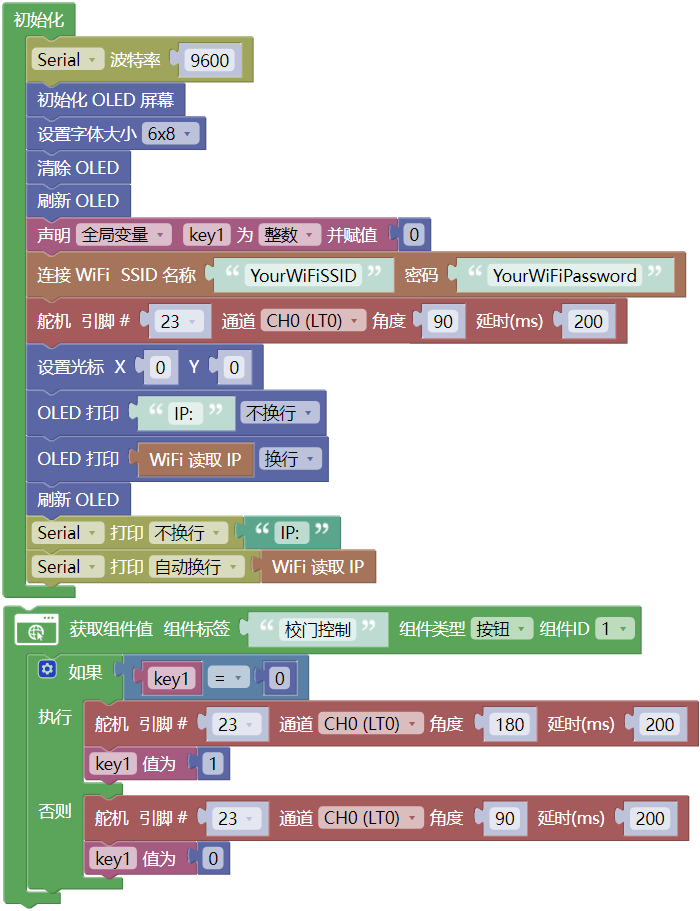
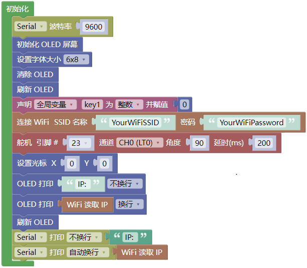
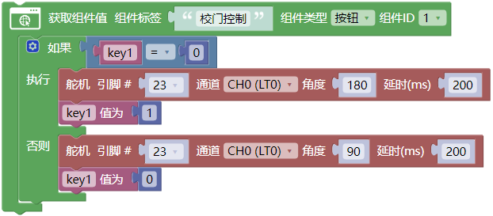
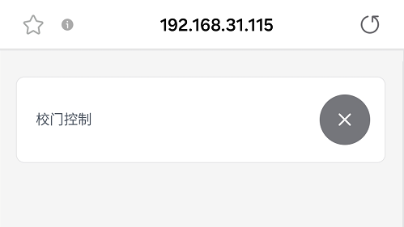
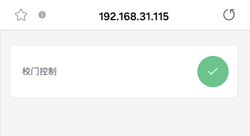

## 18. 网页远程控制校门

在智慧校园的建设浪潮中，智能管控与远程互联正成为校园现代化的重要标志。本项目以"网页远程控制大门开关"为主题，带领您深入探索物联网技术在校园安全管理中的创新应用。

现在开始，用技术守护校园安全，用创新构建智慧管理环境，共同探索物联网技术在教育领域的无限可能！

#### 18.1 原理

**手机浏览器 → WiFi → ESP32 → 控制舵机转动 → 校门开/关**

1. **手机/电脑** 打开网页（输入ESP32的IP地址）

2. **点击按钮**（开门/关门）

3. **ESP32收到指令**（通过WiFi）

4. **舵机转动**（180°或90°，对应校门开和关）

#### 18.2 流程图

#### 18.3 实验代码

⚠️ **特别提醒： 打开代码文件后，需要分别将代码中的 `YourWiFiSSID` 和 `YourWiFiPassword` 替换为您自己的 Wi-Fi名称和 WiFi密码。**

⚠️ **特别提醒：还需要确保手机/电脑与ESP32主控板连接到同一个 WiFi。**

#### 18.4 代码说明

**注意：此课程涉及HTML、CSS、JS等课外知识， 只做简单介绍。**

- OLED屏、串口初始化、舵机初始化至180°，关门状态

- 设置WiFi账号密码，连接WiFi，等待连接成功将IP地址打印在OLED屏和串口监视器。

  注意：请将代码里的 WiFi 名称和密码替换为你的。

- 页面有一个按钮组件：**校门控制**

- 点击按钮控制校门的开启与关闭。

#### 18.5 实验结果

1\. 外接电源，选择好正确的开发板板型（ESP32 Dev Module）和 适当的串口端口（COMxx），上传代码前单击Mixly IDE左上角的，出现串口监视器窗口，设置串口波特率为 `9600`。

   

2\. 然后单击按钮上传代码。上传代码成功后，可以看到打印的IP地址：

   

   OLED显示屏上同步显示IP地址：

   

3\. 将IP地址输入到手机/电脑浏览器并打开，即可访问校门控制页面。

   注意：确保手机/电脑与ESP32连接到同一个 WiFi 。

   

   

 4\. 点击，控制校门开启和关闭。
   
   

#### 18.6 常见问题解决

1\. 若串口监视器无任何信息打印，请按下ESP32主板的复位键：

   

2\. 若ESP32 一直没有获取到 IP 地址，通常是因为 WiFi 连接失败，解决办法：

   - 确保代码里的 WiFi 名称和 WiFi密码已经替换为您自己的 Wi-Fi名称 和 WiFi密码。
   
   - 确保你的 WiFi 网络是 2.4GHz 的，ESP32不支持 5GHz WiFi。

3\. 若输入IP地址无页面，解决办法：

   - 确保IP地址输入正确。
   
   - 检查手机/电脑是否与ESP32在同一网络。