### 第2课 智能教室空气质量监测系统

让我们用 ENS160 空气质量传感器模块和SK6812 RGB灯模块，打造一个智能教室空气质量监测系统，当空气质量不佳时，RGB 灯会发出警报，为师生创造一个健康舒适的学习环境！

#### 2.1 SK6812 RGB灯模块

我们这款 SK6812 RGB灯模块集成了四个可编程 RGB灯 ，支持多种颜色和动态效果，可通过简单的信号控制实现丰富的灯光效果。

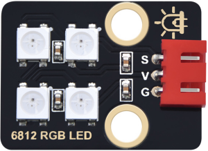

##### 2.1.1 参数

- 工作电压：DC 3.3 ~ 5V 

- 最大功率：1W

- IC型号：4颗/SK6812

- 灰度等级：25

- 发光角度：180°

- 发光颜色：可以通过控制器调为白，红，黄，蓝，绿等

- 工作温度：-10°C ~ +50°C

- 尺寸：32mm x 23mm x 8mm

- 定位孔大小：直径为 4.8 mm

- 接口：间距2.54 mm，3pin防反接口

##### 2.1.2 原理

SK6812 RGB灯模块采用单线串行通信协议，每个灯珠内置驱动IC，通过数据线逐级传输信号，可独立控制每颗灯珠的亮度和颜色，形成动态光效。

每个灯珠包含红（R）、绿（G）、蓝（B）三个颜色的 LED，可以通过调节三原色的亮度混合出任意颜色。

**灯珠序号：**

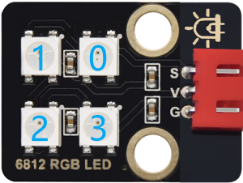

##### 2.1.3 实验代码

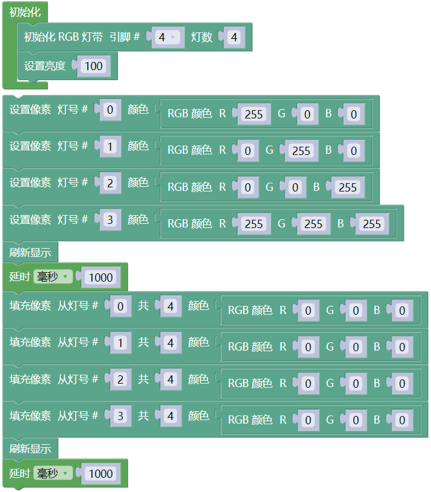

##### 2.1.4 代码说明

**1.   初始化设置**

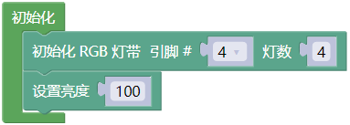

- 定义控制信号引脚为主板的 IO4 引脚， LED 灯珠的数量为 4 个。

- 设置 LED 灯珠的亮度，范围为 0（最暗）到 255（最亮）。

 

**2.  主循环**

- 设置指定序号的灯珠颜色，灯珠的序号从0开始。这个代码块的意思是：设置第一个灯珠为红色。

- 设置多个连续灯珠的颜色，从0号灯珠到3号灯珠连续亮4颗灯珠。

- 更新到灯珠

  这个代码块必须调用！

  所有亮灯指令仅停留在内存，未发送到硬件，调用此代码块后才会实际更新显示。

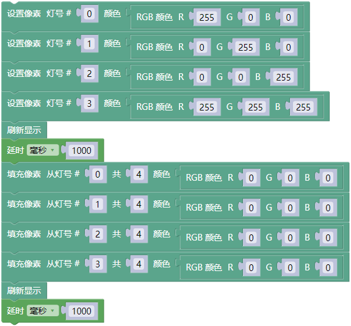

- 设置4颗灯珠依次亮红色、绿色、蓝色和白色，持续 1 秒，然后灭，持续1秒。

##### 2.1.5 实验结果

外接电源，选择好正确的开发板板型（ESP32 Dev Module）和 适当的串口端口（COMxx），然后单击按钮上传代码。上传代码成功后，你能看到循环过程：

- 4 个 LED 灯珠会依次点亮为红色、绿色、蓝色和白色，持续 1 秒，由于速度过快你可能看不到依次点亮的这个过程。

- 然后所有灯珠关闭，持续 1 秒。

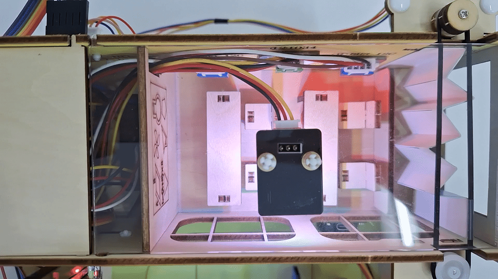

---

#### 2.2 ENS160空气质量传感器

ENS160 是一款高精度数字空气质量传感器，能够实时检测空气中的挥发性有机化合物（VOCs）、二氧化碳（CO₂）和空气质量指数（AQI）。该传感器专为室内空气质量检测而设计，能直接输出多种IAQ（TVOC、eCO2、AQI）数据。广泛应用于环境监测、智能家居和健康设备中。

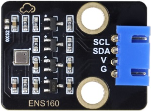

##### 2.2.1 参数

- 工作电压：DC 3.3 ~ 5V 

- 工作电流：29 mA 

- 预热时间：< 3 分钟 

- 通讯接口：I2C

- I2C地址：默认为0x53，可修改为0x52

- 工作温度：-10°C ~ +50°C

- 工作湿度：5 %RH ~ 95 %RH

- eCO₂测量范围：400 ppm ~ 65000 ppm

- TVOC测量范围：0 ppb ~ 65000 ppb

- 尺寸：32mm x 23mm x 8mm

- 定位孔大小：直径为 3.2 mm

- 接口：间距2.54 mm，4pin防反接口

##### 2.2.2 原理

**ENS160 的工作原理**

ENS160 通过内置的金属氧化物半导体传感器检测空气中的气体成分，具体原理如下：

**VOCs 检测**：

- **检测原理**

  传感器表面的金属氧化物与空气中的 VOCs 发生化学反应，导致电阻变化，通过测量电阻变化来检测 VOCs 浓度。

  不过，它无法区分具体是哪种 VOCs，而是将所有可检测的 VOCs 混合信号 **折算为总挥发性有机物（TVOC）浓度**（单位ppb）输出。

  因此，ENS160 直接提供的是 **TVOC 数据**，而非单一 VOCs 成分，适合快速评估空气整体污染水平，但无法精确分析具体气体种类。

- **TVOC检测范围**

  输出单位：ppb（parts per billion，十亿分之一）

  检测范围：0 ~ 65,000 ppb（注：实际有效精度范围通常为0 ~ 10,000 ppb）

- **TVOC（总挥发性有机物浓度）等级参考**

  | **TVOC浓度 (ppb)** | **等级划分** | **健康影响与建议**                                           |
  | ------------------ | ------------ | ------------------------------------------------------------ |
  | 0-250              | 优秀         | 空气质量极佳，对人体无影响，适合长时间停留                   |
  | 250-500            | 良好         | 空气质量良好，敏感人群可能出现轻微不适，建议适度通风         |
  | 500-1000           | 轻度污染     | 空气质量可接受，长期暴露可能导致头痛、疲劳，需加强通风       |
  | 1000-3000          | 中度污染     | 空气质量不佳，可能引发眼喉刺激、嗜睡，建议减少暴露并排查污染源 |
  | >3000              | 重度污染     | 严重污染，可能导致神经系统损伤、肝肾毒性，必须立即通风或撤离 |

 

**CO₂ 估算**：

- **估算原理**

  ENS160 无法直接测量 CO₂，而是通过检测空气中的 VOCs（挥发性有机物）浓度，结合内置算法估算出 eCO₂（等效二氧化碳）。eCO₂ 是一种间接的 CO₂ 近似值，适用于趋势监测，但精度不如专业 CO₂ 传感器。

- **eCO₂输出范围**

- 单位：ppm（parts per million，百万分之一）

- 检测范围：400 ~ 65,000 ppm（注：实际有效精度范围通常为400 ~ 5,000 ppm）

- **eCO₂等级参考**

- | eCO₂      | 等级     | 建议                                       |
  | --------- | -------- | ------------------------------------------ |
  | 400-600   | 优秀     | 空气质量极佳，通风良好， 适合长时间停留 |
  | 600-800   | 良好     | 空气质量可接受，建议适度通风               |
  | 800-1000  | 轻度污染 | 空气质量下降，需加强通风                   |
  | 1000-1500 | 重度污染 | 明显闷浊感， 建议减少人员密度或强制换气 |
  | >1500     | 危险     | 严重缺氧环境，必须立即通风或撤离           |

**IAQ 计算**

- **计算原理**

  根据 TVOC 和 eCO₂ 的浓度，结合内置算法计算出室内空气质量指数（AQI）。

- **AQI（空气质量指数）等级参考**

  | AQI指数 | AQI等级 | 健康影响                       |
  | ------- | ------- | ------------------------------ |
  | 1       | 优秀    | 空气清新，无健康风险           |
  | 2       | 良好    | 基本安全，敏感人群或轻微不适   |
  | 3       | 中等    | 可察觉异味，可能引发头痛、疲劳 |
  | 4       | 较差    | 明显刺激眼喉，长期暴露有害健康 |
  | 5       | 极差    | 强烈不适，急性健康风险高       |

 

**ENS160 的控制原理**

ENS160 的控制原理基于 **I²C 通信协议**，通过发送和接收特定的命令和数据来控制传感器并读取测量结果。

**I²C 通信地址**

默认 I²C 通信地址为 `0x53`。

如需更改为 `0x52`，可在模块的 `0X52` 空焊盘处焊接一个 0603 封装的 0Ω 电阻，**同时修改代码中的设备地址**。

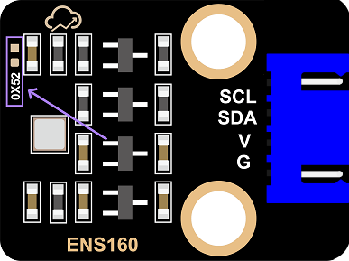

##### 2.2.3 实验代码

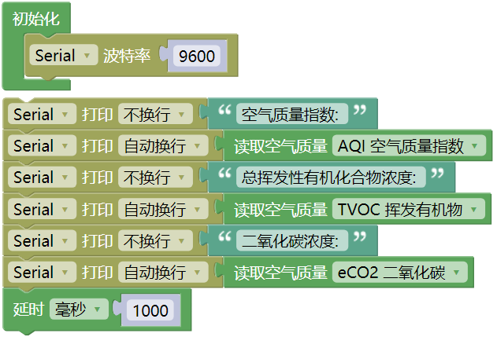

##### 2.2.4 代码说明

**1.   初始化设置**

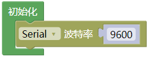

- 初始化串口通信，设置波特率为9600。

 

**2.  主循环**

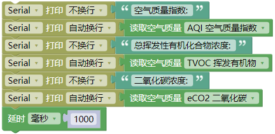

- 依次读取三种关键参数：

  获取1-5级的综合空气质量指数

  检测挥发性有机物浓度

  测量等效二氧化碳值

- 将数据通过串口输出显示，并以每秒采集一次的频率，形成完整的空气质量监测循环。

##### 2.2.5 实验结果

外接电源，选择好正确的开发板板型（ESP32 Dev Module）和 适当的串口端口（COMxx），然后单击按钮上传代码。上传代码成功后，单击Mixly IDE左上角的，出现串口监视器窗口，设置串口波特率为 `9600`。

传感器首次上电需预热3-5分钟达到稳定，稳定后可以对着ENS160空气质量传感器哈气(吹气)，可以看到打印数据，

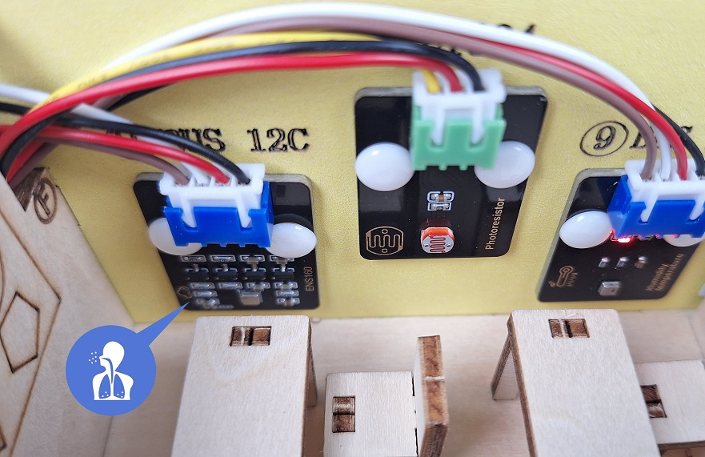 

⚠️ 特别提醒：如果串口监视器打印数据都是0，请按一下ESP32主控板上的复位键，等待几秒钟。

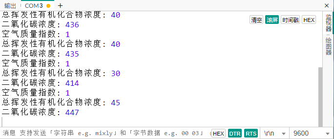

##### 2.2.6 常见问题解决

1\. 代码上传成功后串口监视器无任何信息打印？

   - 确保模块已接线且正确接线，然后按下主板的复位键：

     

---

#### 2.3 智能教室空气质量监测系统

在前面的课程中，我们已经掌握了 SK6812 RGB灯模块 的色彩控制原理和 ENS160空气质量传感器 的数据采集方法。现在，让我们将这些技术结合起来，动手制作一个智能教室空气质量监测系统！

通过这个项目，我们将实现一个能够实时监测教室内的 eCO₂浓度（等效二氧化碳浓度）的智能装置。当空气质量下降（eCO₂浓度过高）时，系统会自动触发 RGB灯闪烁红色警报，提醒师生及时通风换气，保障健康的学习环境。

让我们一起打造这个既实用又富有科技感的智能监测系统吧！

##### 2.3.1 流程图

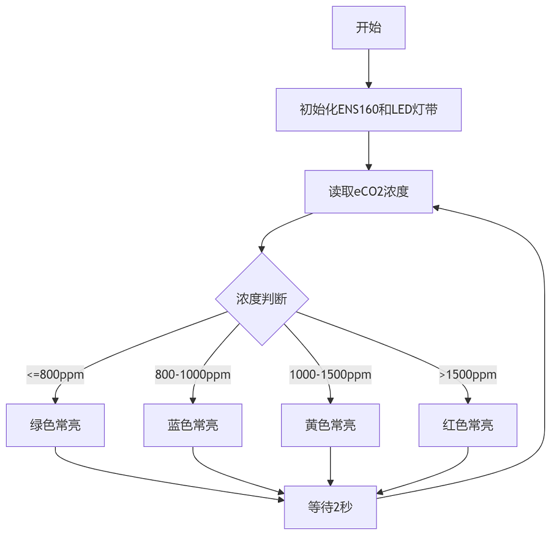

##### 2.3.2 实验代码

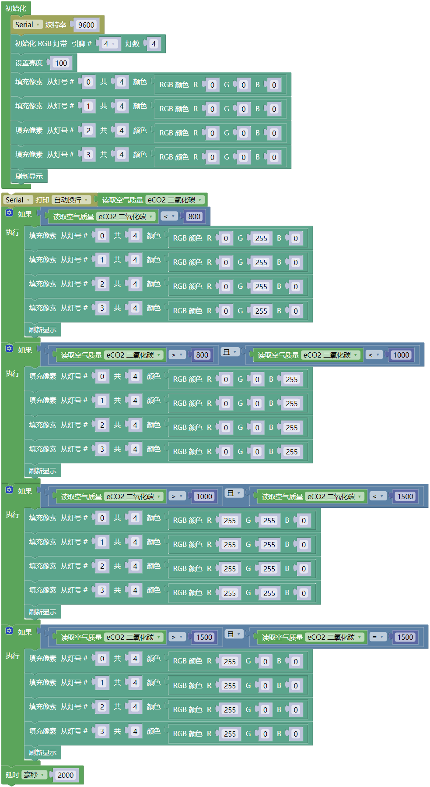

##### 2.3.3 代码说明

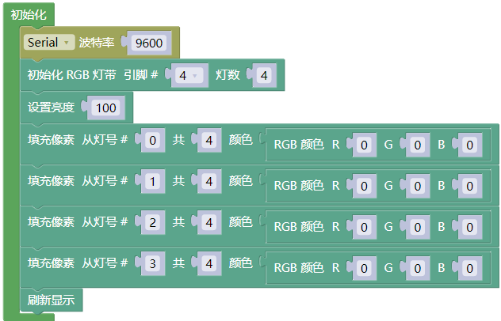

- 串口初始化、SK6812 RGB灯初始化

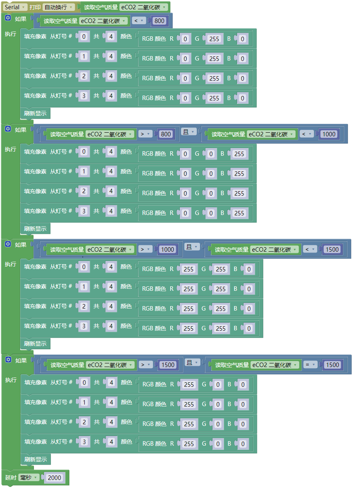

- 从ENS160传感器读取 eCO₂ 浓度值，打印在串口监视器

- 根据eCO₂浓度选择不同的显示效果，4种显示模式对应4个空气质量等级：

1. 优/良状态：绿色常亮

2. 一般状态：蓝色常亮

3. 差状态：黄色常亮

4. 严重污染状态：红色常亮

##### 2.3.4 实验结果

外接电源，选择好正确的开发板板型（ESP32 Dev Module）和 适当的串口端口（COMxx），然后单击按钮上传代码。上传代码成功后，单击Mixly IDE左上角的，出现串口监视器窗口，设置串口波特率为 `9600`。

对着ENS160空气质量传感器不断地哈气(吹气)，ENS160传感器每2秒读取一次eCO₂浓度值。

⚠️ 特别提醒：如果串口监视器打印数据是0，请按一下ESP32主控板上的复位键，等待几秒钟。

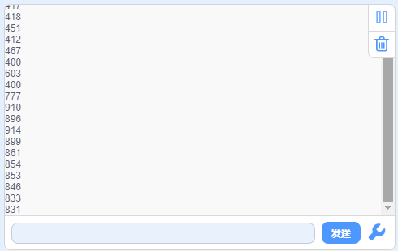

根据eCO₂浓度值分为4个等级，并通过 RGB LED 灯直观显示当前空气质量等级：

- 优/良(≤800ppm)：绿灯常亮

- 一般(≤1000ppm)：蓝灯常亮

- 差(≤1500ppm)：黄灯常亮

- 严重污染(>1500ppm)：红灯常亮

您可以通过深吸气后向ENS160传感器缓慢呼气来模拟空气质量变化，此时eCO₂浓度值将上升，同时可观察到RGB LED灯的颜色和动态效果随之改变。对着模块呼气并不能将eCO2浓度值达到严重污染的级别。

##### 2.3.5 常见问题解决

1\. 代码上传成功后SK6812 RGB灯不亮？

   - 确保ENS160传感器和RGB LED灯已接线且正确接线，然后按下主板的复位键：

     
