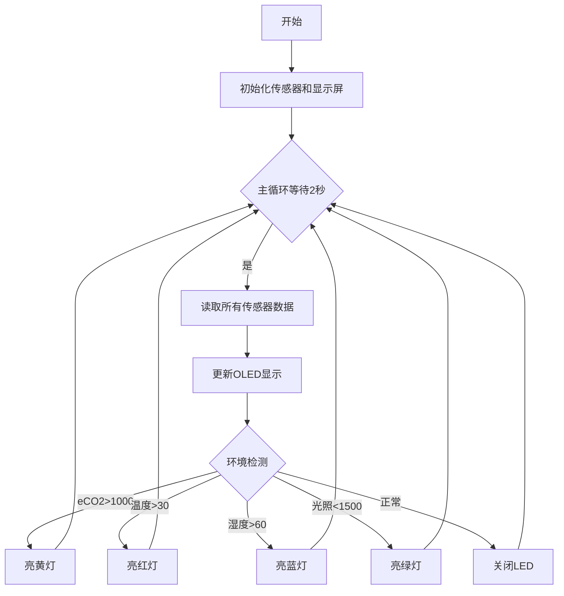
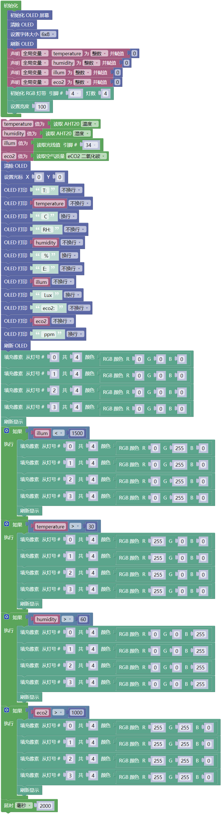
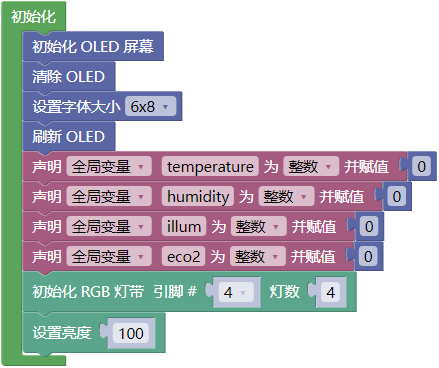
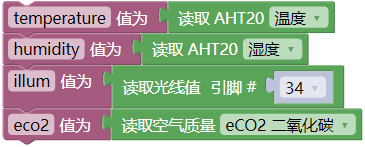
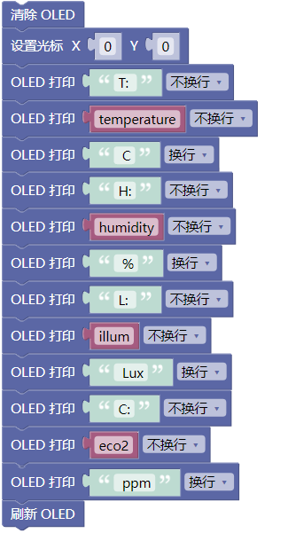
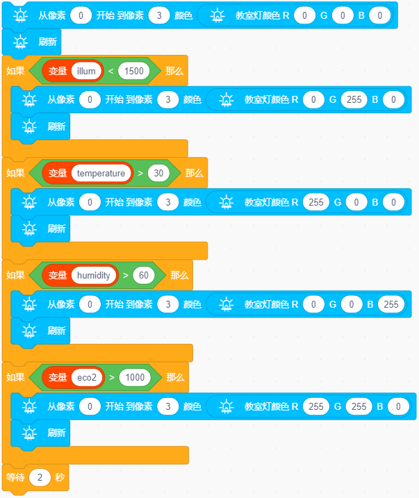

### 第4课 教室环境监测显示与报警

#### 4.1 教室环境监测显示与报警

在前面的学习中，我们已经掌握了光敏电阻传感器、ENS160空气质量传感器、6812 RGB灯模块和OLED显示屏的使用方法。现在，我们将整合这些技术，开发一个智能教室环境监测系统！

##### 4.1.1 项目功能

- 实时监测：通过OLED屏显示光照、温湿度、空气质量（eCO₂）

- 智能报警：当参数异常时，SK6812 RGB灯自动切换颜色提示：
 
  - 光照异常 → 绿色
  
  - 温度升高 → 红色
  
  - 湿度超标 → 蓝色
  
  - eCO₂浓度过高 → 黄色

这个系统不仅能直观展示教室环境状况，还能通过色彩设计视觉报警，帮助师生快速识别环境问题。现在，让我们开始构建这个集监测、显示与智能报警于一体的装置吧！

##### 4.1.2 流程图

##### 4.1.3 实验代码

##### 4.1.4 代码说明

**1.   初始化设置**

- 初始化OLED显示屏、清屏、设置文本大小

- 定义变量 temperature、humidity、illum、eco2

- 定义SK6812 RGB灯的引脚，灯珠数量，灯珠亮度

 

**2.  主循环**

- 传感器数据读取：

  - AHT20传感器采集温湿度值

  - 光敏传感器读取光照值

  - ENS160传感器测量等效二氧化碳值

- OLED 显示更新：清屏，然后显示温湿度、光照、eCO2

- SK6812 RGB灯状态反馈：

  - 低光照（<1500）→ 亮绿灯

  - 高温（>30℃）→ 亮红灯

  - 高湿（>60%）→ 亮蓝灯

  - 高eCO2（>1000ppm）→ 亮黄灯

- 每 2 秒 读取一次传感器数据

##### 4.1.5 实验结果

外接电源，选择好正确的开发板板型（ESP32 Dev Module）和 适当的串口端口（COMxx），然后单击按钮上传代码。上传代码成功后，通过AHT20传感器、ENS160传感器和光敏电阻传感器实时采集环境数据，并且每2秒更新在 OLED 显示屏 ，同时用 SK6812 RGB灯 提供视觉反馈。

- 低光照（<1500）→ 亮绿灯

- 高温（>30℃）→ 亮红灯

- 高湿（>60%）→ 亮蓝灯

- 高eCO2（>1000ppm）→ 亮黄灯

⚠️ 特别提醒：如果OLED模块上显示屏显示的二氧化碳浓度(eCO2)的数据都是0，请按一下ESP32主控板上的复位键，等待几秒钟。

