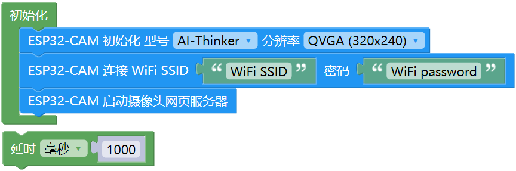
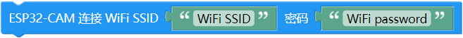
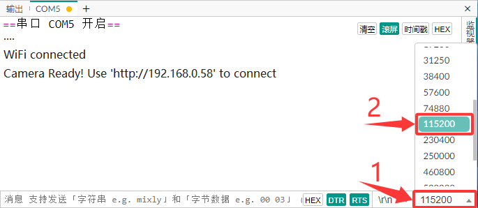
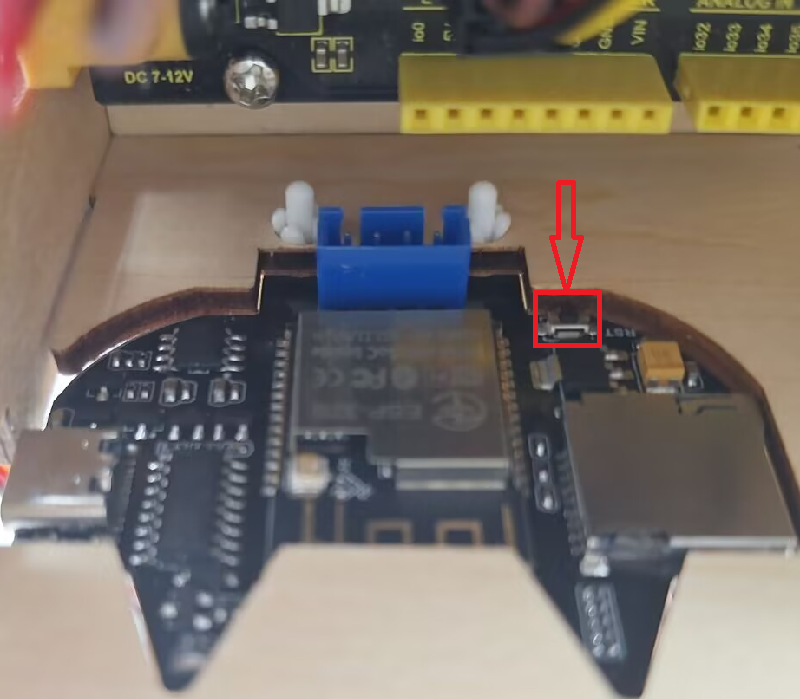

### 第9课 校园安防监控系统

摄像头模块采用ESP32-S模组与OV3660摄像头模组，支持最小系统独立工作，可广泛应用于各种物联网应用、家庭智能设备、工业无线控制、无线监控、二维码无线识别、无线定位系统信号等物联网应用，支持二次开发以及各种物联网设备应用。

#### 9.1 参数

- 供电范围：5V

- 工作电流：0.21A

- 产品尺寸：55mm × 51mm × 15.5 mm

- 采用低功耗、双核 32 位 CPU，可作为应用处理器。

- 主频高达 240MHz，算力达到 600 DMIPS。

- 内置 520 KB SRAM，外部 8MB PSRAM。

- 兼容 UART 。

- 支持 OV2640 和 OV3660 摄像头，内置闪光灯。

- 支持 TF 卡、多种休眠模式、WIFI 上传和 STA/AP/STA+AP 工作模式。

- 内置 Lwip 和 FreeRTOS。

- 支持 Smart Config/AirKiss 智能配置。

#### 9.2 实验代码

使用USB线将摄像头模块的USB口连接到电脑的USB口。

⚠️ **特别提醒： 打开代码文件后，需要分别将代码中的 `WiFi SSID` 和 `WiFi password` 替换为您自己的 WiFi名称 和 WiFi密码。**

⚠️ **特别注意：请确保代码中的WiFi名称和WiFi密码与连接到您的电脑、手机/平板、ESP32开发板和路由器的网络相同，它们必须在同一局域网（WiFi）内。**

⚠️ **特别注意：WiFi必须是2.4Ghz频率的，否则ESP32无法连接WiFi。**

#### 9.3 代码说明

**1. 硬件配置**

- 选择了AI Thinker ESP32-CAM模块

- 这里是设置分辨率为QVGA(320x240)

**2. 网络配置**

- 需要分别将代码中的 `MySSID` 和 `MyPassword` 替换为您自己的 WiFi名称 和 WiFi密码

**3. 启动摄像头网页服务器**

- ESP32-CAM启动摄像头网页服务器

#### 9.4 实验结果

修改好了代码中的WiFi名称和WiFi密码，选择好正确的开发板板型（ESP32 Dev Module）和 适当的串口端口（COMxx），然后单击按钮上传代码。代码上传成功后，单击Arduino IDE右上角的 ，打开串口监视器，设置波特率为 `115200`。串口监视器出现以下内容说明WiFi连接成功：(⚠️ 注意：确保手机/电脑与摄像头模块连接到同一个 WiFi 。)

若串口监视器无内容显示，用手指上的指甲尖按一下复位键，如下图所示(不建议拆掉摄像头下来处理，用指甲尖按复位键比较容易按)：

**在电脑上操作：**

先将电脑与摄像头模块连接到相同的WIFI（与代码中的WiFi名称和WiFi密码保持一致），然后将串口监视器打印IP地址输入到谷歌浏览器或者火狐浏览器的搜索框（用其他浏览器可能导致不兼容），按下回车键(Enter键)跳转到页面。 

参考下图绿框内的参数去设置 (主要是设置这两个参数，不断地切换这两个参数的开关, 如下图绿框内所示，使画面是正的就行；其他参数自由选择设置，一般可以不重新去设置)。

然后点击 **Start Stream** 按钮，摄像头开始工作，画面清晰可见。

此过程中WIFI模块发热，串口会显示大量通信数据是正常工作现象，有条件可以将模块置于通风的位置。

若模块输入电源不足，会导致图片出现水纹，如下所示：

**在智能手机上操作：**

先将手机与摄像头模块连接到相同的WIFI（与代码中的WiFi名称和WiFi密码保持一致），然后将串口监视器打印IP地址输入到谷歌浏览器或者火狐浏览器的搜索框（用其他浏览器可能导致不兼容），按下回车键跳转到页面。 

参考下图绿框内的参数去设置 (主要是设置这两个参数，不断地切换这两个参数的开关, 如下图绿框内所示，使画面是正的就行；其他参数自由选择设置，一般可以不重新去设置)。

然后点击 **Start Stream** 按钮，摄像头开始工作，画面清晰可见。

此过程中WIFI模块发热，串口会显示大量通信数据是正常工作现象，有条件可以将模块置于通风的位置。

若模块输入电源不足，会导致图片出现水纹，如下所示：

