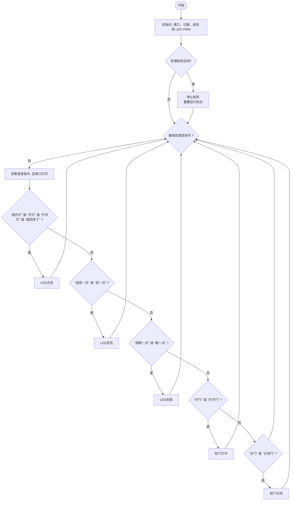
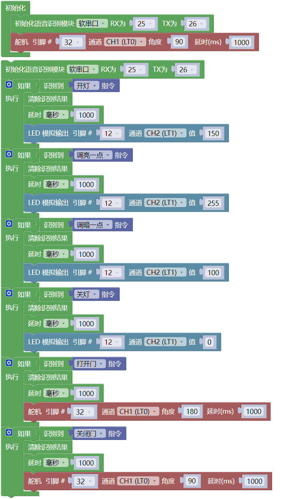

### 第10课 语音控制门灯系统

#### 10.1 项目介绍

语音控制门灯是一种基于智能语音识别技术的现代化家居控制系统，通过语音指令实现对门灯的开启、关闭等操作，为用户提供更便捷、智能的生活体验。

语音控制门灯系统代表了智能家居发展的重要方向，通过将传统的门灯控制与先进的语音识别技术相结合，不仅提升了用户的生活便利性，还为实现真正的智能学校生态奠定了基础。随着人工智能技术的不断进步，语音控制门灯将在安全性、智能化程度和用户体验方面持续优化，成为未来智能建筑的标准配置。

#### 10.2 流程图

#### 10.3 实验代码 

#### 10.4 实验结果

外接电源，选择好正确的开发板板型（ESP32 Dev Module）和 适当的串口端口（COMxx），然后单击按钮上传代码。上传代码成功后，可以通过智能语音模块来控制校门和路灯。

对着智能语音模块上的麦克风，使用唤醒词 “你好，小智” 或 “小智小智” 来唤醒智能语音模块，同时喇叭播放回复语 “有什么可以帮到您”；

智能语音模块唤醒后，对着麦克风说：“请开灯” 或 “开灯” 或 “打开灯” 或 “我回来了” 等命令词时，喇叭播放对应的回复语 “已为您打开照明”，同时路灯点亮；

对着麦克风说：“调亮一点” 或 “亮一点” 等命令词时，喇叭播放对应的回复语 “灯光已调亮”，同时路灯变亮;

对着麦克风说：“调暗一点” 或 “暗一点” 等命令词时，喇叭播放对应的回复语 “灯光已调暗”，同时路灯变暗;

对着麦克风说：“请关灯” 或 “关灯” 或 “关上灯” 或 “我出去了”等命令词时，喇叭播放对应的回复语 “已为您关闭照明”，同时路灯熄灭。

对着麦克风说：“开门” 或 “打开门”等命令词时，串口打印命令参数 “59”，喇叭播放对应的回复语 “已为您打开门”，同时校门打开；

对着麦克风说：“关门” 或 “关闭门” 等命令词时，串口打印命令参数 “60”，同时喇叭播放对应的回复语 “已为您关闭门”，同时校门关闭。

