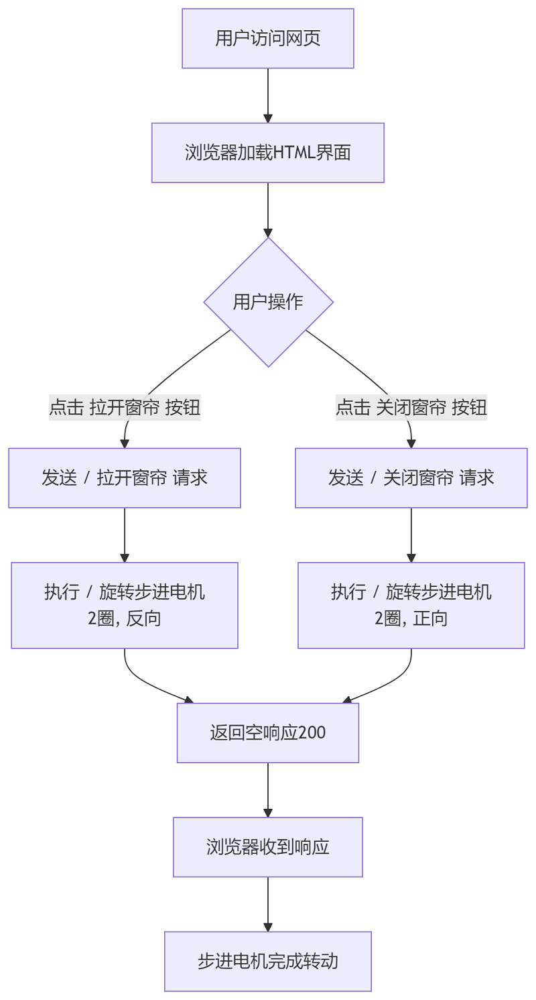
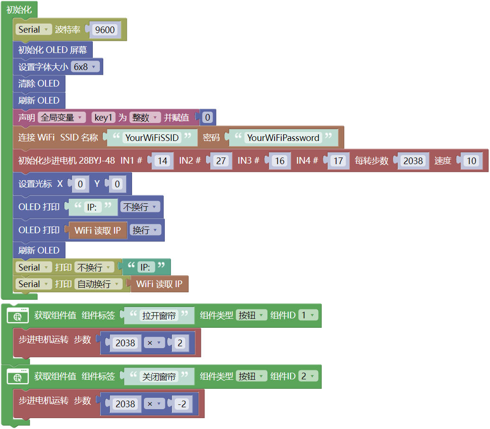
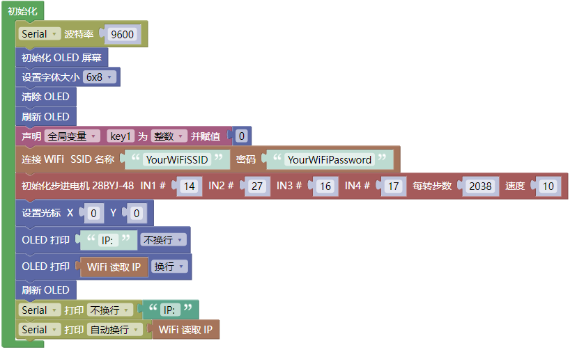
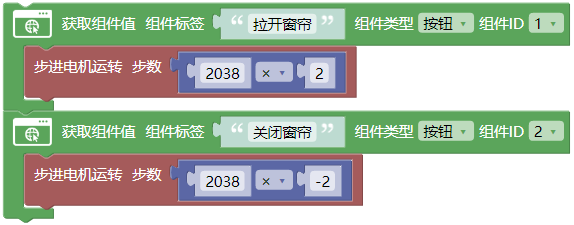
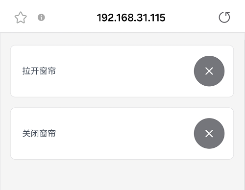

### 第16课 网页远程控制智能窗帘

 在智慧校园的建设中，物联网技术正逐步改变传统的校园管理模式。本课程以“网页远程控制智能窗帘”为实践项目，探索物联网在校园生活中的实际应用。

通过本项目，你不仅能做出一个“会听话”的窗帘，更能掌握物联网系统的核心逻辑——“感知-决策-执行”，为智慧校园的创新打开一扇窗。

#### 16.1 工作原理

**手机浏览器 → WiFi → ESP32 → 控制电机转2圈 → 窗帘开/关**

1. **手机/电脑** 打开网页（输入ESP32的IP地址）

2. **点击按钮**（正转/反转）

3. **ESP32收到指令**（通过WiFi）

4. **电机转动**（转2圈，窗帘移动对应距离）

5. **窗帘移动**（电机通过齿轮带动窗帘）

#### 16.2 流程图

#### 16.3 实验代码

⚠️ **特别提醒： 打开代码文件后，需要分别将代码中的 `YourWiFiSSID` 和 `YourWiFiPassword` 替换为您自己的 WiFi名称 和 WiFi密码。**

⚠️ **特别注意：请确保代码中的WiFi名称和WiFi密码与连接到您的电脑、手机/平板、ESP32开发板和路由器的网络相同，它们必须在同一局域网（WiFi）内。**

⚠️ **特别注意：WiFi必须是2.4Ghz频率的，否则ESP32无法连接WiFi。**

#### 16.4 代码说明

**注意：此课程涉及HTML、CSS、JS等课外知识， 只做简单介绍。**

- OLED屏、串口初始化、步进电机初始化

- 设置WiFi账号密码，连接WiFi，等待连接成功将IP地址打印在OLED屏和串口监视器。

  ⚠️ 注意：请将代码里的 WiFi名称 和 WiFi密码替换为你自己的WiFi名称 和 WiFi密码。

- 页面有两个组件：**打开窗帘** 和 **关闭窗帘**
  
  - **打开窗帘** 按钮 每按一次控制电机反转2038*2步
  
  - **关闭窗帘** 按钮 每按一次控制电机正转2038*2步

#### 16.5 实验结果

1\. 外接电源，选择好正确的开发板板型（ESP32 Dev Module）和 适当的串口端口（COMxx），上传代码前单击Mixly IDE左上角的，出现串口监视器窗口，设置串口波特率为 `9600`。

   

2\. 然后单击按钮上传代码。上传代码成功后，可以看到打印的IP地址 (如果看不到，可以按下复位按键重新连接一次)：

   

   OLED屏上同步显示IP地址：

   

3\. 将IP地址输入到手机/电脑浏览器并打开，你将看到一个简单的控制页面。

  ⚠️ 注意：确保手机/电脑与ESP32连接到同一个 WiFi 。

   

   

4\. 每按下一次 `拉开窗帘` 的，步进电机反转2038*2步，窗帘拉开。

每按下一次 `关闭窗帘` 的 ，步进电机正转2038*2步，窗帘关闭。

#### 16.6 常见问题解决

1\. 若串口监视器无任何信息打印，请按下ESP32主板的复位键：

   

2\. 若ESP32 一直没有获取到 IP 地址，通常是因为 WiFi 连接失败，解决办法：

   - 确保代码里的 WiFi 名称和 WiFi密码已经替换为您自己的 Wi-Fi名称 和 WiFi密码。
   
   - 确保你的 WiFi 网络是 2.4GHz 的，ESP32不支持 5GHz WiFi。

3\. 若输入IP地址无页面，解决办法：

   - 确保IP地址输入正确。
   
   - 检查手机/电脑是否与ESP32在同一网络。