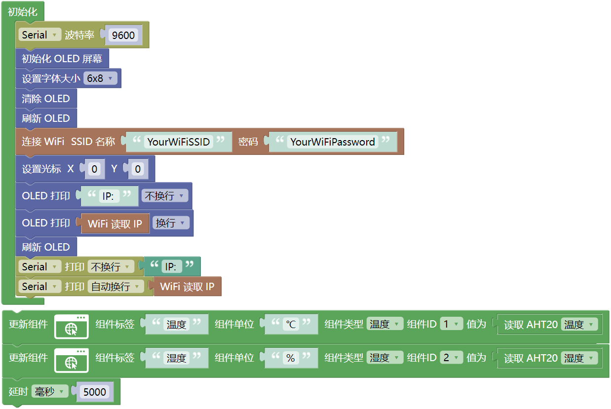
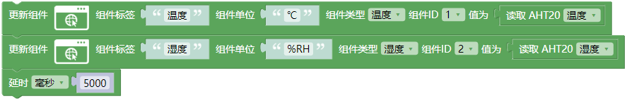
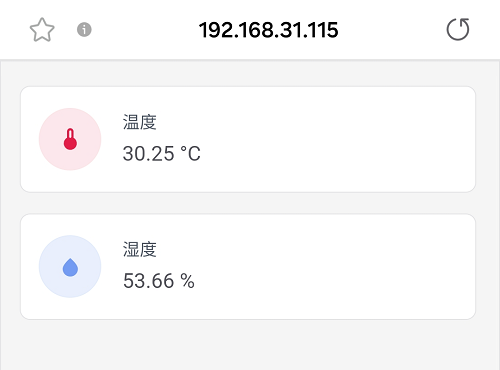
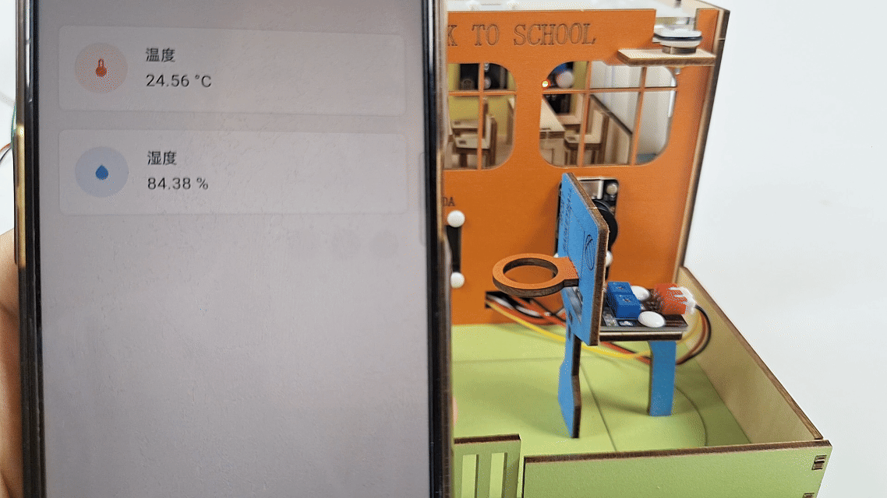

### 第18课 网页远程监测温湿度

在智慧校园建设中，环境感知是打造绿色、舒适、智能化教学空间的重要基础。本课程将带领你开发一套轻量级环境监测系统，通过ESP32微控制器和AHT20传感器，实现教室环境质量远程监管。

现在开始，用技术让校园环境管理更智能！

#### 18.1 工作原理

1. 数据采集
   AHT20传感器 → ESP32（通过I2C）
2. 数据传输
   ESP32 → 路由器 → 手机/电脑
3. 数据显示
   浏览器请求 → 服务器响应 → 更新网页

#### 18.2 流程图

#### 18.3 实验代码

⚠️ **特别提醒： 打开代码文件后，需要分别将代码中的 `YourWiFiSSID` 和 `YourWiFiPassword` 替换为您自己的 WiFi名称 和 WiFi密码。**

⚠️ **特别注意：请确保代码中的WiFi名称和WiFi密码与连接到您的电脑、手机/平板、ESP32开发板和路由器的网络相同，它们必须在同一局域网（WiFi）内。**

⚠️ **特别注意：WiFi必须是2.4Ghz频率的，否则ESP32无法连接WiFi。**

#### 18.4 代码说明

**注意：此课程涉及HTML、CSS、JS等课外知识， 只做简单介绍。**

- OLED屏、串口初始化

- 设置WiFi账号密码，连接WiFi，等待连接成功将IP地址打印在OLED屏和串口监视器。

 ⚠️ 注意：请将代码里的 WiFi名称和WiFi密码 替换为你自己的 WiFi名称和WiFi密码。

- 页面有两个组件：**温度** 和 **湿度**
  
  - **温度** 组件实时显示当前温度值
  
  - **湿度** 组件实时显示当前湿度值

- 每5秒更新一次数据。

#### 18.5 实验结果

1\. 外接电源，选择好正确的开发板板型（ESP32 Dev Module）和 适当的串口端口（COMxx），上传代码前单击Mixly IDE左上角的，出现串口监视器窗口，设置串口波特率为 `9600`。

   

2\. 然后单击按钮上传代码。上传代码成功后，可以看到打印的IP地址 (如果看不到，可以按下复位按键重新连接一次)：

   

   OLED显示屏上同步显示IP地址：

   

3\. 将IP地址输入到手机/电脑浏览器并打开，即可访问温湿度监测页面。

  ⚠️ 注意：确保手机/电脑与ESP32连接到同一个 WiFi 。

   

   页面打开时立即获取数据，且每5秒更新一次数据。

   

#### 18.6 常见问题解决

1\. 若串口监视器无任何信息打印，请按下ESP32主板的复位键：

   

2\. 若ESP32 一直没有获取到 IP 地址，通常是因为 WiFi 连接失败，解决办法：

   - 确保代码里的 WiFi 名称和 WiFi密码已经替换为您自己的 Wi-Fi名称 和 WiFi密码。
   
   - 确保你的 WiFi 网络是 2.4GHz 的，ESP32不支持 5GHz WiFi。

3\. 若输入IP地址无页面，解决办法：

   - 确保IP地址输入正确。
   
   - 检查手机/电脑是否与ESP32在同一网络。
